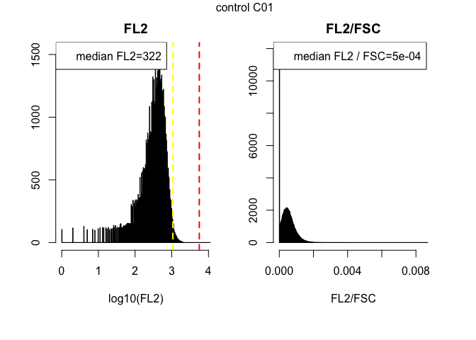
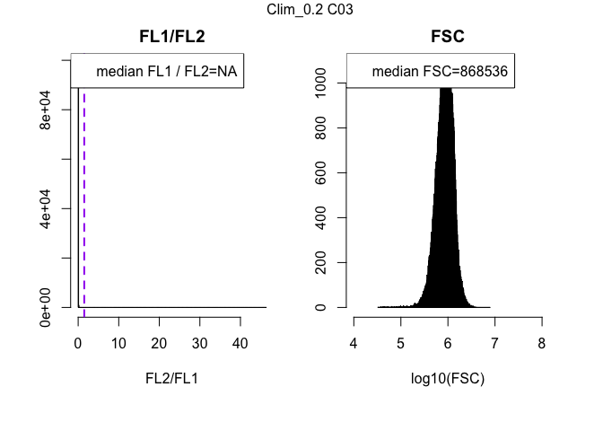
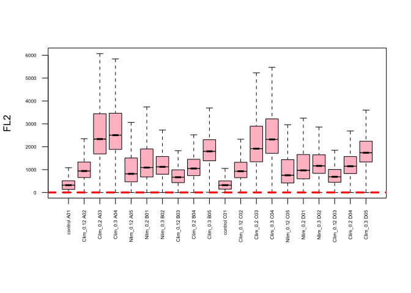

# RNA_Content_Analysis_Chemostat_12032015
`r Sys.info()[7]`  
`r Sys.Date()`  


**Experiment overview**

Write a detailed description of your experiment here including the goal of the analysis and your interpretation of the results.   
If you still see this text it means that you have not described the experiment and whatever follows is meaningless.
###############################

> This code is designed for use with the Accuri flow cytometer, which is equiped with the following lasers and filters

* Blue laser (488 nm)
  + FL1 filter = 514/20nm   GFP
  + FL3 filter = 575/25nm   YFP

* Yellow/green laser (552 nm)
  + FL2 filter = 610/20nm   mCherry, dtomato
  + FL4 filter = 586/15nm   DsRed
  
  

**Requirements**  
In order to run this code you need:  
  + to predefine your gates using the **gating.R** script  
  + the **gates.Rdata** workspace, which contains the gates used in this script  
  + the path of the directory(ies), given the variable names **dir1**, **dir2**... that contain .fcs files named A01.fcs, A02.fcs, A03.fcs...  
  + a tab delimited sample sheet in each directory with the following rows: <Well>	<Strain>	<Genotype>	<Ploidy>	<Media>	<Experiment>  
  + the variable names are changed in chunk 2 named "Variable Names"    


**Output**  
This script generates a summary of results followed by quality control plots.  


#Step 1: Load relevant libraries 

```r
# This is a function that just makes sure you have a package, or installs it for you without prompting

requireInstall <- function(packageName,isBioconductor=F) {
  if ( !try(require(packageName,character.only=T)) ) {
    print(paste0("You don't have ",packageName," accessible, ",
      "I'm gonna install it"))
    if (isBioconductor) {
      source("http://bioconductor.org/biocLite.R")                        
      biocLite(packageName)                                                 
    } else {
      install.packages("packageName", repos = "http://cran.us.r-project.org")
    }
  }
  return(1)
}

#Load libraries
requireInstall("flowCore",isBioconductor=T)
```

```
## Loading required package: flowCore
```

```
## [1] 1
```

```r
requireInstall("flowViz",isBioconductor=T)
```

```
## Loading required package: flowViz
```

```
## Loading required package: lattice
```

```
## [1] 1
```

```r
requireInstall("flowStats")
```

```
## Loading required package: flowStats
```

```
## Loading required package: fda
```

```
## Loading required package: splines
```

```
## Loading required package: Matrix
```

```
## 
## Attaching package: 'Matrix'
```

```
## The following object is masked from 'package:flowCore':
## 
##     %&%
```

```
## 
## Attaching package: 'fda'
```

```
## The following object is masked from 'package:graphics':
## 
##     matplot
```

```
## Loading required package: cluster
```

```
## Loading required package: flowWorkspace
```

```
## Loading required package: ncdfFlow
```

```
## Loading required package: RcppArmadillo
```

```
## Loading required package: BH
```

```
## Loading required package: gridExtra
```

```
## [1] 1
```

```r
requireInstall("Hmisc")
```

```
## Loading required package: Hmisc
```

```
## Loading required package: survival
```

```
## Loading required package: Formula
```

```
## Loading required package: ggplot2
```

```
## 
## Attaching package: 'Hmisc'
```

```
## The following object is masked from 'package:gridExtra':
## 
##     combine
```

```
## The following objects are masked from 'package:base':
## 
##     format.pval, round.POSIXt, trunc.POSIXt, units
```

```
## [1] 1
```

```r
requireInstall("reshape2")
```

```
## Loading required package: reshape2
```

```
## [1] 1
```

```r
requireInstall("ggplot2")
```

```
## [1] 1
```

```r
requireInstall("flowWorkspace")
```

```
## [1] 1
```

```r
requireInstall("ggcyto", isBioconductor=T)
```

```
## Loading required package: ggcyto
```

```
## [1] 1
```

```r
requireInstall("gridExtra")
```

```
## [1] 1
```

#Step 2: Read in .fcs files, an Rdata file containing the gates sample sheet(s) that contains four columns with 
* column1 = Well
* column2 = Strain
* column3 = Staining
* column4 = Media
* column5 = Userdefined


```r
#Read in all data for analysis. Data should be in individual directories that contain .fcs files and a corresponding sample sheet with a generic format. FCS file names should be unaltered e.g AO1.fcs, A02.fcs, ...H12.fcs 
#An abitrary number of directories can be used named dir1, dir2, dir3...with a corresponding flowData.1, flowData.2, flowData.3...and sample.sheet.1, sample.sheet.2, sample.sheet.3...

#load the Rdata file containing the gates
#load("gates.Rdata") 

#Define the directory, or directories, containing your .fcs files using absolute path names 
dir1 <- "/Users/nathanbrandt/Google Drive/Transfer_Folder/RNA_Content_Analysis_SPARQ/TotalRNA_FY4_Chemostat_12032015"

#Read in all the fcs files in the directory, with alter.names changing "-" to "."  
flowData <- read.flowSet(path = dir1, pattern=".fcs", alter.names=TRUE)

#Read in the sample sheet that should be in each directory that contains the .fcs files.  
sample.sheet <- read.csv(paste(path="/Users/nathanbrandt/Google Drive/Transfer_Folder/RNA_Content_Analysis_SPARQ/", "TotalRNA_FY4_Chemostat_SampleSheet_12032015.csv", sep=""))

#Change names of samples to those specified in the sample sheets
sampleNames(flowData) <- paste(sample.sheet[,5], sample.sheet[,1], sep=" ")
```


```r
#Check how many cells were counted in each fcs file
fsApply(flowData, each_col, length)[1:6]
```

```
## [1] 100000 100000 100000 100000 100000 100000
```

```r
total <- fsApply(flowData, each_col, length)[1:6]  #total counts per sample

#Print the medians of data values for each measurement
fsApply(flowData, each_col, median)
```

```
##                   FSC.A    SSC.A   FL1.A FL2.A   FL3.A FL4.A     FSC.H
## control A01    734391.5  86183.0  3028.0   322   921.0   290 1139156.5
## Clim_0.12 A02  729134.0  90393.5 15715.0   940  3734.0   795 1130571.5
## Clim_0.2 A03  1122036.0 138938.0 40430.0  2335  9904.0  1951 1545426.5
## Clim_0.3 A04   940498.0 120600.0 43241.0  2506 11014.5  2101 1320793.0
## Nlim_0.12 A05  785781.0  92392.5 15459.0   816  3419.0   719 1172048.5
## Nlim_0.2 B01   704853.0  85645.5 19682.0  1090  4496.0   944 1073701.0
## Nlim_0.3 B02   472980.5  71961.0 18599.0  1122  4654.0   937  742028.5
## Clim_0.12 B03  371753.0  49228.0 12098.0   668  2821.0   578  624264.5
## Clim_0.2 B04   500216.0  70642.0 18991.5  1049  4838.0   905  806946.0
## Clim_0.3 B05   611290.5  82616.0 27130.0  1799  7662.0  1559  943873.0
## control C01    683963.5  73198.0  3025.0   322   897.0   291 1093173.0
## Clim_0.12 C02  692707.5  88932.0 15934.0   929  3731.0   797 1086519.5
## Clim_0.2 C03   868536.0 133002.5 35161.0  1916  8530.0  1579 1190596.5
## Clim_0.3 C04  1029944.0 116237.0 40935.0  2320  9676.0  2007 1459579.5
## Nlim_0.12 C05  837993.0 101483.0 15583.0   754  3342.0   696 1237961.0
## Nlim_0.2 D01   603652.0  91829.0 18021.0   968  4278.0   834  915401.5
## Nlim_0.3 D02   511576.0  76441.5 18294.5  1163  4770.0   988  807096.0
## Clim_0.12 D03  524918.0  64583.5 12372.0   686  2901.0   616  842041.0
## Clim_0.2 D04   517485.5  63968.0 20232.0  1149  4976.0  1002  836032.0
## Clim_0.3 D05   619619.0  75890.0 26322.0  1738  6850.0  1532  943443.0
##                  SSC.H   FL1.H FL2.H FL3.H FL4.H Width Time
## control A01   121896.5  3431.0   230  1679   455    61  181
## Clim_0.12 A02 127111.5 15977.0   830  3817   830    61  181
## Clim_0.2 A03  179506.0 35800.0  1918  8581  1725    71  282
## Clim_0.3 A04  156233.5 36888.5  1992  9192  1802    69  405
## Nlim_0.12 A05 125254.0 14873.0   737  3517   805    63  167
## Nlim_0.2 B01  118108.0 18634.0   989  4427   989    60  162
## Nlim_0.3 B02   99848.5 17595.0   945  4406   930    55  181
## Clim_0.12 B03  73764.5 12832.0   610  3099   671    50  163
## Clim_0.2 B04  104369.5 19651.0   978  4987   950    54  172
## Clim_0.3 B05  112392.5 24732.0  1500  6795  1422    59  278
## control C01   105276.5  3456.0   228  1675   453    59  176
## Clim_0.12 C02 129588.5 16483.0   838  3866   837    60  179
## Clim_0.2 C03  174238.0 31169.0  1569  7414  1402    68  285
## Clim_0.3 C04  145524.5 34673.0  1831  8065  1713    69  412
## Nlim_0.12 C05 133316.0 15004.5   694  3494   797    63  176
## Nlim_0.2 D01  124472.0 17642.0   887  4326   895    59  163
## Nlim_0.3 D02  106789.0 17701.0  1007  4614   986    56  184
## Clim_0.12 D03  92631.0 12972.0   614  3169   700    55  169
## Clim_0.2 D04   91767.0 20245.0  1043  4956  1018    55  174
## Clim_0.3 D05   99499.5 22996.0  1383  5882  1356    60  273
```

```r
samples.num <- length(flowData) #number of samples
```

#Step 3: apply filters to data and generate plots showing the effect on filtering

```r
##Subset the data by applying sequential gates##

#apply doublet gate
flowData.singlets <- Subset(flowData, pg.singlets) 
fsApply(flowData.singlets, each_col, length)[1:samples.num]
singlets <- fsApply(flowData.singlets, each_col, length)[1:samples.num]
barplot(singlets/total, ylim=c(0,1), ylab = "Proportion singlet cells", las=2, cex.names = 0.5, names.arg=sampleNames(flowData))

#apply debris gate
filteredData <- Subset(flowData.singlets, pg.nondebris) 
fsApply(filteredData, each_col, length)[1:samples.num]
non.debris <- fsApply(filteredData, each_col, length)[1:samples.num]
barplot(non.debris/total, ylim=c(0,1), ylab = "Proportion singlet and nondebris cells", las=2, cex.names = 0.5, names.arg=sampleNames(flowData))

#########
#filteredData is the variable name for the data filtered of doublets and debris that are used for all subsequent analyses
##########

#this gate defines nongfp cells
gfp.neg <- Subset(filteredData, pg.nongfp) 
fsApply(gfp.neg, each_col, length)[1:samples.num]
non.gfp <- fsApply(gfp.neg, each_col, length)[1:samples.num]
barplot(non.gfp/non.debris, ylim=c(0,1), ylab = "Proportion cells with no GFP", las=2, cex.names = 0.5, names.arg=sampleNames(flowData))

#this gate defines gfp cells
gfp.pos <- Subset(filteredData, pg.gfp) 
fsApply(gfp.pos, each_col, length)[1:samples.num]
gfp.cells <- fsApply(gfp.pos, each_col, length)[1:samples.num]
barplot(gfp.cells/non.debris, ylim=c(0,1), ylab = "Proportion cells with GFP", las=2, cex.names = 0.5, names.arg=sampleNames(flowData))

#this gate defines high GFP cells
gfp.hi <- Subset(filteredData, pg.hi.gfp) 
fsApply(gfp.hi, each_col, length)[1:samples.num]
hi.gfp.cells <- fsApply(gfp.hi, each_col, length)[1:samples.num]
barplot(hi.gfp.cells/non.debris, ylim=c(0,1), ylab = "Proportion cells with high GFP", las=2, cex.names = 0.5, names.arg=sampleNames(flowData))
```


```r
filteredData <- flowData
```

#Step 4: Data analysis

##diagnostic values can be defined for plotting purposes

```r
#define critical values that can superimposed on plots for easy visual comparison

gfp.bg <- 3.9  #a background value for GFP
gfp.wt <- 5.9 #a value for wildtype GFP expression
red.bg <- 3.03 #a background value for the red channel
red.wt <- 3.75 #a value for wildtype Red expression
haploid.fsc <- 6e5 #an empirical value for forward scatter for haploids
diploid.fsc <- 7e5 #an empirical value for forward scatter for diploids
gfp.norm <- 0.935 #an empricial value for gfp expression normalized by forward scatter
red.norm <- 0.57 #an empricial value for red expression normalized by forward scatter
gfp.red.norm <- 1.5 #an empricial value for gfp expression normalized by red channel
```

##Extract data from fcs files to generate statistics and boxplots

```r
#record summary statistics for each sample in a matrix named summary.stats 
summary.stats <- matrix(data = NA, nrow = length(filteredData), ncol = 18, dimnames = list(sampleNames(filteredData),c("FSC_median","FSC_mean", "FSC_sd","FL1_median", "FL1_mean","FL1_sd","normalizedGFP_median", "normalizedGFP_mean", "normalizedGFP_sd","FL2_median","FL2_mean","FL2_sd","normalizedRed_median","normalizedRed_mean", "normalizedRed_sd","GFPnormalizedByRed_median", "GFPnormalizedByRed_mean","GFPnormalizedByRed_sd")))

#use the sample containing the minimum number of points after filtering for doublets and debris to define the number of data points retained for all samples
sample.size <- min(fsApply(filteredData, each_col, length))  

print(sample.size)
```

```
## [1] 100000
```

```r
comparison.FSC <- matrix(data = NA, nrow = sample.size, ncol = length(filteredData), byrow = FALSE,dimnames = NULL)
comparison.FL1 <- matrix(data = NA, nrow = sample.size, ncol = length(filteredData), byrow = FALSE,dimnames = NULL)
comparison.FL2 <- matrix(data = NA, nrow = sample.size, ncol = length(filteredData), byrow = FALSE,dimnames = NULL)
comparison.FL1NormFsc <- matrix(data = NA, nrow = sample.size, ncol = length(filteredData), byrow = FALSE,dimnames = NULL)
comparison.FL2NormFsc <- matrix(data = NA, nrow = sample.size, ncol = length(filteredData), byrow = FALSE,dimnames = NULL)
comparison.FL1NormFL2 <- matrix(data = NA, nrow = sample.size, ncol = length(filteredData), byrow = FALSE,dimnames = NULL)

#for each sample plot a histogram of the normalized data, raw FSC and raw GFP per row
par(mfrow=c(1,2), mar=c(5.1,2.1,2.1,2.1), oma=c(1.5,2,1,1))

#extract data from flowFrames to plot histograms of values and record summary statistics
for (i in 1:length(filteredData)){
 
  temp <- exprs(filteredData[[i]]) #exprs() extracts a matrix of the values from the flowframe
 

  ##########################################
  #record summary statistics for the sample#
  ##########################################
  
  #FSC
  summary.stats[i,1] <- median(temp[,1]) 
  summary.stats[i,2] <-mean(temp[,1])  
  summary.stats[i,3] <- sd(temp[,1])
  #FL1
  summary.stats[i,4] <- median(temp[,3])
  summary.stats[i,5] <-mean(temp[,3])  
  summary.stats[i,6] <- sd(temp[,3])
  #FL1 (GFP) divided by FSC
  summary.stats[i,7] <- median(temp[,3]/temp[,1])
  summary.stats[i,8] <-mean(temp[,3]/temp[,1])  
  summary.stats[i,9] <- sd(temp[,3]/temp[,1])
  #FL2
  summary.stats[i,10] <- median(temp[,4])
  summary.stats[i,11] <-mean(temp[,4])  
  summary.stats[i,12] <- sd(temp[,4])
  #FL2 (Red) divided by FSC
  summary.stats[i,13] <- median(temp[,4]/temp[,1])
  summary.stats[i,14] <-mean(temp[,4]/temp[,1])  
  summary.stats[i,15] <- sd(temp[,4]/temp[,1])
  #FL1 (GFP) divided by FL2 (Red)
  summary.stats[i,16] <- median(temp[,3]/temp[,4])
  summary.stats[i,17] <-mean(temp[,3]/temp[,4])  
  summary.stats[i,18] <- sd(temp[,3]/temp[,4])  
  
  ##############################################
  #plot histograms of the channels of interest##
  ##############################################

  ###############
  #Green channel#
  ###############
  
  #FL1 (GFP)
  hist(log10(temp[,3]), br=1000, xlab = "log10(FL1)", main = "FL1") 
  abline(v=gfp.bg, col="yellow", lty=2, lwd=2)
  abline(v=gfp.wt, col="green", lty=2, lwd=2) 
  legend("topleft",  legend=paste("median FL1 = ",round(median(temp[,3]), digits=4),sep=""))

  #GFP divided by FSC
  hist(temp[,3]/temp[,1], br=500, xlab = "FL1/FSC", main = "FL1/FSC") 
  abline(v=gfp.norm, col="green", lty=2, lwd=2 )
  legend("topleft",  legend=paste("median GFP / FSC=",round(median(temp[,3]/temp[,1]), digits=4),sep=""))
  
  mtext(sampleNames(filteredData[i]), outer = TRUE, cex = 1.0)
  
  ###############
  #Red channel#
  ###############
  #FL2 (Red)
  hist(log10(temp[,4]), br=500, xlab = "log10(FL2)", main = "FL2") 
  abline(v=red.bg, col="yellow", lty=2, lwd=2)
  abline(v=red.wt, col="red", lty=2, lwd=2) 
  legend("topleft",  legend=paste("median FL2=",round(median(temp[,4]), digits=4),sep=""))
 
  #FL2 divided by FSC
  hist(temp[,4]/temp[,1], br=500, xlab = "FL2/FSC", main = "FL2/FSC") 
  abline(v=red.norm, col="red", lty=2, lwd=2 )
  legend("topleft",  legend=paste("median FL2 / FSC=",round(median(temp[,4]/temp[,1]), digits=4),sep=""))

  mtext(sampleNames(filteredData[i]), outer = TRUE, cex = 1.0)
  
  ###############
  #Other#########
  ###############
  
  #FL1 divided by FL2
  hist(temp[,4]/temp[,3], br=500, xlab = "FL2/FL1", main = "FL1/FL2") 
  abline(v=gfp.red.norm, col="purple", lty=2, lwd=2)
  legend("topleft",  legend=paste("median FL1 / FL2=",round(median(temp[,4]/temp[,3]), digits=4),sep=""))

    #FSC
  hist(log10(temp[,1]), br=500, xlab = "log10(FSC)", main = "FSC", xlim=c(4,8)) 
  abline(v=haploid.fsc, col="blue", lty=2, lwd=2)
  abline(v=diploid.fsc, col="grey", lty=2, lwd=2)
  legend("topleft",  legend=paste("median FSC=",round(median(temp[,1]), digits=4),sep=""))
  
  mtext(sampleNames(filteredData[i]), outer = TRUE, cex = 1.0)

print("-------------------------------------------------------")
print("-----------------------------------")
print("----------------------")

  ############################################################
  #keep the data set for generating boxplots comparing values#
  ############################################################
  
  #Note that the amount of data kept for each sample is defined by the lowest count among all the samples.
  comparison.FSC[1:sample.size,i] <- temp[1:sample.size,1] #FSC
  comparison.FL1[1:sample.size,i] <- temp[1:sample.size,3] #FL1 (GFP)
  comparison.FL1NormFsc[1:sample.size,i] <- temp[1:sample.size,3]/temp[1:sample.size,1] #GFP/FSC
  comparison.FL2[1:sample.size,i] <- temp[1:sample.size,4] #FL2 
  comparison.FL2NormFsc[1:sample.size,i] <- temp[1:sample.size,4]/temp[1:sample.size,1] #FL2/FSC
  comparison.FL1NormFL2[1:sample.size,i] <- temp[1:sample.size,3]/temp[1:sample.size,4] #FL1/FL2
  
}
```

<!-- --><!-- --><!-- -->

```
## [1] "-------------------------------------------------------"
## [1] "-----------------------------------"
## [1] "----------------------"
```

<!-- --><!-- --><!-- -->

```
## [1] "-------------------------------------------------------"
## [1] "-----------------------------------"
## [1] "----------------------"
```

<!-- --><!-- --><!-- -->

```
## [1] "-------------------------------------------------------"
## [1] "-----------------------------------"
## [1] "----------------------"
```

<!-- --><!-- --><!-- -->

```
## [1] "-------------------------------------------------------"
## [1] "-----------------------------------"
## [1] "----------------------"
```

<!-- --><!-- --><!-- -->

```
## [1] "-------------------------------------------------------"
## [1] "-----------------------------------"
## [1] "----------------------"
```

<!-- --><!-- --><!-- -->

```
## [1] "-------------------------------------------------------"
## [1] "-----------------------------------"
## [1] "----------------------"
```

<!-- --><!-- --><!-- -->

```
## [1] "-------------------------------------------------------"
## [1] "-----------------------------------"
## [1] "----------------------"
```

<!-- --><!-- --><!-- -->

```
## [1] "-------------------------------------------------------"
## [1] "-----------------------------------"
## [1] "----------------------"
```

<!-- --><!-- --><!-- -->

```
## [1] "-------------------------------------------------------"
## [1] "-----------------------------------"
## [1] "----------------------"
```

<!-- --><!-- --><!-- -->

```
## [1] "-------------------------------------------------------"
## [1] "-----------------------------------"
## [1] "----------------------"
```

<!-- --><!-- --><!-- -->

```
## [1] "-------------------------------------------------------"
## [1] "-----------------------------------"
## [1] "----------------------"
```

<!-- --><!-- --><!-- -->

```
## [1] "-------------------------------------------------------"
## [1] "-----------------------------------"
## [1] "----------------------"
```

<!-- --><!-- --><!-- -->

```
## [1] "-------------------------------------------------------"
## [1] "-----------------------------------"
## [1] "----------------------"
```

<!-- --><!-- --><!-- -->

```
## [1] "-------------------------------------------------------"
## [1] "-----------------------------------"
## [1] "----------------------"
```

<!-- --><!-- --><!-- -->

```
## [1] "-------------------------------------------------------"
## [1] "-----------------------------------"
## [1] "----------------------"
```

<!-- --><!-- --><!-- -->

```
## [1] "-------------------------------------------------------"
## [1] "-----------------------------------"
## [1] "----------------------"
```

<!-- --><!-- --><!-- -->

```
## [1] "-------------------------------------------------------"
## [1] "-----------------------------------"
## [1] "----------------------"
```

<!-- --><!-- --><!-- -->

```
## [1] "-------------------------------------------------------"
## [1] "-----------------------------------"
## [1] "----------------------"
```

<!-- --><!-- --><!-- -->

```
## [1] "-------------------------------------------------------"
## [1] "-----------------------------------"
## [1] "----------------------"
```

<!-- --><!-- --><!-- -->

```
## [1] "-------------------------------------------------------"
## [1] "-----------------------------------"
## [1] "----------------------"
```

```r
par(mfrow=c(1,1)) #change number of plots per row back to standard
```


##Overview of data distributions

```r
par(mar=c(8.1,4.1,4.1,2.1)) #create more space at lower margin

boxplot(comparison.FSC, names=sampleNames(filteredData), notch = TRUE, col = "gray", ylab="FSC", cex.axis=0.5,las=2, outline=F)
abline(h=haploid.fsc, lty=2, col=2)
abline(h=diploid.fsc, lty=2, col=3)
```

<!-- -->

```r
boxplot(comparison.FL1, names=sampleNames(filteredData), notch = TRUE, col = "lightgreen", ylab="FL1", cex.axis=0.5,las=2, outline=F)
abline(h=gfp.bg ,lty=2, lwd=3, col="yellow")
abline(h=gfp.wt, lty = 2, lwd=3, col="green")
```

<!-- -->

```r
boxplot(comparison.FL1NormFsc, names=sampleNames(filteredData), notch = TRUE, col = "green", ylab="FL1/FSC", cex.axis=0.5,las=2, outline=F)
abline(h=gfp.norm, lty=2, lwd=3, col="blue")
```

<!-- -->

```r
boxplot(comparison.FL2, names=sampleNames(filteredData), notch = TRUE, col = "pink", ylab="FL2", cex.axis=0.5,las=2, outline=F)
abline(h=red.bg, lty=2, lwd=3, col="pink")
abline(h=red.wt, lty=2, lwd=3, col="red")
```

<!-- -->

```r
boxplot(comparison.FL2NormFsc, names=sampleNames(filteredData), notch = TRUE, col = "red", ylab="FL2/FSC", cex.axis=0.5,las=2, outline=F)
abline(h=red.norm, lty=2, lwd=3, col="red")
```

<!-- -->

```r
boxplot(comparison.FL1NormFL2, names=sampleNames(filteredData), notch = TRUE, col = "purple", ylab="FL1/FL2", cex.axis=0.5,las=2, outline=F)
abline(h=gfp.red.norm, lty=2, lwd=3, col="purple")
```

<!-- -->

```r
par(mar=c(5.1,4.1,4.1,2.1)) #reset margins to default

#generate a summary table containing all the recorded statistics
print(summary.stats)
```

```
##               FSC_median  FSC_mean   FSC_sd FL1_median   FL1_mean
## control A01     734391.5  805865.6 375294.6     3028.0   3405.727
## Clim_0.12 A02   729134.0  799293.1 366834.9    15715.0  86863.651
## Clim_0.2 A03   1122036.0 1176833.9 456889.4    40430.0 182278.228
## Clim_0.3 A04    940498.0 1010104.7 407907.6    43241.0 202883.918
## Nlim_0.12 A05   785781.0 1028305.3 756683.7    15459.0 122791.069
## Nlim_0.2 B01    704853.0  917633.5 635773.1    19682.0  72527.680
## Nlim_0.3 B02    472980.5  543664.1 304611.3    18599.0  51664.112
## Clim_0.12 B03   371753.0  444839.4 297369.7    12098.0  50885.794
## Clim_0.2 B04    500216.0  553112.6 264698.3    18991.5  33672.997
## Clim_0.3 B05    611290.5  656223.0 246077.5    27130.0  62286.890
## control C01     683963.5  756080.1 366074.3     3025.0   3397.974
## Clim_0.12 C02   692707.5  764255.4 358084.8    15934.0  84327.486
## Clim_0.2 C03    868536.0  927386.1 389518.9    35161.0 171357.942
## Clim_0.3 C04   1029944.0 1108043.5 424067.6    40935.0 178904.744
## Nlim_0.12 C05   837993.0 1097751.4 758504.0    15583.0 128347.254
## Nlim_0.2 D01    603652.0  779220.1 534085.3    18021.0  64279.562
## Nlim_0.3 D02    511576.0  597397.2 295541.2    18294.5  53360.794
## Clim_0.12 D03   524918.0  595797.5 324969.8    12372.0  48161.613
## Clim_0.2 D04    517485.5  568501.9 265351.3    20232.0  36134.546
## Clim_0.3 D05    619619.0  664216.8 250123.4    26322.0  60155.358
##                   FL1_sd normalizedGFP_median normalizedGFP_mean
## control A01     2302.098          0.004097719        0.004190421
## Clim_0.12 A02 351438.351          0.022541959        0.133297739
## Clim_0.2 A03  567875.124          0.036087745        0.230174285
## Clim_0.3 A04  589703.024          0.044345356        0.288414854
## Nlim_0.12 A05 398446.679          0.019880647        0.128374992
## Nlim_0.2 B01  262233.042          0.027480917        0.086464952
## Nlim_0.3 B02  223310.715          0.039286023        0.115019302
## Clim_0.12 B03 202720.541          0.033073961        0.141777414
## Clim_0.2 B04  136111.229          0.038043898        0.065420988
## Clim_0.3 B05  283899.775          0.042980250        0.099948954
## control C01     2314.595          0.004371919        0.004492780
## Clim_0.12 C02 335605.721          0.024116614        0.136916971
## Clim_0.2 C03  527856.336          0.040567718        0.295662176
## Clim_0.3 C04  542414.339          0.038576538        0.226581616
## Nlim_0.12 C05 420980.556          0.018530154        0.120954001
## Nlim_0.2 D01  238441.571          0.029701831        0.087002385
## Nlim_0.3 D02  229940.896          0.034358874        0.100084547
## Clim_0.12 D03 188932.260          0.024285326        0.090119459
## Clim_0.2 D04  150403.698          0.038773373        0.067583546
## Clim_0.3 D05  271846.042          0.041482640        0.095032618
##               normalizedGFP_sd FL2_median   FL2_mean     FL2_sd
## control A01        0.002148754        322   350.3830   271.4712
## Clim_0.12 A02      0.561352072        940  4326.6729 17724.2874
## Clim_0.2 A03       0.780153282       2335 10296.3011 36209.0358
## Clim_0.3 A04       0.900324939       2506 11075.7522 34182.2279
## Nlim_0.12 A05      0.480848320        816  5677.0564 18590.5461
## Nlim_0.2 B01       0.388298804       1090  3555.5192 12737.7787
## Nlim_0.3 B02       0.565137267       1122  2815.1628 15279.4307
## Clim_0.12 B03      0.605286790        668  2489.4794 15487.6554
## Clim_0.2 B04       0.271672081       1049  1869.3290 11431.7036
## Clim_0.3 B05       0.436638432       1799  4154.8950 26656.1855
## control C01        0.002302972        322   348.3642   265.9441
## Clim_0.12 C02      0.565843890        929  4226.1651 19433.4320
## Clim_0.2 C03       1.004951470       1916  9477.3916 39539.5036
## Clim_0.3 C04       0.737635174       2320  9577.0267 31365.3324
## Nlim_0.12 C05      0.444540207        754  5874.0092 19544.4030
## Nlim_0.2 D01       0.381853966        968  3104.5453 12112.9054
## Nlim_0.3 D02       0.469117137       1163  3057.2257 20647.1369
## Clim_0.12 D03      0.350216010        686  2364.9900 13129.5534
## Clim_0.2 D04       0.277169958       1149  2076.4191 17133.7737
## Clim_0.3 D05       0.414180522       1738  4057.0472 29203.5931
##               normalizedRed_median normalizedRed_mean normalizedRed_sd
## control A01           0.0004284430       0.0004719936     0.0003803247
## Clim_0.12 A02         0.0012896294       0.0070213467     0.0435829213
## Clim_0.2 A03          0.0021024314       0.0136106323     0.0685506046
## Clim_0.3 A04          0.0026019139       0.0166703699     0.0787378971
## Nlim_0.12 A05         0.0010285991       0.0061536709     0.0352396637
## Nlim_0.2 B01          0.0015344030       0.0044334856     0.0312989067
## Nlim_0.3 B02          0.0023453488       0.0067635137     0.0596158635
## Clim_0.12 B03         0.0017821591       0.0071641556     0.0485338051
## Clim_0.2 B04          0.0020998689       0.0038630386     0.0310763032
## Clim_0.3 B05          0.0028915328       0.0071715632     0.0541647664
## control C01           0.0004577279       0.0005052016     0.0003984882
## Clim_0.12 C02         0.0013412099       0.0070029583     0.0363699255
## Clim_0.2 C03          0.0022176469       0.0189257860     0.1151340853
## Clim_0.3 C04          0.0022151274       0.0129234804     0.0701222620
## Nlim_0.12 C05         0.0008838760       0.0055679333     0.0208841746
## Nlim_0.2 D01          0.0015962806       0.0043514934     0.0287983864
## Nlim_0.3 D02          0.0021900443       0.0059996713     0.0509582840
## Clim_0.12 D03         0.0013073564       0.0046833494     0.0326977670
## Clim_0.2 D04          0.0022207130       0.0040673452     0.0307104161
## Clim_0.3 D05          0.0027727086       0.0069577958     0.0582342361
##               GFPnormalizedByRed_median GFPnormalizedByRed_mean
## control A01                          NA                     NaN
## Clim_0.12 A02                  17.69162                     Inf
## Clim_0.2 A03                         NA                     NaN
## Clim_0.3 A04                         NA                     NaN
## Nlim_0.12 A05                        NA                     NaN
## Nlim_0.2 B01                         NA                     NaN
## Nlim_0.3 B02                   17.03895                     Inf
## Clim_0.12 B03                        NA                     NaN
## Clim_0.2 B04                         NA                     NaN
## Clim_0.3 B05                         NA                     NaN
## control C01                          NA                     NaN
## Clim_0.12 C02                        NA                     NaN
## Clim_0.2 C03                         NA                     NaN
## Clim_0.3 C04                   17.98909                     Inf
## Nlim_0.12 C05                        NA                     NaN
## Nlim_0.2 D01                         NA                     NaN
## Nlim_0.3 D02                   16.22702                     Inf
## Clim_0.12 D03                        NA                     NaN
## Clim_0.2 D04                   17.72493                     Inf
## Clim_0.3 D05                         NA                     NaN
##               GFPnormalizedByRed_sd
## control A01                      NA
## Clim_0.12 A02                   NaN
## Clim_0.2 A03                     NA
## Clim_0.3 A04                     NA
## Nlim_0.12 A05                    NA
## Nlim_0.2 B01                     NA
## Nlim_0.3 B02                    NaN
## Clim_0.12 B03                    NA
## Clim_0.2 B04                     NA
## Clim_0.3 B05                     NA
## control C01                      NA
## Clim_0.12 C02                    NA
## Clim_0.2 C03                     NA
## Clim_0.3 C04                    NaN
## Nlim_0.12 C05                    NA
## Nlim_0.2 D01                     NA
## Nlim_0.3 D02                    NaN
## Clim_0.12 D03                    NA
## Clim_0.2 D04                    NaN
## Clim_0.3 D05                     NA
```

```r
summary.stats <- as.data.frame(summary.stats)
```


##Quantitation of relative FL1 signal

```r
baseline.FL1 <- summary.stats$FL1_median[1]

barplot(summary.stats$FL1_median/baseline.FL1, ylab="Relative FL1 median expression", las=2, cex.names = 0.5, names.arg=sampleNames(filteredData))
```

<!-- -->

##Quantitation of forward scatter

```r
baseline.FSC <- summary.stats$FSC_median[1]

barplot(summary.stats$FSC_median/baseline.FSC, ylab="Relative median FSC", las=2, cex.names = 0.5, names.arg=sampleNames(filteredData))
```

<!-- -->

##Population composition

```r
pop.composition <- rbind(non.gfp/non.debris,gfp.cells/non.debris,hi.gfp.cells/non.debris)
barplot(pop.composition, ylab="Proportion of population", legend=c("No GFP", "Normal GFP", "High GFP"),las=2, cex.names = 0.5,names.arg=sampleNames(filteredData))
```

#Step 5: Quality control

##Gates

```r
###First flowset
#Singlets gate
xyplot(FSC.A~FSC.H, data=flowData.1, xlim=c(0,3e6), ylim=c(0,3e6), filter=pg.singlets,  smooth=F, xbin=1024, stat=T, pos=0.5, abs=T, main = "First flowset - singlets gate")

#Debris gate
xyplot(SSC.A ~ FSC.A, data=flowData.1, displayFilter=TRUE, xlim=c(0,3e6), ylim=c(0,3e5), filter=pg.nondebris, smooth=F, xbin=1024, stat=T, pos=0.5, abs=T,  main = "First flowset - nondebris gate")

#Non-fluorescent population gate
xyplot(FL1.A~FSC.A,data=flowData.1, displayFilter=TRUE, xlim=c(0,5e6), ylim=c(0,5e4), filter=pg.nongfp, smooth=F, xbin=1024, stat=T, pos=0.5, abs=T,  main = "First flowset - non GFP gate")

#Fluorescent population gate
xyplot(FL1.A~FSC.A,data=flowData.1, displayFilter=TRUE, xlim=c(0,5e6), ylim=c(0,5e4), filter=pg.gfp, smooth=F, xbin=1024, stat=T, pos=0.5, abs=T, main = "First flowset - GFP gate")

#High fluorescing gate
xyplot(FL1.A~FSC.A,data=flowData.1, xlim=c(0,5e6), ylim=c(0,5e4), filter=pg.hi.gfp, smooth=F, xbin=1024, stat=T, pos=0.5, abs=T,  main = "First flowset - high GFP gate")

################
###Second flowset
#Singlets gate
xyplot(FSC.A~FSC.H, data=flowData.2, xlim=c(0,3e6), ylim=c(0,3e6), filter=pg.singlets,  smooth=F, xbin=1024, stat=T, pos=0.5, abs=T, main = "Second flowset - singlets gate")

#Debris gate
xyplot(SSC.A ~ FSC.A, data=flowData.2, displayFilter=TRUE, xlim=c(0,3e6), ylim=c(0,3e5), filter=pg.nondebris, smooth=F, xbin=1024, stat=T, pos=0.5, abs=T,  main = "Second flowset  - nondebris gate")

#Non-fluorescent population gate
xyplot(FL1.A~FSC.A,data=flowData.2, displayFilter=TRUE, xlim=c(0,5e6), ylim=c(0,5e4), filter=pg.nongfp, smooth=F, xbin=1024, stat=T, pos=0.5, abs=T,  main = "Second flowset - non GFP gate")

#Fluorescent population gate
xyplot(FL1.A~FSC.A,data=flowData.2, displayFilter=TRUE, xlim=c(0,5e6), ylim=c(0,5e4), filter=pg.gfp, smooth=F, xbin=1024, stat=T, pos=0.5, abs=T, main = "Second flowset - GFP gate")

#High fluorescing gate 
xyplot(FL1.A~FSC.A,data=flowData.2, xlim=c(0,5e6), ylim=c(0,5e4), filter=pg.hi.gfp, smooth=F, xbin=1024, stat=T, pos=0.5, abs=T,  main = "Second flowset - high GFP gate")


#####Attempted as loop below to plot each one individually and is not working

for (i in 1:length(filteredData)){

#Singlets gate
xyplot(FSC.A~FSC.H, data=flowData[i], xlim=c(0,3e6), ylim=c(0,3e6), filter=pg.singlets,  smooth=F, xbin=1024, stat=T, pos=0.5, abs=T, main = sampleNames(flowData)[i])

#Debris gate
xyplot(SSC.A ~ FSC.A, data=flowData[i], displayFilter=TRUE, xlim=c(0,3e5), ylim=c(0,3e6), filter=pg.nondebris, smooth=F, xbin=1024, stat=T, pos=0.5, abs=T, main = sampleNames(flowData)[i])

#Non-fluorescent population gate
xyplot(FL1.A~FSC.A,data=flowData[i], displayFilter=TRUE, xlim=c(0,5e6), ylim=c(0,5e4), filter=pg.nongfp, smooth=F, xbin=1024, stat=T, pos=0.5, abs=T, main = sampleNames(flowData)[i])

#Fluorescent population gate
xyplot(FL1.A~FSC.A,data=flowData[i], displayFilter=TRUE, xlim=c(0,5e6), ylim=c(0,5e4), filter=pg.gfp, smooth=F, xbin=1024, stat=T, pos=0.5, abs=T, main = sampleNames(flowData)[i])

#High fluorescing gate
xyplot(FL1.A~FSC.A,data=flowData[i], xlim=c(0,5e6), ylim=c(0,5e4), filter=pg.hi.gfp, smooth=F, xbin=1024, stat=T, pos=0.5, abs=T, main = sampleNames(flowData)[i])

}
```


##Data transformation for visualization

```r
#In order to look at QC plots the data is transformed using the logicle transform, which is a log transform for high values that transitions to a linear transformation near zero values 

#This is simply for visualization purposes

lgcl <- logicleTransform(w = 0.5, t= 10000, m=4.5) #the parameters w,t, and m define the transformation parameters

#Dataset 1 tranformation applied to every channel except width and time
dataLGCLTransform <- transform(filteredData,'FSC.A' = lgcl(`FSC.A`), 'SSC.A' =lgcl(`SSC.A`), 'FL1.A' = lgcl(`FL1.A`), 'FL2.A' = lgcl(`FL2.A`), 'FL3.A' = lgcl(`FL3.A`), 'FL4.A' = lgcl(`FL4.A`),'FSC.H' = lgcl(`FSC.H`),'SSC.H' = lgcl(`SSC.H`),'FL1.H' = lgcl(`FL1.H`),'FL2.H' = lgcl(`FL2.H`),'FL3.H' = lgcl(`FL3.H`),'FL4.H' = lgcl(`FL4.H`)) 
```

##Effect of time

```r
#The effect of time on signal (of which there shouldn't be any)
i <- 1
xyplot(FL1.A ~ Time, data=dataLGCLTransform[i], smooth=F,  stat=T, pos=0.5, abs=T, xlim=c(150,250), main = sampleNames(filteredData)[i])
```

<!-- -->

```r
i <- 2
xyplot(FL1.A ~ Time, data=dataLGCLTransform[i], smooth=F,  stat=T, pos=0.5, abs=T, xlim=c(150,250), main = sampleNames(filteredData)[i])
```

<!-- -->

```r
i <- 3
xyplot(FL1.A ~ Time, data=dataLGCLTransform[i], smooth=F,  stat=T, pos=0.5, abs=T, xlim=c(150,250), main = sampleNames(filteredData)[i])
```

<!-- -->

```r
####Attempted as loop and will not work 
for (i in 1:length(filteredData)){
xyplot(FL1.A ~ Time, data=dataLGCLTransform[i], smooth=F,  stat=T, pos=0.5, abs=T, xlim=c(150,250), main = sampleNames(filteredData)[i])
}
```

##Plots of FL1 versus FSC

```r
i <- 1
xyplot(FL1.A ~ FSC.A, data=dataLGCLTransform[i], smooth=F,  stat=T, pos=0.5, abs=T, xlim=c(4,8), sampleNames(filteredData)[i])
```

```
## Warning: 'filter' must either be a filtersList,filterResultList, a single
## filter object or a named list of filter objects.
```

<!-- -->

```r
i <- 2
xyplot(FL1.A ~ FSC.A, data=dataLGCLTransform[i], smooth=F,  stat=T, pos=0.5, abs=T, xlim=c(4,8), sampleNames(filteredData)[i])
```

```
## Warning: 'filter' must either be a filtersList,filterResultList, a single
## filter object or a named list of filter objects.
```

<!-- -->

```r
i <- 3
xyplot(FL1.A ~ FSC.A, data=dataLGCLTransform[i], smooth=F,  stat=T, pos=0.5, abs=T, xlim=c(4,8), sampleNames(filteredData)[i])
```

```
## Warning: 'filter' must either be a filtersList,filterResultList, a single
## filter object or a named list of filter objects.
```

<!-- -->

```r
####Attempted as loop and will not work 
for (i in 1:length(filteredData)){
xyplot(FL1.A ~ FSC.A, data=dataLGCLTransform[i], smooth=F,  stat=T, pos=0.5, abs=T, xlim=c(4,8), ylim=c(2,6), sampleNames(filteredData)[i])
}
```

##Plots of FSC versus SSC

```r
i <- 1
xyplot(SSC.A ~ FSC.A, data=dataLGCLTransform[i], smooth=F,  stat=T, pos=0.5, abs=T, xlim=c(4,8), ylim=c(4,8), sampleNames(filteredData)[i])
```

```
## Warning: 'filter' must either be a filtersList,filterResultList, a single
## filter object or a named list of filter objects.
```

<!-- -->

```r
i <- 2
xyplot(SSC.A ~ FSC.A, data=dataLGCLTransform[i], smooth=F,  stat=T, pos=0.5, abs=T, xlim=c(4,8), ylim=c(4,8), sampleNames(filteredData)[i])
```

```
## Warning: 'filter' must either be a filtersList,filterResultList, a single
## filter object or a named list of filter objects.
```

<!-- -->

```r
i <- 3
xyplot(SSC.A ~ FSC.A, data=dataLGCLTransform[i], smooth=F,  stat=T, pos=0.5, abs=T, xlim=c(4,8), ylim=c(4,8), sampleNames(filteredData)[i])
```

```
## Warning: 'filter' must either be a filtersList,filterResultList, a single
## filter object or a named list of filter objects.
```

<!-- -->

```r
####Attempted as loop and will not work 
for (i in 1:length(filteredData)){
xyplot(SSC.A ~ FSC.A, data=dataLGCLTransform[i], smooth=F,  stat=T, pos=0.5, abs=T, xlim=c(4,8), ylim=c(4,8), sampleNames(filteredData)[i])
}
```


