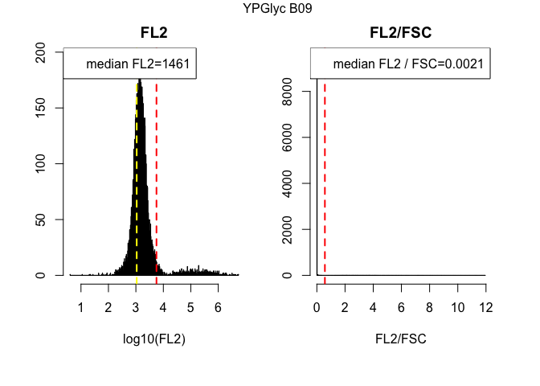
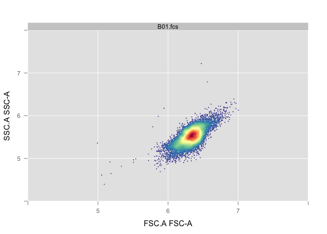

# RNA_Content_Analysis_SPARQ
`r Sys.info()[7]`  
`r Sys.Date()`  


**Experiment overview**

Write a detailed description of your experiment here including the goal of the analysis and your interpretation of the results.   
If you still see this text it means that you have not described the experiment and whatever follows is meaningless.
###############################

> This code is designed for use with the Accuri flow cytometer, which is equiped with the following lasers and filters

* Blue laser (488 nm)
  + FL1 filter = 514/20nm   GFP
  + FL3 filter = 575/25nm   YFP

* Yellow/green laser (552 nm)
  + FL2 filter = 610/20nm   mCherry, dtomato
  + FL4 filter = 586/15nm   DsRed
  
  

**Requirements**  
In order to run this code you need:  
  + to predefine your gates using the **gating.R** script  
  + the **gates.Rdata** workspace, which contains the gates used in this script  
  + the path of the directory(ies), given the variable names **dir1**, **dir2**... that contain .fcs files named A01.fcs, A02.fcs, A03.fcs...  
  + a tab delimited sample sheet in each directory with the following rows: <Well>	<Strain>	<Genotype>	<Ploidy>	<Media>	<Experiment>  
  + the variable names are changed in chunk 2 named "Variable Names"    


**Output**  
This script generates a summary of results followed by quality control plots.  


#Step 1: Load relevant libraries 

```r
# This is a function that just makes sure you have a package, or installs it for you without prompting

requireInstall <- function(packageName,isBioconductor=F) {
  if ( !try(require(packageName,character.only=T)) ) {
    print(paste0("You don't have ",packageName," accessible, ",
      "I'm gonna install it"))
    if (isBioconductor) {
      source("http://bioconductor.org/biocLite.R")                        
      biocLite(packageName)                                                 
    } else {
      install.packages("packageName", repos = "http://cran.us.r-project.org")
    }
  }
  return(1)
}

#Load libraries
requireInstall("flowCore",isBioconductor=T)
```

```
## Loading required package: flowCore
```

```
## [1] 1
```

```r
requireInstall("flowViz",isBioconductor=T)
```

```
## Loading required package: flowViz
```

```
## Loading required package: lattice
```

```
## [1] 1
```

```r
requireInstall("flowStats")
```

```
## Loading required package: flowStats
```

```
## Loading required package: fda
```

```
## Loading required package: splines
```

```
## Loading required package: Matrix
```

```
## 
## Attaching package: 'Matrix'
```

```
## The following object is masked from 'package:flowCore':
## 
##     %&%
```

```
## 
## Attaching package: 'fda'
```

```
## The following object is masked from 'package:graphics':
## 
##     matplot
```

```
## Loading required package: cluster
```

```
## Loading required package: flowWorkspace
```

```
## Loading required package: ncdfFlow
```

```
## Loading required package: RcppArmadillo
```

```
## Loading required package: BH
```

```
## Loading required package: gridExtra
```

```
## [1] 1
```

```r
requireInstall("Hmisc")
```

```
## Loading required package: Hmisc
```

```
## Loading required package: survival
```

```
## Loading required package: Formula
```

```
## Loading required package: ggplot2
```

```
## 
## Attaching package: 'Hmisc'
```

```
## The following object is masked from 'package:gridExtra':
## 
##     combine
```

```
## The following objects are masked from 'package:base':
## 
##     format.pval, round.POSIXt, trunc.POSIXt, units
```

```
## [1] 1
```

```r
requireInstall("reshape2")
```

```
## Loading required package: reshape2
```

```
## [1] 1
```

```r
requireInstall("ggplot2")
```

```
## [1] 1
```

```r
requireInstall("flowWorkspace")
```

```
## [1] 1
```

```r
requireInstall("ggcyto", isBioconductor=T)
```

```
## Loading required package: ggcyto
```

```
## [1] 1
```

```r
requireInstall("gridExtra")
```

```
## [1] 1
```

#Step 2: Read in .fcs files, an Rdata file containing the gates sample sheet(s) that contains four columns with 
* column1 = Well
* column2 = Strain
* column3 = Staining
* column4 = Media
* column5 = Userdefined


```r
#Read in all data for analysis. Data should be in individual directories that contain .fcs files and a corresponding sample sheet with a generic format. FCS file names should be unaltered e.g AO1.fcs, A02.fcs, ...H12.fcs 
#An abitrary number of directories can be used named dir1, dir2, dir3...with a corresponding flowData.1, flowData.2, flowData.3...and sample.sheet.1, sample.sheet.2, sample.sheet.3...

#load the Rdata file containing the gates
#load("gates.Rdata") 

#Define the directory, or directories, containing your .fcs files using absolute path names 
dir1 <- "/Users/nathanbrandt/Google Drive/Transfer_Folder/RNA_Content_Analysis_SPARQ/TotalRNA_FY4_Varied_Media"

#Read in all the fcs files in the directory, with alter.names changing "-" to "."  
flowData <- read.flowSet(path = dir1, pattern=".fcs", alter.names=TRUE)

#Read in the sample sheet that should be in each directory that contains the .fcs files.  
sample.sheet <- read.csv(paste(path="/Users/nathanbrandt/Google Drive/Transfer_Folder/RNA_Content_Analysis_SPARQ/", "TotalRNA_FY4_Varied_Media_SampleSheet.csv", sep=""))

#Change names of samples to those specified in the sample sheets
sampleNames(flowData) <- paste(sample.sheet[,5], sample.sheet[,1], sep=" ")
```


```r
#Check how many cells were counted in each fcs file
fsApply(flowData, each_col, length)[1:6]
```

```
## [1] 10000 10000 10000 10000 10000 10000
```

```r
total <- fsApply(flowData, each_col, length)[1:6]  #total counts per sample

#Print the medians of data values for each measurement
fsApply(flowData, each_col, median)
```

```
##               FSC.A    SSC.A    FL1.A   FL2.A   FL3.A   FL4.A     FSC.H
## YPD B01    689990.5 103298.5  14933.5   764.0  3032.0   653.0 1202645.0
## YPGal B02  636482.5 102701.0  19119.0   954.0  3819.0   795.0 1076020.5
## YPGlyc B03 743083.0 113811.5  29266.5  1371.0  5400.5  1154.0 1103063.5
## GlnLim B04 716647.5  99960.0  78673.5  8259.0 19253.5  7782.5 1086203.5
## ProLim B05 545838.5  71152.0 129582.5 37403.0 78009.5 30654.0  864628.5
## SD B06     632818.5  89111.0  43396.0  2889.0  9586.5  2455.5  985152.0
## YPD B07    690964.0 103287.5  15927.5   783.0  3133.0   684.0 1160342.5
## YPGal B08  612823.5  97969.0  18622.5   953.5  3728.0   798.5 1046458.0
## YPGlyc B09 697293.0 108480.0  31868.0  1461.0  5894.0  1242.0 1069537.0
## GlnLim B10 685283.0  94043.5  93312.5  9431.5 22902.5  9087.0 1037134.5
## ProLim B11 501178.5  67249.5 148940.5 34201.5 79007.5 27609.5  815435.5
## SD B12     644792.5  91665.5  50930.5  3399.0 11361.0  2877.0  989039.5
## YPD C01    588045.5  96182.0   2241.0   263.0   628.0   269.0 1016572.0
## YPGal C02  574802.5  91550.5   1885.0   275.5   710.0   246.0 1018102.5
## YPGlyc C03 589825.5  86320.5   2521.0   362.0   905.0   339.0  967961.0
## GlnLim C04 655348.5 103820.0   3101.5   276.0   717.0   262.0 1007457.0
## ProLim C05 545356.5  81539.0   1852.0   246.0   604.0   235.0  895314.0
## SD C06     510689.0  85283.0   1951.0   251.0   620.0   242.0  871899.5
## YPD C07    541967.5  88490.5   2279.0   265.0   662.0   255.0  999675.0
## YPGal C08  559506.0  94609.0   1878.0   282.0   704.0   255.0 1017736.0
## YPGlyc C09 611277.5  95069.5   2637.0   374.0   948.0   343.0 1000991.0
## GlnLim C10 664830.5 116025.5   3466.0   281.0   717.0   248.0 1006457.5
## ProLim C11 507901.5  79932.5   1706.0   229.0   524.0   210.0  857547.5
## SD C12     499223.5  80675.0   1911.0   259.0   631.0   251.0  838800.0
## YPD D01    642248.0  95127.5  15002.0   773.0  3063.0   668.0 1179705.5
## YPGal D02  660056.0 107761.5  19795.0  1009.0  3966.5   833.0 1124747.5
## YPGlyc D03 757114.5 119133.5  33138.5  1514.0  6043.5  1265.0 1125010.0
## GlnLim D04 693133.5  97846.0  75486.5  6621.5 17975.5  6288.0 1046395.0
## ProLim D05 530360.5  68093.0 104844.0 14993.0 44508.5 13075.5  855412.5
## SD D06     649334.5  92796.5  37286.0  2604.0  8862.0  2186.0 1000390.5
## YPD F01    505371.5  80105.0   1828.0   263.0   607.0   270.0  987559.5
## YPGal F02  524767.0  81818.5   1645.0   266.0   659.0   236.0 1013445.5
## YPGlyc F03 590692.0  89956.0   2659.0   386.0  1015.0   366.0  988898.5
## GlnLim F04 668329.5 116880.5   3317.0   281.0   739.0   259.0 1016472.5
## ProLim F05 540595.0  82760.5   1798.0   240.0   595.0   224.0  895739.5
## SD F06     534227.0  85245.0   1788.0   235.0   599.0   227.0  894500.0
##               SSC.H    FL1.H   FL2.H   FL3.H   FL4.H Width Time
## YPD B01    164756.0  17206.5   701.0  3398.0   686.0    56  188
## YPGal B02  159264.5  21282.5   879.0  4060.0   791.0    56  194
## YPGlyc B03 153113.0  27313.0  1111.0  5002.0  1001.0    62  341
## GlnLim B04 134877.0  72936.0  6237.5 16994.0  5541.0    62  379
## ProLim B05  98265.5 131453.5 33039.0 76993.5 24134.5    57  471
## SD B06     122797.0  42594.0  2428.5  8858.5  2057.5    59  437
## YPD B07    159120.5  17867.5   706.0  3432.0   690.0    57  197
## YPGal B08  150263.0  20685.0   867.0  4027.0   797.0    55  203
## YPGlyc B09 150229.5  30749.5  1217.0  5485.0  1093.0    60  289
## GlnLim B10 124931.5  86110.5  7160.5 20548.0  6597.5    61  445
## ProLim B11  95332.5 156629.0 31965.0 80903.5 22994.5    55  342
## SD B12     124565.5  47835.0  2761.0 10120.0  2352.5    59  461
## YPD C01    148862.0   2782.0   179.0  1459.0   398.0    54  188
## YPGal C02  145149.0   2421.0   190.0  1475.5   389.0    53  196
## YPGlyc C03 125222.5   2918.0   241.0  1590.0   440.0    56  244
## GlnLim C04 141115.0   3327.5   181.0  1514.0   406.0    60  330
## ProLim C05 116236.5   2298.0   164.0  1409.0   381.0    55  318
## SD C06     128582.5   2363.0   164.0  1556.0   382.0    54  225
## YPD C07    145583.5   2885.0   181.0  1477.0   392.0    52  179
## YPGal C08  151461.5   2435.0   193.0  1472.5   384.0    52  188
## YPGlyc C09 137578.0   2998.0   249.0  1603.0   442.0    57  234
## GlnLim C10 156418.0   3606.0   182.0  1554.0   399.0    61  330
## ProLim C11 115952.0   2154.5   153.0  1399.5   364.0    53  298
## SD C12     117483.5   2321.0   170.0  1442.0   390.0    54  254
## YPD D01    157539.5  18322.5   749.5  3565.0   706.0    53  184
## YPGal D02  169879.0  21848.0   920.0  4298.0   822.0    56  214
## YPGlyc D03 159091.5  31318.0  1247.0  5586.0  1095.0    63  346
## GlnLim D04 130988.0  70539.5  5159.5 15741.5  4612.0    61  549
## ProLim D05  97028.0 106283.5 13883.0 44824.0 11258.0    56  446
## SD D06     126248.5  35944.0  2193.0  8176.0  1848.0    59  535
## YPD F01    139479.5   2444.0   178.0  1380.0   385.0    49  181
## YPGal F02  139258.0   2203.0   185.0  1429.0   371.0    50  192
## YPGlyc F03 137580.0   3089.0   264.0  1646.0   458.0    56  245
## GlnLim F04 159359.0   3486.0   181.0  1524.0   405.0    60  323
## ProLim F05 120838.5   2240.0   160.0  1423.5   375.0    55  294
## SD F06     125843.0   2218.0   154.0  1431.0   379.0    55  262
```

```r
samples.num <- length(flowData) #number of samples
```

#Step 3: apply filters to data and generate plots showing the effect on filtering

```r
##Subset the data by applying sequential gates##

#apply doublet gate
flowData.singlets <- Subset(flowData, pg.singlets) 
fsApply(flowData.singlets, each_col, length)[1:samples.num]
singlets <- fsApply(flowData.singlets, each_col, length)[1:samples.num]
barplot(singlets/total, ylim=c(0,1), ylab = "Proportion singlet cells", las=2, cex.names = 0.5, names.arg=sampleNames(flowData))

#apply debris gate
filteredData <- Subset(flowData.singlets, pg.nondebris) 
fsApply(filteredData, each_col, length)[1:samples.num]
non.debris <- fsApply(filteredData, each_col, length)[1:samples.num]
barplot(non.debris/total, ylim=c(0,1), ylab = "Proportion singlet and nondebris cells", las=2, cex.names = 0.5, names.arg=sampleNames(flowData))

#########
#filteredData is the variable name for the data filtered of doublets and debris that are used for all subsequent analyses
##########

#this gate defines nongfp cells
gfp.neg <- Subset(filteredData, pg.nongfp) 
fsApply(gfp.neg, each_col, length)[1:samples.num]
non.gfp <- fsApply(gfp.neg, each_col, length)[1:samples.num]
barplot(non.gfp/non.debris, ylim=c(0,1), ylab = "Proportion cells with no GFP", las=2, cex.names = 0.5, names.arg=sampleNames(flowData))

#this gate defines gfp cells
gfp.pos <- Subset(filteredData, pg.gfp) 
fsApply(gfp.pos, each_col, length)[1:samples.num]
gfp.cells <- fsApply(gfp.pos, each_col, length)[1:samples.num]
barplot(gfp.cells/non.debris, ylim=c(0,1), ylab = "Proportion cells with GFP", las=2, cex.names = 0.5, names.arg=sampleNames(flowData))

#this gate defines high GFP cells
gfp.hi <- Subset(filteredData, pg.hi.gfp) 
fsApply(gfp.hi, each_col, length)[1:samples.num]
hi.gfp.cells <- fsApply(gfp.hi, each_col, length)[1:samples.num]
barplot(hi.gfp.cells/non.debris, ylim=c(0,1), ylab = "Proportion cells with high GFP", las=2, cex.names = 0.5, names.arg=sampleNames(flowData))
```


```r
filteredData <- flowData
```

#Step 4: Data analysis

##diagnostic values can be defined for plotting purposes

```r
#define critical values that can superimposed on plots for easy visual comparison

gfp.bg <- 3.9  #a background value for GFP
gfp.wt <- 5.9 #a value for wildtype GFP expression
red.bg <- 3.03 #a background value for the red channel
red.wt <- 3.75 #a value for wildtype Red expression
haploid.fsc <- 6e5 #an empirical value for forward scatter for haploids
diploid.fsc <- 7e5 #an empirical value for forward scatter for diploids
gfp.norm <- 0.935 #an empricial value for gfp expression normalized by forward scatter
red.norm <- 0.57 #an empricial value for red expression normalized by forward scatter
gfp.red.norm <- 1.5 #an empricial value for gfp expression normalized by red channel
```

##Extract data from fcs files to generate statistics and boxplots

```r
#record summary statistics for each sample in a matrix named summary.stats 
summary.stats <- matrix(data = NA, nrow = length(filteredData), ncol = 18, dimnames = list(sampleNames(filteredData),c("FSC_median","FSC_mean", "FSC_sd","FL1_median", "FL1_mean","FL1_sd","normalizedGFP_median", "normalizedGFP_mean", "normalizedGFP_sd","FL2_median","FL2_mean","FL2_sd","normalizedRed_median","normalizedRed_mean", "normalizedRed_sd","GFPnormalizedByRed_median", "GFPnormalizedByRed_mean","GFPnormalizedByRed_sd")))

#use the sample containing the minimum number of points after filtering for doublets and debris to define the number of data points retained for all samples
sample.size <- min(fsApply(filteredData, each_col, length))  

print(sample.size)
```

```
## [1] 10000
```

```r
comparison.FSC <- matrix(data = NA, nrow = sample.size, ncol = length(filteredData), byrow = FALSE,dimnames = NULL)
comparison.FL1 <- matrix(data = NA, nrow = sample.size, ncol = length(filteredData), byrow = FALSE,dimnames = NULL)
comparison.FL2 <- matrix(data = NA, nrow = sample.size, ncol = length(filteredData), byrow = FALSE,dimnames = NULL)
comparison.FL1NormFsc <- matrix(data = NA, nrow = sample.size, ncol = length(filteredData), byrow = FALSE,dimnames = NULL)
comparison.FL2NormFsc <- matrix(data = NA, nrow = sample.size, ncol = length(filteredData), byrow = FALSE,dimnames = NULL)
comparison.FL1NormFL2 <- matrix(data = NA, nrow = sample.size, ncol = length(filteredData), byrow = FALSE,dimnames = NULL)

#for each sample plot a histogram of the normalized data, raw FSC and raw GFP per row
par(mfrow=c(1,2), mar=c(5.1,2.1,2.1,2.1), oma=c(1.5,2,1,1))

#extract data from flowFrames to plot histograms of values and record summary statistics
for (i in 1:length(filteredData)){
 
  temp <- exprs(filteredData[[i]]) #exprs() extracts a matrix of the values from the flowframe
 

  ##########################################
  #record summary statistics for the sample#
  ##########################################
  
  #FSC
  summary.stats[i,1] <- median(temp[,1]) 
  summary.stats[i,2] <-mean(temp[,1])  
  summary.stats[i,3] <- sd(temp[,1])
  #FL1
  summary.stats[i,4] <- median(temp[,3])
  summary.stats[i,5] <-mean(temp[,3])  
  summary.stats[i,6] <- sd(temp[,3])
  #FL1 (GFP) divided by FSC
  summary.stats[i,7] <- median(temp[,3]/temp[,1])
  summary.stats[i,8] <-mean(temp[,3]/temp[,1])  
  summary.stats[i,9] <- sd(temp[,3]/temp[,1])
  #FL2
  summary.stats[i,10] <- median(temp[,4])
  summary.stats[i,11] <-mean(temp[,4])  
  summary.stats[i,12] <- sd(temp[,4])
  #FL2 (Red) divided by FSC
  summary.stats[i,13] <- median(temp[,4]/temp[,1])
  summary.stats[i,14] <-mean(temp[,4]/temp[,1])  
  summary.stats[i,15] <- sd(temp[,4]/temp[,1])
  #FL1 (GFP) divided by FL2 (Red)
  summary.stats[i,16] <- median(temp[,3]/temp[,4])
  summary.stats[i,17] <-mean(temp[,3]/temp[,4])  
  summary.stats[i,18] <- sd(temp[,3]/temp[,4])  
  
  ##############################################
  #plot histograms of the channels of interest##
  ##############################################

  ###############
  #Green channel#
  ###############
  
  #FL1 (GFP)
  hist(log10(temp[,3]), br=1000, xlab = "log10(FL1)", main = "FL1") 
  abline(v=gfp.bg, col="yellow", lty=2, lwd=2)
  abline(v=gfp.wt, col="green", lty=2, lwd=2) 
  legend("topleft",  legend=paste("median FL1 = ",round(median(temp[,3]), digits=4),sep=""))

  #GFP divided by FSC
  hist(temp[,3]/temp[,1], br=500, xlab = "FL1/FSC", main = "FL1/FSC") 
  abline(v=gfp.norm, col="green", lty=2, lwd=2 )
  legend("topleft",  legend=paste("median GFP / FSC=",round(median(temp[,3]/temp[,1]), digits=4),sep=""))
  
  mtext(sampleNames(filteredData[i]), outer = TRUE, cex = 1.0)
  
  ###############
  #Red channel#
  ###############
  #FL2 (Red)
  hist(log10(temp[,4]), br=500, xlab = "log10(FL2)", main = "FL2") 
  abline(v=red.bg, col="yellow", lty=2, lwd=2)
  abline(v=red.wt, col="red", lty=2, lwd=2) 
  legend("topleft",  legend=paste("median FL2=",round(median(temp[,4]), digits=4),sep=""))
 
  #FL2 divided by FSC
  hist(temp[,4]/temp[,1], br=500, xlab = "FL2/FSC", main = "FL2/FSC") 
  abline(v=red.norm, col="red", lty=2, lwd=2 )
  legend("topleft",  legend=paste("median FL2 / FSC=",round(median(temp[,4]/temp[,1]), digits=4),sep=""))

  mtext(sampleNames(filteredData[i]), outer = TRUE, cex = 1.0)
  
  ###############
  #Other#########
  ###############
  
  #FL1 divided by FL2
  hist(temp[,4]/temp[,3], br=500, xlab = "FL2/FL1", main = "FL1/FL2") 
  abline(v=gfp.red.norm, col="purple", lty=2, lwd=2)
  legend("topleft",  legend=paste("median FL1 / FL2=",round(median(temp[,4]/temp[,3]), digits=4),sep=""))

    #FSC
  hist(log10(temp[,1]), br=500, xlab = "log10(FSC)", main = "FSC", xlim=c(4,8)) 
  abline(v=haploid.fsc, col="blue", lty=2, lwd=2)
  abline(v=diploid.fsc, col="grey", lty=2, lwd=2)
  legend("topleft",  legend=paste("median FSC=",round(median(temp[,1]), digits=4),sep=""))
  
  mtext(sampleNames(filteredData[i]), outer = TRUE, cex = 1.0)

print("-------------------------------------------------------")
print("-----------------------------------")
print("----------------------")

  ############################################################
  #keep the data set for generating boxplots comparing values#
  ############################################################
  
  #Note that the amount of data kept for each sample is defined by the lowest count among all the samples.
  comparison.FSC[1:sample.size,i] <- temp[1:sample.size,1] #FSC
  comparison.FL1[1:sample.size,i] <- temp[1:sample.size,3] #FL1 (GFP)
  comparison.FL1NormFsc[1:sample.size,i] <- temp[1:sample.size,3]/temp[1:sample.size,1] #GFP/FSC
  comparison.FL2[1:sample.size,i] <- temp[1:sample.size,4] #FL2 
  comparison.FL2NormFsc[1:sample.size,i] <- temp[1:sample.size,4]/temp[1:sample.size,1] #FL2/FSC
  comparison.FL1NormFL2[1:sample.size,i] <- temp[1:sample.size,3]/temp[1:sample.size,4] #FL1/FL2
  
}
```

<!-- --><!-- --><!-- -->

```
## [1] "-------------------------------------------------------"
## [1] "-----------------------------------"
## [1] "----------------------"
```

<!-- --><!-- --><!-- -->

```
## [1] "-------------------------------------------------------"
## [1] "-----------------------------------"
## [1] "----------------------"
```

<!-- --><!-- --><!-- -->

```
## [1] "-------------------------------------------------------"
## [1] "-----------------------------------"
## [1] "----------------------"
```

<!-- --><!-- --><!-- -->

```
## [1] "-------------------------------------------------------"
## [1] "-----------------------------------"
## [1] "----------------------"
```

<!-- --><!-- --><!-- -->

```
## [1] "-------------------------------------------------------"
## [1] "-----------------------------------"
## [1] "----------------------"
```

<!-- --><!-- --><!-- -->

```
## [1] "-------------------------------------------------------"
## [1] "-----------------------------------"
## [1] "----------------------"
```

<!-- --><!-- --><!-- -->

```
## [1] "-------------------------------------------------------"
## [1] "-----------------------------------"
## [1] "----------------------"
```

<!-- --><!-- --><!-- -->

```
## [1] "-------------------------------------------------------"
## [1] "-----------------------------------"
## [1] "----------------------"
```

<!-- --><!-- --><!-- -->

```
## [1] "-------------------------------------------------------"
## [1] "-----------------------------------"
## [1] "----------------------"
```

<!-- --><!-- --><!-- -->

```
## [1] "-------------------------------------------------------"
## [1] "-----------------------------------"
## [1] "----------------------"
```

<!-- --><!-- --><!-- -->

```
## [1] "-------------------------------------------------------"
## [1] "-----------------------------------"
## [1] "----------------------"
```

<!-- --><!-- --><!-- -->

```
## [1] "-------------------------------------------------------"
## [1] "-----------------------------------"
## [1] "----------------------"
```

<!-- --><!-- --><!-- -->

```
## [1] "-------------------------------------------------------"
## [1] "-----------------------------------"
## [1] "----------------------"
```

<!-- --><!-- --><!-- -->

```
## [1] "-------------------------------------------------------"
## [1] "-----------------------------------"
## [1] "----------------------"
```

<!-- --><!-- --><!-- -->

```
## [1] "-------------------------------------------------------"
## [1] "-----------------------------------"
## [1] "----------------------"
```

<!-- --><!-- --><!-- -->

```
## [1] "-------------------------------------------------------"
## [1] "-----------------------------------"
## [1] "----------------------"
```

<!-- --><!-- --><!-- -->

```
## [1] "-------------------------------------------------------"
## [1] "-----------------------------------"
## [1] "----------------------"
```

<!-- --><!-- --><!-- -->

```
## [1] "-------------------------------------------------------"
## [1] "-----------------------------------"
## [1] "----------------------"
```

<!-- --><!-- --><!-- -->

```
## [1] "-------------------------------------------------------"
## [1] "-----------------------------------"
## [1] "----------------------"
```

<!-- --><!-- --><!-- -->

```
## [1] "-------------------------------------------------------"
## [1] "-----------------------------------"
## [1] "----------------------"
```

<!-- --><!-- --><!-- -->

```
## [1] "-------------------------------------------------------"
## [1] "-----------------------------------"
## [1] "----------------------"
```

<!-- --><!-- --><!-- -->

```
## [1] "-------------------------------------------------------"
## [1] "-----------------------------------"
## [1] "----------------------"
```

<!-- --><!-- --><!-- -->

```
## [1] "-------------------------------------------------------"
## [1] "-----------------------------------"
## [1] "----------------------"
```

<!-- --><!-- --><!-- -->

```
## [1] "-------------------------------------------------------"
## [1] "-----------------------------------"
## [1] "----------------------"
```

<!-- --><!-- --><!-- -->

```
## [1] "-------------------------------------------------------"
## [1] "-----------------------------------"
## [1] "----------------------"
```

<!-- --><!-- --><!-- -->

```
## [1] "-------------------------------------------------------"
## [1] "-----------------------------------"
## [1] "----------------------"
```

<!-- --><!-- --><!-- -->

```
## [1] "-------------------------------------------------------"
## [1] "-----------------------------------"
## [1] "----------------------"
```

<!-- --><!-- --><!-- -->

```
## [1] "-------------------------------------------------------"
## [1] "-----------------------------------"
## [1] "----------------------"
```

<!-- --><!-- --><!-- -->

```
## [1] "-------------------------------------------------------"
## [1] "-----------------------------------"
## [1] "----------------------"
```

<!-- --><!-- --><!-- -->

```
## [1] "-------------------------------------------------------"
## [1] "-----------------------------------"
## [1] "----------------------"
```

<!-- --><!-- --><!-- -->

```
## [1] "-------------------------------------------------------"
## [1] "-----------------------------------"
## [1] "----------------------"
```

<!-- --><!-- --><!-- -->

```
## [1] "-------------------------------------------------------"
## [1] "-----------------------------------"
## [1] "----------------------"
```

<!-- --><!-- --><!-- -->

```
## [1] "-------------------------------------------------------"
## [1] "-----------------------------------"
## [1] "----------------------"
```

<!-- --><!-- --><!-- -->

```
## [1] "-------------------------------------------------------"
## [1] "-----------------------------------"
## [1] "----------------------"
```

<!-- --><!-- --><!-- -->

```
## [1] "-------------------------------------------------------"
## [1] "-----------------------------------"
## [1] "----------------------"
```

<!-- --><!-- --><!-- -->

```
## [1] "-------------------------------------------------------"
## [1] "-----------------------------------"
## [1] "----------------------"
```

```r
par(mfrow=c(1,1)) #change number of plots per row back to standard
```


##Overview of data distributions

```r
par(mar=c(8.1,4.1,4.1,2.1)) #create more space at lower margin

boxplot(comparison.FSC, names=sampleNames(filteredData), notch = TRUE, col = "gray", ylab="FSC", cex.axis=0.5,las=2, outline=F)
abline(h=haploid.fsc, lty=2, col=2)
abline(h=diploid.fsc, lty=2, col=3)
```

<!-- -->

```r
boxplot(comparison.FL1, names=sampleNames(filteredData), notch = TRUE, col = "lightgreen", ylab="FL1", cex.axis=0.5,las=2, outline=F)
abline(h=gfp.bg ,lty=2, lwd=3, col="yellow")
abline(h=gfp.wt, lty = 2, lwd=3, col="green")
```

<!-- -->

```r
boxplot(comparison.FL1NormFsc, names=sampleNames(filteredData), notch = TRUE, col = "green", ylab="FL1/FSC", cex.axis=0.5,las=2, outline=F)
abline(h=gfp.norm, lty=2, lwd=3, col="blue")
```

<!-- -->

```r
boxplot(comparison.FL2, names=sampleNames(filteredData), notch = TRUE, col = "pink", ylab="FL2", cex.axis=0.5,las=2, outline=F)
abline(h=red.bg, lty=2, lwd=3, col="pink")
abline(h=red.wt, lty=2, lwd=3, col="red")
```

<!-- -->

```r
boxplot(comparison.FL2NormFsc, names=sampleNames(filteredData), notch = TRUE, col = "red", ylab="FL2/FSC", cex.axis=0.5,las=2, outline=F)
abline(h=red.norm, lty=2, lwd=3, col="red")
```

<!-- -->

```r
boxplot(comparison.FL1NormFL2, names=sampleNames(filteredData), notch = TRUE, col = "purple", ylab="FL1/FL2", cex.axis=0.5,las=2, outline=F)
abline(h=gfp.red.norm, lty=2, lwd=3, col="purple")
```

<!-- -->

```r
par(mar=c(5.1,4.1,4.1,2.1)) #reset margins to default

#generate a summary table containing all the recorded statistics
print(summary.stats)
```

```
##            FSC_median FSC_mean   FSC_sd FL1_median   FL1_mean      FL1_sd
## YPD B01      689990.5 717382.7 258329.7    14933.5  19824.937   56313.687
## YPGal B02    636482.5 679141.1 281693.1    19119.0  26219.482   65406.236
## YPGlyc B03   743083.0 813602.4 372118.4    29266.5  53506.039  160743.681
## GlnLim B04   716647.5 766842.1 298682.1    78673.5 486415.136  952642.413
## ProLim B05   545838.5 570964.6 249379.5   129582.5 328970.495  519221.426
## SD B06       632818.5 679180.2 404213.5    43396.0 283808.060  758313.186
## YPD B07      690964.0 724710.3 282369.1    15927.5  22934.595   73025.979
## YPGal B08    612823.5 656740.4 289987.7    18622.5  28951.995   86621.996
## YPGlyc B09   697293.0 787191.8 422260.5    31868.0  59436.625  193405.646
## GlnLim B10   685283.0 724053.0 273723.3    93312.5 620317.544 1045257.581
## ProLim B11   501178.5 533118.2 239965.4   148940.5 305968.770  426565.692
## SD B12       644792.5 698932.4 399688.4    50930.5 351003.928  792805.958
## YPD C01      588045.5 671507.7 314368.0     2241.0   2574.102    1958.569
## YPGal C02    574802.5 632386.5 285347.5     1885.0   2181.173    1726.457
## YPGlyc C03   589825.5 673316.3 335911.3     2521.0   2940.268    2288.271
## GlnLim C04   655348.5 701656.6 238402.5     3101.5   6323.994   56456.662
## ProLim C05   545356.5 595809.0 255398.3     1852.0   2076.636    2865.198
## SD C06       510689.0 589773.7 306327.6     1951.0   2276.439    1873.716
## YPD C07      541967.5 626076.0 309890.4     2279.0   2680.326    2151.240
## YPGal C08    559506.0 627285.3 307248.4     1878.0   2223.797    1856.830
## YPGlyc C09   611277.5 713960.7 401094.7     2637.0   3171.614    2607.655
## GlnLim C10   664830.5 723982.8 270887.7     3466.0   3710.098    2162.450
## ProLim C11   507901.5 545075.2 212989.1     1706.0   1872.425    1303.127
## SD C12       499223.5 594497.9 344124.8     1911.0   2311.145    2005.942
## YPD D01      642248.0 665196.4 237837.3    15002.0  21419.363   60484.552
## YPGal D02    660056.0 699236.1 289874.9    19795.0  29658.543   94007.495
## YPGlyc D03   757114.5 849509.4 411793.3    33138.5  57961.555  168666.743
## GlnLim D04   693133.5 722539.4 243194.3    75486.5 647630.602 1097889.347
## ProLim D05   530360.5 548926.4 230736.7   104844.0 342468.685  559822.965
## SD D06       649334.5 681435.6 314350.5    37286.0 210575.159  725211.701
## YPD F01      505371.5 560779.5 249817.5     1828.0   2093.101    1652.899
## YPGal F02    524767.0 564720.2 239534.9     1645.0   1920.735    2204.798
## YPGlyc F03   590692.0 698971.2 423900.6     2659.0   3628.924    4639.217
## GlnLim F04   668329.5 721083.9 258280.5     3317.0   4929.400   33084.550
## ProLim F05   540595.0 579926.7 233080.5     1798.0   2010.472    1596.587
## SD F06       534227.0 624898.9 360826.5     1788.0   2165.240    2000.262
##            normalizedGFP_median normalizedGFP_mean normalizedGFP_sd
## YPD B01             0.021559560        0.029172426      0.106077112
## YPGal B02           0.030877536        0.042153246      0.133037402
## YPGlyc B03          0.038632967        0.092767708      0.360560963
## GlnLim B04          0.104161736        0.666977270      1.269269393
## ProLim B05          0.229473236        0.586972752      0.859135932
## SD B06              0.066458529        0.427345368      0.904033682
## YPD B07             0.022998644        0.033970332      0.129401176
## YPGal B08           0.031608798        0.052841084      0.182868143
## YPGlyc B09          0.045664003        0.111401865      0.382927370
## GlnLim B10          0.128827768        0.905403242      1.468935928
## ProLim B11          0.290477394        0.593573032      0.785631069
## SD B12              0.074770647        0.645819512      9.640024037
## YPD C01             0.003630415        0.003772173      0.002263945
## YPGal C02           0.003272437        0.003379200      0.002110278
## YPGlyc C03          0.004204772        0.004297259      0.002438130
## GlnLim C04          0.004534413        0.010989604      0.110453301
## ProLim C05          0.003331174        0.003551454      0.005610649
## SD C06              0.003668386        0.003831759      0.002191731
## YPD C07             0.004035893        0.004177105      0.002410326
## YPGal C08           0.003368830        0.003476163      0.002794658
## YPGlyc C09          0.004266000        0.004347393      0.002409461
## GlnLim C10          0.004995865        0.005196753      0.002809237
## ProLim C11          0.003311772        0.003501842      0.002276598
## SD C12              0.003714433        0.003837618      0.002277376
## YPD D01             0.023407320        0.035413306      0.124361273
## YPGal D02           0.030850996        0.048392839      0.179452375
## YPGlyc D03          0.043521612        0.085306085      0.356240517
## GlnLim D04          0.103949919        0.948179689      1.545281335
## ProLim D05          0.202412794        0.635482556      0.971553015
## SD D06              0.056016110        0.309100776      0.900306368
## YPD F01             0.003528091        0.003642102      0.002145753
## YPGal F02           0.003157455        0.003364310      0.003707234
## YPGlyc F03          0.004398656        0.005830850      0.009674120
## GlnLim F04          0.004767758        0.007781380      0.057888315
## ProLim F05          0.003318608        0.003520820      0.004038385
## SD F06              0.003255927        0.003402028      0.002438266
##            FL2_median   FL2_mean      FL2_sd normalizedRed_median
## YPD B01         764.0  1250.9815  20226.1060         0.0011205618
## YPGal B02       954.0  1515.7424   9958.8247         0.0015342487
## YPGlyc B03     1371.0  7654.3200  61507.7839         0.0018007329
## GlnLim B04     8259.0 41855.8518 102890.0000         0.0115028000
## ProLim B05    37403.0 52137.8978  67564.6672         0.0949772797
## SD B06         2889.0 22175.6039 132942.8002         0.0043034310
## YPD B07         783.0  1485.8256  15231.9458         0.0011464920
## YPGal B08       953.5  3673.3983  38090.4871         0.0015930250
## YPGlyc B09     1461.0 19583.4015 159713.4001         0.0020664748
## GlnLim B10     9431.5 45701.6683  80539.0325         0.0137032111
## ProLim B11    34201.5 46604.6846  80592.7087         0.0908027952
## SD B12         3399.0 28009.7950 162307.0857         0.0047877831
## YPD C01         263.0   289.1360    228.8965         0.0004204233
## YPGal C02       275.5   296.9361    228.8240         0.0004577977
## YPGlyc C03      362.0   397.0459    288.6906         0.0005835302
## GlnLim C04      276.0   641.5048   5231.8644         0.0004096650
## ProLim C05      246.0   272.0128    284.6269         0.0004359220
## SD C06          251.0   276.1797    218.8998         0.0004587432
## YPD C07         265.0   286.3186    224.6150         0.0004489657
## YPGal C08       282.0   307.7073    238.2803         0.0004772136
## YPGlyc C09      374.0   414.0593    306.8222         0.0005789695
## GlnLim C10      281.0   306.1860    241.5961         0.0004014518
## ProLim C11      229.0   253.0986    206.6592         0.0004378928
## SD C12          259.0   290.8147    235.3209         0.0004753731
## YPD D01         773.0  1622.3463  21170.6411         0.0012171228
## YPGal D02      1009.0  3747.6351  53449.6057         0.0015603125
## YPGlyc D03     1514.0  2905.0552  11475.6530         0.0019779240
## GlnLim D04     6621.5 41186.2797  75988.1403         0.0094750284
## ProLim D05    14993.0 42422.3672 108064.9237         0.0353480225
## SD D06         2604.0 19529.8930  76631.3821         0.0037871047
## YPD F01         263.0   279.7945    206.6551         0.0004947455
## YPGal F02       266.0   292.8793    384.4280         0.0004954633
## YPGlyc F03      386.0   486.7519    646.2197         0.0006083759
## GlnLim F04      281.0   664.4755   6977.0877         0.0004036873
## ProLim F05      240.0   268.1437    332.2801         0.0004365833
## SD F06          235.0   263.4086    224.5325         0.0003997738
##            normalizedRed_mean normalizedRed_sd GFPnormalizedByRed_median
## YPD B01          0.0024515998     0.0754725790                        NA
## YPGal B02        0.0059502374     0.1175966737                 20.509651
## YPGlyc B03       0.0456871323     0.3978334236                        NA
## GlnLim B04       0.0691963480     0.2848563945                 12.498379
## ProLim B05       0.1050000457     0.2623621051                  8.808692
## SD B06           0.0733881671     0.4975787722                        NA
## YPD B07          0.0051005812     0.1124735098                 20.892684
## YPGal B08        0.0255244540     0.3079508113                 19.988286
## YPGlyc B09       0.1147535927     0.6566105797                        NA
## GlnLim B10       0.0844734945     0.3090120339                        NA
## ProLim B11       0.0914675609     0.1790336109                  9.628653
## SD B12           0.1435845016     6.7173769161                        NA
## YPD C01          0.0004692095     0.0003841369                        NA
## YPGal C02        0.0005044239     0.0004080602                        NA
## YPGlyc C03       0.0006306844     0.0006079741                        NA
## GlnLim C04       0.0011620803     0.0103336308                        NA
## ProLim C05       0.0005107088     0.0005921550                        NA
## SD C06           0.0005127758     0.0004333698                        NA
## YPD C07          0.0004962674     0.0003994202                        NA
## YPGal C08        0.0005362125     0.0005553823                        NA
## YPGlyc C09       0.0006206652     0.0004532229                        NA
## GlnLim C10       0.0004562162     0.0004239614                        NA
## ProLim C11       0.0005065730     0.0004446496                        NA
## SD C12           0.0005397508     0.0004447254                        NA
## YPD D01          0.0066946481     0.1507402399                 19.970019
## YPGal D02        0.0191309187     0.2952946386                 19.868315
## YPGlyc D03       0.0094514425     0.1265838302                        NA
## GlnLim D04       0.0774226756     0.3018130088                        NA
## ProLim D05       0.0862054227     0.1912583344                        NA
## SD D06           0.0730919126     0.4514264269                        NA
## YPD F01          0.0005373422     0.0004073990                        NA
## YPGal F02        0.0005634731     0.0007137359                        NA
## YPGlyc F03       0.0008748780     0.0016217317                        NA
## GlnLim F04       0.0017337763     0.0527674296                        NA
## ProLim F05       0.0005145308     0.0012124320                        NA
## SD F06           0.0004674369     0.0004233192                        NA
##            GFPnormalizedByRed_mean GFPnormalizedByRed_sd
## YPD B01                        NaN                    NA
## YPGal B02                      Inf                   NaN
## YPGlyc B03                     NaN                    NA
## GlnLim B04                     Inf                   NaN
## ProLim B05                 9.53839              7.123417
## SD B06                         NaN                    NA
## YPD B07                        Inf                   NaN
## YPGal B08                      Inf                   NaN
## YPGlyc B09                     NaN                    NA
## GlnLim B10                     NaN                    NA
## ProLim B11                10.17467              7.089692
## SD B12                         NaN                    NA
## YPD C01                        NaN                    NA
## YPGal C02                      NaN                    NA
## YPGlyc C03                     NaN                    NA
## GlnLim C04                     NaN                    NA
## ProLim C05                     NaN                    NA
## SD C06                         NaN                    NA
## YPD C07                        NaN                    NA
## YPGal C08                      NaN                    NA
## YPGlyc C09                     NaN                    NA
## GlnLim C10                     NaN                    NA
## ProLim C11                     NaN                    NA
## SD C12                         NaN                    NA
## YPD D01                        Inf                   NaN
## YPGal D02                      Inf                   NaN
## YPGlyc D03                     NaN                    NA
## GlnLim D04                     NaN                    NA
## ProLim D05                     NaN                    NA
## SD D06                         NaN                    NA
## YPD F01                        NaN                    NA
## YPGal F02                      NaN                    NA
## YPGlyc F03                     NaN                    NA
## GlnLim F04                     NaN                    NA
## ProLim F05                     NaN                    NA
## SD F06                         NaN                    NA
```

```r
summary.stats <- as.data.frame(summary.stats)
```


##Quantitation of relative FL1 signal

```r
baseline.FL1 <- summary.stats$FL1_median[1]

barplot(summary.stats$FL1_median/baseline.FL1, ylab="Relative FL1 median expression", las=2, cex.names = 0.5, names.arg=sampleNames(filteredData))
```

<!-- -->

##Quantitation of forward scatter

```r
baseline.FSC <- summary.stats$FSC_median[1]

barplot(summary.stats$FSC_median/baseline.FSC, ylab="Relative median FSC", las=2, cex.names = 0.5, names.arg=sampleNames(filteredData))
```

<!-- -->

##Population composition

```r
pop.composition <- rbind(non.gfp/non.debris,gfp.cells/non.debris,hi.gfp.cells/non.debris)
barplot(pop.composition, ylab="Proportion of population", legend=c("No GFP", "Normal GFP", "High GFP"),las=2, cex.names = 0.5,names.arg=sampleNames(filteredData))
```

#Step 5: Quality control

##Gates

```r
###First flowset
#Singlets gate
xyplot(FSC.A~FSC.H, data=flowData.1, xlim=c(0,3e6), ylim=c(0,3e6), filter=pg.singlets,  smooth=F, xbin=1024, stat=T, pos=0.5, abs=T, main = "First flowset - singlets gate")

#Debris gate
xyplot(SSC.A ~ FSC.A, data=flowData.1, displayFilter=TRUE, xlim=c(0,3e6), ylim=c(0,3e5), filter=pg.nondebris, smooth=F, xbin=1024, stat=T, pos=0.5, abs=T,  main = "First flowset - nondebris gate")

#Non-fluorescent population gate
xyplot(FL1.A~FSC.A,data=flowData.1, displayFilter=TRUE, xlim=c(0,5e6), ylim=c(0,5e4), filter=pg.nongfp, smooth=F, xbin=1024, stat=T, pos=0.5, abs=T,  main = "First flowset - non GFP gate")

#Fluorescent population gate
xyplot(FL1.A~FSC.A,data=flowData.1, displayFilter=TRUE, xlim=c(0,5e6), ylim=c(0,5e4), filter=pg.gfp, smooth=F, xbin=1024, stat=T, pos=0.5, abs=T, main = "First flowset - GFP gate")

#High fluorescing gate
xyplot(FL1.A~FSC.A,data=flowData.1, xlim=c(0,5e6), ylim=c(0,5e4), filter=pg.hi.gfp, smooth=F, xbin=1024, stat=T, pos=0.5, abs=T,  main = "First flowset - high GFP gate")

################
###Second flowset
#Singlets gate
xyplot(FSC.A~FSC.H, data=flowData.2, xlim=c(0,3e6), ylim=c(0,3e6), filter=pg.singlets,  smooth=F, xbin=1024, stat=T, pos=0.5, abs=T, main = "Second flowset - singlets gate")

#Debris gate
xyplot(SSC.A ~ FSC.A, data=flowData.2, displayFilter=TRUE, xlim=c(0,3e6), ylim=c(0,3e5), filter=pg.nondebris, smooth=F, xbin=1024, stat=T, pos=0.5, abs=T,  main = "Second flowset  - nondebris gate")

#Non-fluorescent population gate
xyplot(FL1.A~FSC.A,data=flowData.2, displayFilter=TRUE, xlim=c(0,5e6), ylim=c(0,5e4), filter=pg.nongfp, smooth=F, xbin=1024, stat=T, pos=0.5, abs=T,  main = "Second flowset - non GFP gate")

#Fluorescent population gate
xyplot(FL1.A~FSC.A,data=flowData.2, displayFilter=TRUE, xlim=c(0,5e6), ylim=c(0,5e4), filter=pg.gfp, smooth=F, xbin=1024, stat=T, pos=0.5, abs=T, main = "Second flowset - GFP gate")

#High fluorescing gate 
xyplot(FL1.A~FSC.A,data=flowData.2, xlim=c(0,5e6), ylim=c(0,5e4), filter=pg.hi.gfp, smooth=F, xbin=1024, stat=T, pos=0.5, abs=T,  main = "Second flowset - high GFP gate")


#####Attempted as loop below to plot each one individually and is not working

for (i in 1:length(filteredData)){

#Singlets gate
xyplot(FSC.A~FSC.H, data=flowData[i], xlim=c(0,3e6), ylim=c(0,3e6), filter=pg.singlets,  smooth=F, xbin=1024, stat=T, pos=0.5, abs=T, main = sampleNames(flowData)[i])

#Debris gate
xyplot(SSC.A ~ FSC.A, data=flowData[i], displayFilter=TRUE, xlim=c(0,3e5), ylim=c(0,3e6), filter=pg.nondebris, smooth=F, xbin=1024, stat=T, pos=0.5, abs=T, main = sampleNames(flowData)[i])

#Non-fluorescent population gate
xyplot(FL1.A~FSC.A,data=flowData[i], displayFilter=TRUE, xlim=c(0,5e6), ylim=c(0,5e4), filter=pg.nongfp, smooth=F, xbin=1024, stat=T, pos=0.5, abs=T, main = sampleNames(flowData)[i])

#Fluorescent population gate
xyplot(FL1.A~FSC.A,data=flowData[i], displayFilter=TRUE, xlim=c(0,5e6), ylim=c(0,5e4), filter=pg.gfp, smooth=F, xbin=1024, stat=T, pos=0.5, abs=T, main = sampleNames(flowData)[i])

#High fluorescing gate
xyplot(FL1.A~FSC.A,data=flowData[i], xlim=c(0,5e6), ylim=c(0,5e4), filter=pg.hi.gfp, smooth=F, xbin=1024, stat=T, pos=0.5, abs=T, main = sampleNames(flowData)[i])

}
```


##Data transformation for visualization

```r
#In order to look at QC plots the data is transformed using the logicle transform, which is a log transform for high values that transitions to a linear transformation near zero values 

#This is simply for visualization purposes

lgcl <- logicleTransform(w = 0.5, t= 10000, m=4.5) #the parameters w,t, and m define the transformation parameters

#Dataset 1 tranformation applied to every channel except width and time
dataLGCLTransform <- transform(filteredData,'FSC.A' = lgcl(`FSC.A`), 'SSC.A' =lgcl(`SSC.A`), 'FL1.A' = lgcl(`FL1.A`), 'FL2.A' = lgcl(`FL2.A`), 'FL3.A' = lgcl(`FL3.A`), 'FL4.A' = lgcl(`FL4.A`),'FSC.H' = lgcl(`FSC.H`),'SSC.H' = lgcl(`SSC.H`),'FL1.H' = lgcl(`FL1.H`),'FL2.H' = lgcl(`FL2.H`),'FL3.H' = lgcl(`FL3.H`),'FL4.H' = lgcl(`FL4.H`)) 
```

##Effect of time

```r
#The effect of time on signal (of which there shouldn't be any)
i <- 1
xyplot(FL1.A ~ Time, data=dataLGCLTransform[i], smooth=F,  stat=T, pos=0.5, abs=T, xlim=c(150,250), main = sampleNames(filteredData)[i])
```

<!-- -->

```r
i <- 2
xyplot(FL1.A ~ Time, data=dataLGCLTransform[i], smooth=F,  stat=T, pos=0.5, abs=T, xlim=c(150,250), main = sampleNames(filteredData)[i])
```

<!-- -->

```r
i <- 3
xyplot(FL1.A ~ Time, data=dataLGCLTransform[i], smooth=F,  stat=T, pos=0.5, abs=T, xlim=c(150,250), main = sampleNames(filteredData)[i])
```

<!-- -->

```r
####Attempted as loop and will not work 
for (i in 1:length(filteredData)){
xyplot(FL1.A ~ Time, data=dataLGCLTransform[i], smooth=F,  stat=T, pos=0.5, abs=T, xlim=c(150,250), main = sampleNames(filteredData)[i])
}
```

##Plots of FL1 versus FSC

```r
i <- 1
xyplot(FL1.A ~ FSC.A, data=dataLGCLTransform[i], smooth=F,  stat=T, pos=0.5, abs=T, xlim=c(4,8), sampleNames(filteredData)[i])
```

```
## Warning: 'filter' must either be a filtersList,filterResultList, a single
## filter object or a named list of filter objects.
```

<!-- -->

```r
i <- 2
xyplot(FL1.A ~ FSC.A, data=dataLGCLTransform[i], smooth=F,  stat=T, pos=0.5, abs=T, xlim=c(4,8), sampleNames(filteredData)[i])
```

```
## Warning: 'filter' must either be a filtersList,filterResultList, a single
## filter object or a named list of filter objects.
```

<!-- -->

```r
i <- 3
xyplot(FL1.A ~ FSC.A, data=dataLGCLTransform[i], smooth=F,  stat=T, pos=0.5, abs=T, xlim=c(4,8), sampleNames(filteredData)[i])
```

```
## Warning: 'filter' must either be a filtersList,filterResultList, a single
## filter object or a named list of filter objects.
```

<!-- -->

```r
####Attempted as loop and will not work 
for (i in 1:length(filteredData)){
xyplot(FL1.A ~ FSC.A, data=dataLGCLTransform[i], smooth=F,  stat=T, pos=0.5, abs=T, xlim=c(4,8), ylim=c(2,6), sampleNames(filteredData)[i])
}
```

##Plots of FSC versus SSC

```r
i <- 1
xyplot(SSC.A ~ FSC.A, data=dataLGCLTransform[i], smooth=F,  stat=T, pos=0.5, abs=T, xlim=c(4,8), ylim=c(4,8), sampleNames(filteredData)[i])
```

```
## Warning: 'filter' must either be a filtersList,filterResultList, a single
## filter object or a named list of filter objects.
```

<!-- -->

```r
i <- 2
xyplot(SSC.A ~ FSC.A, data=dataLGCLTransform[i], smooth=F,  stat=T, pos=0.5, abs=T, xlim=c(4,8), ylim=c(4,8), sampleNames(filteredData)[i])
```

```
## Warning: 'filter' must either be a filtersList,filterResultList, a single
## filter object or a named list of filter objects.
```

<!-- -->

```r
i <- 3
xyplot(SSC.A ~ FSC.A, data=dataLGCLTransform[i], smooth=F,  stat=T, pos=0.5, abs=T, xlim=c(4,8), ylim=c(4,8), sampleNames(filteredData)[i])
```

```
## Warning: 'filter' must either be a filtersList,filterResultList, a single
## filter object or a named list of filter objects.
```

<!-- -->

```r
####Attempted as loop and will not work 
for (i in 1:length(filteredData)){
xyplot(SSC.A ~ FSC.A, data=dataLGCLTransform[i], smooth=F,  stat=T, pos=0.5, abs=T, xlim=c(4,8), ylim=c(4,8), sampleNames(filteredData)[i])
}
```


