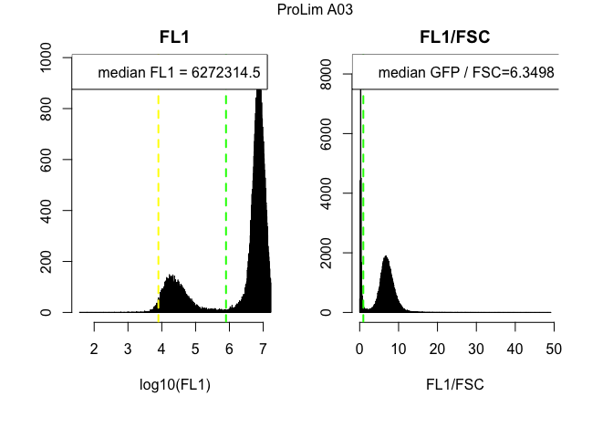

# RNA_Content_Analysis_Pool_052016
`r Sys.info()[7]`  
`r Sys.Date()`  


**Experiment overview**

Write a detailed description of your experiment here including the goal of the analysis and your interpretation of the results.   
If you still see this text it means that you have not described the experiment and whatever follows is meaningless.
###############################

> This code is designed for use with the Accuri flow cytometer, which is equiped with the following lasers and filters

* Blue laser (488 nm)
  + FL1 filter = 514/20nm   GFP
  + FL3 filter = 575/25nm   YFP

* Yellow/green laser (552 nm)
  + FL2 filter = 610/20nm   mCherry, dtomato
  + FL4 filter = 586/15nm   DsRed
  
  

**Requirements**  
In order to run this code you need:  
  + to predefine your gates using the **gating.R** script  
  + the **gates.Rdata** workspace, which contains the gates used in this script  
  + the path of the directory(ies), given the variable names **dir1**, **dir2**... that contain .fcs files named A01.fcs, A02.fcs, A03.fcs...  
  + a tab delimited sample sheet in each directory with the following rows: <Well>	<Strain>	<Genotype>	<Ploidy>	<Media>	<Experiment>  
  + the variable names are changed in chunk 2 named "Variable Names"    


**Output**  
This script generates a summary of results followed by quality control plots.  


#Step 1: Load relevant libraries 

```r
# This is a function that just makes sure you have a package, or installs it for you without prompting

requireInstall <- function(packageName,isBioconductor=F) {
  if ( !try(require(packageName,character.only=T)) ) {
    print(paste0("You don't have ",packageName," accessible, ",
      "I'm gonna install it"))
    if (isBioconductor) {
      source("http://bioconductor.org/biocLite.R")                        
      biocLite(packageName)                                                 
    } else {
      install.packages("packageName", repos = "http://cran.us.r-project.org")
    }
  }
  return(1)
}

#Load libraries
requireInstall("flowCore",isBioconductor=T)
```

```
## Loading required package: flowCore
```

```
## [1] 1
```

```r
requireInstall("flowViz",isBioconductor=T)
```

```
## Loading required package: flowViz
```

```
## Loading required package: lattice
```

```
## [1] 1
```

```r
requireInstall("flowStats")
```

```
## Loading required package: flowStats
```

```
## Loading required package: fda
```

```
## Loading required package: splines
```

```
## Loading required package: Matrix
```

```
## 
## Attaching package: 'Matrix'
```

```
## The following object is masked from 'package:flowCore':
## 
##     %&%
```

```
## 
## Attaching package: 'fda'
```

```
## The following object is masked from 'package:graphics':
## 
##     matplot
```

```
## Loading required package: cluster
```

```
## Loading required package: flowWorkspace
```

```
## Loading required package: ncdfFlow
```

```
## Loading required package: RcppArmadillo
```

```
## Loading required package: BH
```

```
## Loading required package: gridExtra
```

```
## [1] 1
```

```r
requireInstall("Hmisc")
```

```
## Loading required package: Hmisc
```

```
## Loading required package: survival
```

```
## Loading required package: Formula
```

```
## Loading required package: ggplot2
```

```
## 
## Attaching package: 'Hmisc'
```

```
## The following object is masked from 'package:gridExtra':
## 
##     combine
```

```
## The following objects are masked from 'package:base':
## 
##     format.pval, round.POSIXt, trunc.POSIXt, units
```

```
## [1] 1
```

```r
requireInstall("reshape2")
```

```
## Loading required package: reshape2
```

```
## [1] 1
```

```r
requireInstall("ggplot2")
```

```
## [1] 1
```

```r
requireInstall("flowWorkspace")
```

```
## [1] 1
```

```r
requireInstall("ggcyto", isBioconductor=T)
```

```
## Loading required package: ggcyto
```

```
## [1] 1
```

```r
requireInstall("gridExtra")
```

```
## [1] 1
```

#Step 2: Read in .fcs files, an Rdata file containing the gates sample sheet(s) that contains four columns with 
* column1 = Well
* column2 = Strain
* column3 = Staining
* column4 = Media
* column5 = Userdefined


```r
#Read in all data for analysis. Data should be in individual directories that contain .fcs files and a corresponding sample sheet with a generic format. FCS file names should be unaltered e.g AO1.fcs, A02.fcs, ...H12.fcs 
#An abitrary number of directories can be used named dir1, dir2, dir3...with a corresponding flowData.1, flowData.2, flowData.3...and sample.sheet.1, sample.sheet.2, sample.sheet.3...

#load the Rdata file containing the gates
#load("gates.Rdata") 

#Define the directory, or directories, containing your .fcs files using absolute path names 
dir1 <- "/Users/nathanbrandt/Google Drive/Transfer_Folder/RNA_Content_Analysis_SPARQ/TotalRNA_GAP1_GFP_Pool_052016"

#Read in all the fcs files in the directory, with alter.names changing "-" to "."  
flowData <- read.flowSet(path = dir1, pattern=".fcs", alter.names=TRUE)

#Read in the sample sheet that should be in each directory that contains the .fcs files.  
sample.sheet <- read.csv("/Users/nathanbrandt/Google Drive/Transfer_Folder/RNA_Content_Analysis_SPARQ/TotalRNA_GAP1_GFP_Pool_052016_SampleSheet.csv")

#Change names of samples to those specified in the sample sheets
sampleNames(flowData) <- paste(sample.sheet[,5], sample.sheet[,1], sep=" ")
```


```r
#Check how many cells were counted in each fcs file
fsApply(flowData, each_col, length)[1:6]
```

```
## [1] 100000 100000 100000 100000 100000 100000
```

```r
total <- fsApply(flowData, each_col, length)[1:6]  #total counts per sample

#Print the medians of data values for each measurement
fsApply(flowData, each_col, median)
```

```
##               FSC.A    SSC.A     FL1.A    FL2.A   FL3.A    FL4.A   FSC.H
## ProLim A01 982671.0 124708.0    1169.0    302.0     608    360.0 1339916
## ProLim A02 806479.5 142332.5  763469.5 137153.0  322598 108053.0 1125442
## ProLim A03 923712.5 142977.0 6272314.5 404688.5 1538678 307749.5 1266628
## ProLim A04 924887.5 105328.5    1413.0    294.0     644    290.0 1295286
## ProLim A05 684779.0 115668.5  505632.5 120072.5  250878  99814.0  996817
## ProLim A06 776362.0 115669.0 4487294.0 377265.0 1234174 301538.5 1114424
##               SSC.H     FL1.H    FL2.H     FL3.H    FL4.H Width Time
## ProLim A01 162951.0    1649.0    189.0    1560.0    481.0    69 2553
## ProLim A02 185034.5  735428.0 115010.0  290649.0  82392.5    65  701
## ProLim A03 180496.0 6013710.5 355101.5 1419132.0 248648.0    68  870
## ProLim A04 138824.0    1803.0    185.0    1590.0    442.0    67 1619
## ProLim A05 154697.5  503955.5 100311.5  226740.5  75668.5    62 1004
## ProLim A06 149794.0 4456455.0 323978.5 1116640.5 242893.0    64 1211
```

```r
samples.num <- length(flowData) #number of samples
```

#Step 3: apply filters to data and generate plots showing the effect on filtering

```r
##Subset the data by applying sequential gates##

#apply doublet gate
flowData.singlets <- Subset(flowData, pg.singlets) 
fsApply(flowData.singlets, each_col, length)[1:samples.num]
singlets <- fsApply(flowData.singlets, each_col, length)[1:samples.num]
barplot(singlets/total, ylim=c(0,1), ylab = "Proportion singlet cells", las=2, cex.names = 0.5, names.arg=sampleNames(flowData))

#apply debris gate
filteredData <- Subset(flowData.singlets, pg.nondebris) 
fsApply(filteredData, each_col, length)[1:samples.num]
non.debris <- fsApply(filteredData, each_col, length)[1:samples.num]
barplot(non.debris/total, ylim=c(0,1), ylab = "Proportion singlet and nondebris cells", las=2, cex.names = 0.5, names.arg=sampleNames(flowData))

#########
#filteredData is the variable name for the data filtered of doublets and debris that are used for all subsequent analyses
##########

#this gate defines nongfp cells
gfp.neg <- Subset(filteredData, pg.nongfp) 
fsApply(gfp.neg, each_col, length)[1:samples.num]
non.gfp <- fsApply(gfp.neg, each_col, length)[1:samples.num]
barplot(non.gfp/non.debris, ylim=c(0,1), ylab = "Proportion cells with no GFP", las=2, cex.names = 0.5, names.arg=sampleNames(flowData))

#this gate defines gfp cells
gfp.pos <- Subset(filteredData, pg.gfp) 
fsApply(gfp.pos, each_col, length)[1:samples.num]
gfp.cells <- fsApply(gfp.pos, each_col, length)[1:samples.num]
barplot(gfp.cells/non.debris, ylim=c(0,1), ylab = "Proportion cells with GFP", las=2, cex.names = 0.5, names.arg=sampleNames(flowData))

#this gate defines high GFP cells
gfp.hi <- Subset(filteredData, pg.hi.gfp) 
fsApply(gfp.hi, each_col, length)[1:samples.num]
hi.gfp.cells <- fsApply(gfp.hi, each_col, length)[1:samples.num]
barplot(hi.gfp.cells/non.debris, ylim=c(0,1), ylab = "Proportion cells with high GFP", las=2, cex.names = 0.5, names.arg=sampleNames(flowData))
```


```r
filteredData <- flowData
```

#Step 4: Data analysis

##diagnostic values can be defined for plotting purposes

```r
#define critical values that can superimposed on plots for easy visual comparison

gfp.bg <- 3.9  #a background value for GFP
gfp.wt <- 5.9 #a value for wildtype GFP expression
red.bg <- 3.03 #a background value for the red channel
red.wt <- 3.75 #a value for wildtype Red expression
haploid.fsc <- 6e5 #an empirical value for forward scatter for haploids
diploid.fsc <- 7e5 #an empirical value for forward scatter for diploids
gfp.norm <- 0.935 #an empricial value for gfp expression normalized by forward scatter
red.norm <- 0.57 #an empricial value for red expression normalized by forward scatter
gfp.red.norm <- 1.5 #an empricial value for gfp expression normalized by red channel
```

##Extract data from fcs files to generate statistics and boxplots

```r
#record summary statistics for each sample in a matrix named summary.stats 
summary.stats <- matrix(data = NA, nrow = length(filteredData), ncol = 18, dimnames = list(sampleNames(filteredData),c("FSC_median","FSC_mean", "FSC_sd","FL1_median", "FL1_mean","FL1_sd","normalizedGFP_median", "normalizedGFP_mean", "normalizedGFP_sd","FL2_median","FL2_mean","FL2_sd","normalizedRed_median","normalizedRed_mean", "normalizedRed_sd","GFPnormalizedByRed_median", "GFPnormalizedByRed_mean","GFPnormalizedByRed_sd")))

#use the sample containing the minimum number of points after filtering for doublets and debris to define the number of data points retained for all samples
sample.size <- min(fsApply(filteredData, each_col, length))  

print(sample.size)
```

```
## [1] 100000
```

```r
comparison.FSC <- matrix(data = NA, nrow = sample.size, ncol = length(filteredData), byrow = FALSE,dimnames = NULL)
comparison.FL1 <- matrix(data = NA, nrow = sample.size, ncol = length(filteredData), byrow = FALSE,dimnames = NULL)
comparison.FL2 <- matrix(data = NA, nrow = sample.size, ncol = length(filteredData), byrow = FALSE,dimnames = NULL)
comparison.FL1NormFsc <- matrix(data = NA, nrow = sample.size, ncol = length(filteredData), byrow = FALSE,dimnames = NULL)
comparison.FL2NormFsc <- matrix(data = NA, nrow = sample.size, ncol = length(filteredData), byrow = FALSE,dimnames = NULL)
comparison.FL1NormFL2 <- matrix(data = NA, nrow = sample.size, ncol = length(filteredData), byrow = FALSE,dimnames = NULL)

#for each sample plot a histogram of the normalized data, raw FSC and raw GFP per row
par(mfrow=c(1,2), mar=c(5.1,2.1,2.1,2.1), oma=c(1.5,2,1,1))

#extract data from flowFrames to plot histograms of values and record summary statistics
for (i in 1:length(filteredData)){
 
  temp <- exprs(filteredData[[i]]) #exprs() extracts a matrix of the values from the flowframe
 

  ##########################################
  #record summary statistics for the sample#
  ##########################################
  
  #FSC
  summary.stats[i,1] <- median(temp[,1]) 
  summary.stats[i,2] <-mean(temp[,1])  
  summary.stats[i,3] <- sd(temp[,1])
  #FL1
  summary.stats[i,4] <- median(temp[,3])
  summary.stats[i,5] <-mean(temp[,3])  
  summary.stats[i,6] <- sd(temp[,3])
  #FL1 (GFP) divided by FSC
  summary.stats[i,7] <- median(temp[,3]/temp[,1])
  summary.stats[i,8] <-mean(temp[,3]/temp[,1])  
  summary.stats[i,9] <- sd(temp[,3]/temp[,1])
  #FL2
  summary.stats[i,10] <- median(temp[,4])
  summary.stats[i,11] <-mean(temp[,4])  
  summary.stats[i,12] <- sd(temp[,4])
  #FL2 (Red) divided by FSC
  summary.stats[i,13] <- median(temp[,4]/temp[,1])
  summary.stats[i,14] <-mean(temp[,4]/temp[,1])  
  summary.stats[i,15] <- sd(temp[,4]/temp[,1])
  #FL1 (GFP) divided by FL2 (Red)
  summary.stats[i,16] <- median(temp[,3]/temp[,4])
  summary.stats[i,17] <-mean(temp[,3]/temp[,4])  
  summary.stats[i,18] <- sd(temp[,3]/temp[,4])  
  
  ##############################################
  #plot histograms of the channels of interest##
  ##############################################

  ###############
  #Green channel#
  ###############
  
  #FL1 (GFP)
  hist(log10(temp[,3]), br=1000, xlab = "log10(FL1)", main = "FL1") 
  abline(v=gfp.bg, col="yellow", lty=2, lwd=2)
  abline(v=gfp.wt, col="green", lty=2, lwd=2) 
  legend("topleft",  legend=paste("median FL1 = ",round(median(temp[,3]), digits=4),sep=""))

  #GFP divided by FSC
  hist(temp[,3]/temp[,1], br=500, xlab = "FL1/FSC", main = "FL1/FSC") 
  abline(v=gfp.norm, col="green", lty=2, lwd=2 )
  legend("topleft",  legend=paste("median GFP / FSC=",round(median(temp[,3]/temp[,1]), digits=4),sep=""))
  
  mtext(sampleNames(filteredData[i]), outer = TRUE, cex = 1.0)
  
  ###############
  #Red channel#
  ###############
  #FL2 (Red)
  hist(log10(temp[,4]), br=500, xlab = "log10(FL2)", main = "FL2") 
  abline(v=red.bg, col="yellow", lty=2, lwd=2)
  abline(v=red.wt, col="red", lty=2, lwd=2) 
  legend("topleft",  legend=paste("median FL2=",round(median(temp[,4]), digits=4),sep=""))
 
  #FL2 divided by FSC
  hist(temp[,4]/temp[,1], br=500, xlab = "FL2/FSC", main = "FL2/FSC") 
  abline(v=red.norm, col="red", lty=2, lwd=2 )
  legend("topleft",  legend=paste("median FL2 / FSC=",round(median(temp[,4]/temp[,1]), digits=4),sep=""))

  mtext(sampleNames(filteredData[i]), outer = TRUE, cex = 1.0)
  
  ###############
  #Other#########
  ###############
  
  #FL1 divided by FL2
  hist(temp[,4]/temp[,3], br=500, xlab = "FL2/FL1", main = "FL1/FL2") 
  abline(v=gfp.red.norm, col="purple", lty=2, lwd=2)
  legend("topleft",  legend=paste("median FL1 / FL2=",round(median(temp[,4]/temp[,3]), digits=4),sep=""))

    #FSC
  hist(log10(temp[,1]), br=500, xlab = "log10(FSC)", main = "FSC", xlim=c(4,8)) 
  abline(v=haploid.fsc, col="blue", lty=2, lwd=2)
  abline(v=diploid.fsc, col="grey", lty=2, lwd=2)
  legend("topleft",  legend=paste("median FSC=",round(median(temp[,1]), digits=4),sep=""))
  
  mtext(sampleNames(filteredData[i]), outer = TRUE, cex = 1.0)

print("-------------------------------------------------------")
print("-----------------------------------")
print("----------------------")

  ############################################################
  #keep the data set for generating boxplots comparing values#
  ############################################################
  
  #Note that the amount of data kept for each sample is defined by the lowest count among all the samples.
  comparison.FSC[1:sample.size,i] <- temp[1:sample.size,1] #FSC
  comparison.FL1[1:sample.size,i] <- temp[1:sample.size,3] #FL1 (GFP)
  comparison.FL1NormFsc[1:sample.size,i] <- temp[1:sample.size,3]/temp[1:sample.size,1] #GFP/FSC
  comparison.FL2[1:sample.size,i] <- temp[1:sample.size,4] #FL2 
  comparison.FL2NormFsc[1:sample.size,i] <- temp[1:sample.size,4]/temp[1:sample.size,1] #FL2/FSC
  comparison.FL1NormFL2[1:sample.size,i] <- temp[1:sample.size,3]/temp[1:sample.size,4] #FL1/FL2
  
}
```

<!-- --><!-- --><!-- -->

```
## [1] "-------------------------------------------------------"
## [1] "-----------------------------------"
## [1] "----------------------"
```

<!-- --><!-- --><!-- -->

```
## [1] "-------------------------------------------------------"
## [1] "-----------------------------------"
## [1] "----------------------"
```

<!-- --><!-- --><!-- -->

```
## [1] "-------------------------------------------------------"
## [1] "-----------------------------------"
## [1] "----------------------"
```

<!-- --><!-- --><!-- -->

```
## [1] "-------------------------------------------------------"
## [1] "-----------------------------------"
## [1] "----------------------"
```

<!-- --><!-- --><!-- -->

```
## [1] "-------------------------------------------------------"
## [1] "-----------------------------------"
## [1] "----------------------"
```

<!-- --><!-- --><!-- -->

```
## [1] "-------------------------------------------------------"
## [1] "-----------------------------------"
## [1] "----------------------"
```

```r
par(mfrow=c(1,1)) #change number of plots per row back to standard
```


##Overview of data distributions

```r
par(mar=c(8.1,4.1,4.1,2.1)) #create more space at lower margin

boxplot(comparison.FSC, names=sampleNames(filteredData), notch = TRUE, col = "gray", ylab="FSC", cex.axis=0.5,las=2, outline=F)
abline(h=haploid.fsc, lty=2, col=2)
abline(h=diploid.fsc, lty=2, col=3)
```

<!-- -->

```r
boxplot(comparison.FL1, names=sampleNames(filteredData), notch = TRUE, col = "lightgreen", ylab="FL1", cex.axis=0.5,las=2, outline=F)
abline(h=gfp.bg ,lty=2, lwd=3, col="yellow")
abline(h=gfp.wt, lty = 2, lwd=3, col="green")
```

<!-- -->

```r
boxplot(comparison.FL1NormFsc, names=sampleNames(filteredData), notch = TRUE, col = "green", ylab="FL1/FSC", cex.axis=0.5,las=2, outline=F)
abline(h=gfp.norm, lty=2, lwd=3, col="blue")
```

<!-- -->

```r
boxplot(comparison.FL2, names=sampleNames(filteredData), notch = TRUE, col = "pink", ylab="FL2", cex.axis=0.5,las=2, outline=F)
abline(h=red.bg, lty=2, lwd=3, col="pink")
abline(h=red.wt, lty=2, lwd=3, col="red")
```

<!-- -->

```r
boxplot(comparison.FL2NormFsc, names=sampleNames(filteredData), notch = TRUE, col = "red", ylab="FL2/FSC", cex.axis=0.5,las=2, outline=F)
abline(h=red.norm, lty=2, lwd=3, col="red")
```

<!-- -->

```r
boxplot(comparison.FL1NormFL2, names=sampleNames(filteredData), notch = TRUE, col = "purple", ylab="FL1/FL2", cex.axis=0.5,las=2, outline=F)
abline(h=gfp.red.norm, lty=2, lwd=3, col="purple")
```

<!-- -->

```r
par(mar=c(5.1,4.1,4.1,2.1)) #reset margins to default

#generate a summary table containing all the recorded statistics
print(summary.stats)
```

```
##            FSC_median  FSC_mean   FSC_sd FL1_median    FL1_mean
## ProLim A01   982671.0 1046339.3 370654.0     1169.0    1342.465
## ProLim A02   806479.5  796603.8 498689.0   763469.5  788444.124
## ProLim A03   923712.5  891116.3 539022.3  6272314.5 5951406.863
## ProLim A04   924887.5  976289.7 381293.4     1413.0    5095.459
## ProLim A05   684779.0  657367.1 478954.0   505632.5  541926.211
## ProLim A06   776362.0  721090.4 568609.3  4487294.0 4376322.803
##                 FL1_sd normalizedGFP_median normalizedGFP_mean
## ProLim A01    2719.248          0.001155611        0.001348189
## ProLim A02  633494.417          0.867368405        0.819594175
## ProLim A03 4127286.222          6.349811548        5.632042695
## ProLim A04  151838.545          0.001506823        0.005002441
## ProLim A05  546970.725          0.683161067        0.624912328
## ProLim A06 3995868.216          5.287199622        4.427831956
##            normalizedGFP_sd FL2_median    FL2_mean     FL2_sd
## ProLim A01      0.002182262      302.0    336.8993    945.901
## ProLim A02      0.496444780   137153.0 286497.2316 627569.380
## ProLim A03      3.558128346   404688.5 530982.3246 632651.451
## ProLim A04      0.139459972      294.0    560.2495  16135.575
## ProLim A05      0.424223351   120072.5 301671.7234 641776.016
## ProLim A06      3.521417285   377265.0 542703.3972 738705.665
##            normalizedRed_median normalizedRed_mean normalizedRed_sd
## ProLim A01         0.0002971695       0.0003588200      0.000732586
## ProLim A02         0.1504143664       0.9385010595      1.825692499
## ProLim A03         0.4371162736       1.2435593910      1.952136381
## ProLim A04         0.0003121200       0.0007340188      0.026464709
## ProLim A05         0.1434665006       1.1416698947      1.807630677
## ProLim A06         0.4980920726       1.6580918986      2.169839884
##            GFPnormalizedByRed_median GFPnormalizedByRed_mean
## ProLim A01                        NA                     NaN
## ProLim A02                  6.570847                     Inf
## ProLim A03                        NA                     NaN
## ProLim A04                        NA                     NaN
## ProLim A05                        NA                     NaN
## ProLim A06                        NA                     NaN
##            GFPnormalizedByRed_sd
## ProLim A01                    NA
## ProLim A02                   NaN
## ProLim A03                    NA
## ProLim A04                    NA
## ProLim A05                    NA
## ProLim A06                    NA
```

```r
summary.stats <- as.data.frame(summary.stats)
```


##Quantitation of relative FL1 signal

```r
baseline.FL1 <- summary.stats$FL1_median[1]

barplot(summary.stats$FL1_median/baseline.FL1, ylab="Relative FL1 median expression", las=2, cex.names = 0.5, names.arg=sampleNames(filteredData))
```

<!-- -->

##Quantitation of forward scatter

```r
baseline.FSC <- summary.stats$FSC_median[1]

barplot(summary.stats$FSC_median/baseline.FSC, ylab="Relative median FSC", las=2, cex.names = 0.5, names.arg=sampleNames(filteredData))
```

<!-- -->

##Population composition

```r
pop.composition <- rbind(non.gfp/non.debris,gfp.cells/non.debris,hi.gfp.cells/non.debris)
barplot(pop.composition, ylab="Proportion of population", legend=c("No GFP", "Normal GFP", "High GFP"),las=2, cex.names = 0.5,names.arg=sampleNames(filteredData))
```

#Step 5: Quality control

##Gates

```r
###First flowset
#Singlets gate
xyplot(FSC.A~FSC.H, data=flowData.1, xlim=c(0,3e6), ylim=c(0,3e6), filter=pg.singlets,  smooth=F, xbin=1024, stat=T, pos=0.5, abs=T, main = "First flowset - singlets gate")

#Debris gate
xyplot(SSC.A ~ FSC.A, data=flowData.1, displayFilter=TRUE, xlim=c(0,3e6), ylim=c(0,3e5), filter=pg.nondebris, smooth=F, xbin=1024, stat=T, pos=0.5, abs=T,  main = "First flowset - nondebris gate")

#Non-fluorescent population gate
xyplot(FL1.A~FSC.A,data=flowData.1, displayFilter=TRUE, xlim=c(0,5e6), ylim=c(0,5e4), filter=pg.nongfp, smooth=F, xbin=1024, stat=T, pos=0.5, abs=T,  main = "First flowset - non GFP gate")

#Fluorescent population gate
xyplot(FL1.A~FSC.A,data=flowData.1, displayFilter=TRUE, xlim=c(0,5e6), ylim=c(0,5e4), filter=pg.gfp, smooth=F, xbin=1024, stat=T, pos=0.5, abs=T, main = "First flowset - GFP gate")

#High fluorescing gate
xyplot(FL1.A~FSC.A,data=flowData.1, xlim=c(0,5e6), ylim=c(0,5e4), filter=pg.hi.gfp, smooth=F, xbin=1024, stat=T, pos=0.5, abs=T,  main = "First flowset - high GFP gate")

################
###Second flowset
#Singlets gate
xyplot(FSC.A~FSC.H, data=flowData.2, xlim=c(0,3e6), ylim=c(0,3e6), filter=pg.singlets,  smooth=F, xbin=1024, stat=T, pos=0.5, abs=T, main = "Second flowset - singlets gate")

#Debris gate
xyplot(SSC.A ~ FSC.A, data=flowData.2, displayFilter=TRUE, xlim=c(0,3e6), ylim=c(0,3e5), filter=pg.nondebris, smooth=F, xbin=1024, stat=T, pos=0.5, abs=T,  main = "Second flowset  - nondebris gate")

#Non-fluorescent population gate
xyplot(FL1.A~FSC.A,data=flowData.2, displayFilter=TRUE, xlim=c(0,5e6), ylim=c(0,5e4), filter=pg.nongfp, smooth=F, xbin=1024, stat=T, pos=0.5, abs=T,  main = "Second flowset - non GFP gate")

#Fluorescent population gate
xyplot(FL1.A~FSC.A,data=flowData.2, displayFilter=TRUE, xlim=c(0,5e6), ylim=c(0,5e4), filter=pg.gfp, smooth=F, xbin=1024, stat=T, pos=0.5, abs=T, main = "Second flowset - GFP gate")

#High fluorescing gate 
xyplot(FL1.A~FSC.A,data=flowData.2, xlim=c(0,5e6), ylim=c(0,5e4), filter=pg.hi.gfp, smooth=F, xbin=1024, stat=T, pos=0.5, abs=T,  main = "Second flowset - high GFP gate")


#####Attempted as loop below to plot each one individually and is not working

for (i in 1:length(filteredData)){

#Singlets gate
xyplot(FSC.A~FSC.H, data=flowData[i], xlim=c(0,3e6), ylim=c(0,3e6), filter=pg.singlets,  smooth=F, xbin=1024, stat=T, pos=0.5, abs=T, main = sampleNames(flowData)[i])

#Debris gate
xyplot(SSC.A ~ FSC.A, data=flowData[i], displayFilter=TRUE, xlim=c(0,3e5), ylim=c(0,3e6), filter=pg.nondebris, smooth=F, xbin=1024, stat=T, pos=0.5, abs=T, main = sampleNames(flowData)[i])

#Non-fluorescent population gate
xyplot(FL1.A~FSC.A,data=flowData[i], displayFilter=TRUE, xlim=c(0,5e6), ylim=c(0,5e4), filter=pg.nongfp, smooth=F, xbin=1024, stat=T, pos=0.5, abs=T, main = sampleNames(flowData)[i])

#Fluorescent population gate
xyplot(FL1.A~FSC.A,data=flowData[i], displayFilter=TRUE, xlim=c(0,5e6), ylim=c(0,5e4), filter=pg.gfp, smooth=F, xbin=1024, stat=T, pos=0.5, abs=T, main = sampleNames(flowData)[i])

#High fluorescing gate
xyplot(FL1.A~FSC.A,data=flowData[i], xlim=c(0,5e6), ylim=c(0,5e4), filter=pg.hi.gfp, smooth=F, xbin=1024, stat=T, pos=0.5, abs=T, main = sampleNames(flowData)[i])

}
```


##Data transformation for visualization

```r
#In order to look at QC plots the data is transformed using the logicle transform, which is a log transform for high values that transitions to a linear transformation near zero values 

#This is simply for visualization purposes

lgcl <- logicleTransform(w = 0.5, t= 10000, m=4.5) #the parameters w,t, and m define the transformation parameters

#Dataset 1 tranformation applied to every channel except width and time
dataLGCLTransform <- transform(filteredData,'FSC.A' = lgcl(`FSC.A`), 'SSC.A' =lgcl(`SSC.A`), 'FL1.A' = lgcl(`FL1.A`), 'FL2.A' = lgcl(`FL2.A`), 'FL3.A' = lgcl(`FL3.A`), 'FL4.A' = lgcl(`FL4.A`),'FSC.H' = lgcl(`FSC.H`),'SSC.H' = lgcl(`SSC.H`),'FL1.H' = lgcl(`FL1.H`),'FL2.H' = lgcl(`FL2.H`),'FL3.H' = lgcl(`FL3.H`),'FL4.H' = lgcl(`FL4.H`)) 
```

##Effect of time

```r
#The effect of time on signal (of which there shouldn't be any)
i <- 1
xyplot(FL1.A ~ Time, data=dataLGCLTransform[i], smooth=F,  stat=T, pos=0.5, abs=T, xlim=c(150,250), main = sampleNames(filteredData)[i])
```

<!-- -->

```r
i <- 2
xyplot(FL1.A ~ Time, data=dataLGCLTransform[i], smooth=F,  stat=T, pos=0.5, abs=T, xlim=c(150,250), main = sampleNames(filteredData)[i])
```

<!-- -->

```r
i <- 3
xyplot(FL1.A ~ Time, data=dataLGCLTransform[i], smooth=F,  stat=T, pos=0.5, abs=T, xlim=c(150,250), main = sampleNames(filteredData)[i])
```

<!-- -->

```r
####Attempted as loop and will not work 
for (i in 1:length(filteredData)){
xyplot(FL1.A ~ Time, data=dataLGCLTransform[i], smooth=F,  stat=T, pos=0.5, abs=T, xlim=c(150,250), main = sampleNames(filteredData)[i])
}
```

##Plots of FL1 versus FSC

```r
i <- 1
xyplot(FL1.A ~ FSC.A, data=dataLGCLTransform[i], smooth=F,  stat=T, pos=0.5, abs=T, xlim=c(4,8), sampleNames(filteredData)[i])
```

```
## Warning: 'filter' must either be a filtersList,filterResultList, a single
## filter object or a named list of filter objects.
```

<!-- -->

```r
i <- 2
xyplot(FL1.A ~ FSC.A, data=dataLGCLTransform[i], smooth=F,  stat=T, pos=0.5, abs=T, xlim=c(4,8), sampleNames(filteredData)[i])
```

```
## Warning: 'filter' must either be a filtersList,filterResultList, a single
## filter object or a named list of filter objects.
```

<!-- -->

```r
i <- 3
xyplot(FL1.A ~ FSC.A, data=dataLGCLTransform[i], smooth=F,  stat=T, pos=0.5, abs=T, xlim=c(4,8), sampleNames(filteredData)[i])
```

```
## Warning: 'filter' must either be a filtersList,filterResultList, a single
## filter object or a named list of filter objects.
```

<!-- -->

```r
####Attempted as loop and will not work 
for (i in 1:length(filteredData)){
xyplot(FL1.A ~ FSC.A, data=dataLGCLTransform[i], smooth=F,  stat=T, pos=0.5, abs=T, xlim=c(4,8), ylim=c(2,6), sampleNames(filteredData)[i])
}
```

##Plots of FSC versus SSC

```r
i <- 1
xyplot(SSC.A ~ FSC.A, data=dataLGCLTransform[i], smooth=F,  stat=T, pos=0.5, abs=T, xlim=c(4,8), ylim=c(4,8), sampleNames(filteredData)[i])
```

```
## Warning: 'filter' must either be a filtersList,filterResultList, a single
## filter object or a named list of filter objects.
```

<!-- -->

```r
i <- 2
xyplot(SSC.A ~ FSC.A, data=dataLGCLTransform[i], smooth=F,  stat=T, pos=0.5, abs=T, xlim=c(4,8), ylim=c(4,8), sampleNames(filteredData)[i])
```

```
## Warning: 'filter' must either be a filtersList,filterResultList, a single
## filter object or a named list of filter objects.
```

<!-- -->

```r
i <- 3
xyplot(SSC.A ~ FSC.A, data=dataLGCLTransform[i], smooth=F,  stat=T, pos=0.5, abs=T, xlim=c(4,8), ylim=c(4,8), sampleNames(filteredData)[i])
```

```
## Warning: 'filter' must either be a filtersList,filterResultList, a single
## filter object or a named list of filter objects.
```

<!-- -->

```r
####Attempted as loop and will not work 
for (i in 1:length(filteredData)){
xyplot(SSC.A ~ FSC.A, data=dataLGCLTransform[i], smooth=F,  stat=T, pos=0.5, abs=T, xlim=c(4,8), ylim=c(4,8), sampleNames(filteredData)[i])
}
```


