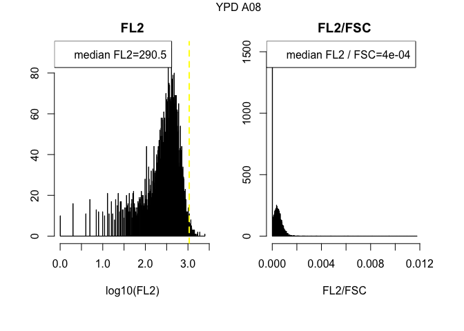
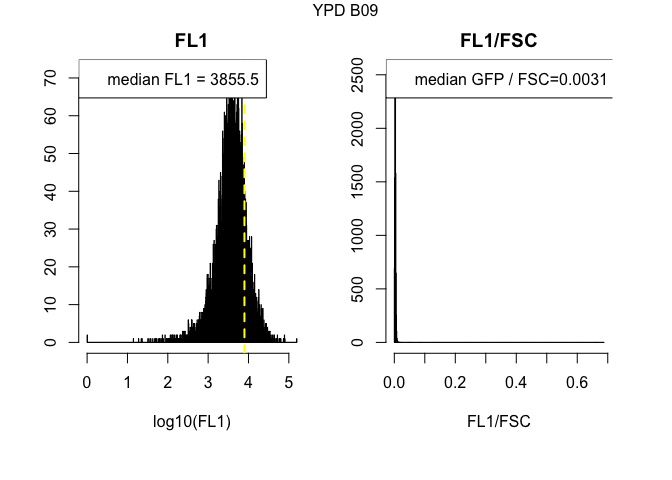
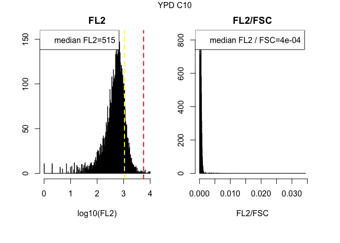
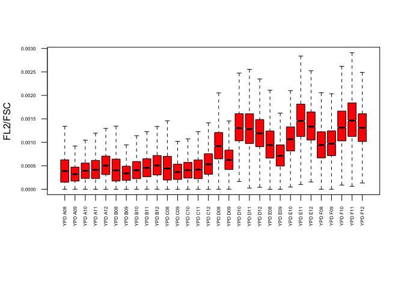
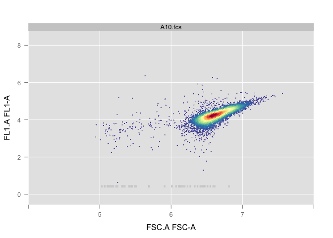
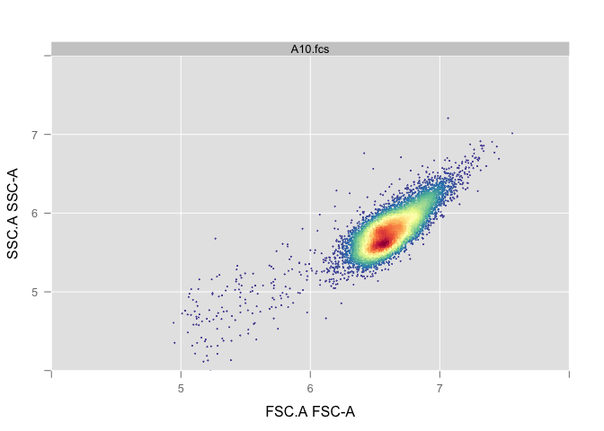

# RNA_Content_Analysis_SPARQ_12122016
`r Sys.info()[7]`  
`r Sys.Date()`  


**Experiment overview**

Write a detailed description of your experiment here including the goal of the analysis and your interpretation of the results.   
If you still see this text it means that you have not described the experiment and whatever follows is meaningless.
###############################

> This code is designed for use with the Accuri flow cytometer, which is equiped with the following lasers and filters

* Blue laser (488 nm)
  + FL1 filter = 514/20nm   GFP
  + FL3 filter = 575/25nm   YFP

* Yellow/green laser (552 nm)
  + FL2 filter = 610/20nm   mCherry, dtomato
  + FL4 filter = 586/15nm   DsRed
  
  

**Requirements**  
In order to run this code you need:  
  + to predefine your gates using the **gating.R** script  
  + the **gates.Rdata** workspace, which contains the gates used in this script  
  + the path of the directory(ies), given the variable names **dir1**, **dir2**... that contain .fcs files named A01.fcs, A02.fcs, A03.fcs...  
  + a tab delimited sample sheet in each directory with the following rows: <Well>	<Strain>	<Genotype>	<Ploidy>	<Media>	<Experiment>  
  + the variable names are changed in chunk 2 named "Variable Names"    


**Output**  
This script generates a summary of results followed by quality control plots.  


#Step 1: Load relevant libraries 

```r
# This is a function that just makes sure you have a package, or installs it for you without prompting

requireInstall <- function(packageName,isBioconductor=F) {
  if ( !try(require(packageName,character.only=T)) ) {
    print(paste0("You don't have ",packageName," accessible, ",
      "I'm gonna install it"))
    if (isBioconductor) {
      source("http://bioconductor.org/biocLite.R")                        
      biocLite(packageName)                                                 
    } else {
      install.packages("packageName", repos = "http://cran.us.r-project.org")
    }
  }
  return(1)
}

#Load libraries
requireInstall("flowCore",isBioconductor=T)
```

```
## Loading required package: flowCore
```

```
## [1] 1
```

```r
requireInstall("flowViz",isBioconductor=T)
```

```
## Loading required package: flowViz
```

```
## Loading required package: lattice
```

```
## [1] 1
```

```r
requireInstall("flowStats")
```

```
## Loading required package: flowStats
```

```
## Loading required package: fda
```

```
## Loading required package: splines
```

```
## Loading required package: Matrix
```

```
## 
## Attaching package: 'Matrix'
```

```
## The following object is masked from 'package:flowCore':
## 
##     %&%
```

```
## 
## Attaching package: 'fda'
```

```
## The following object is masked from 'package:graphics':
## 
##     matplot
```

```
## Loading required package: cluster
```

```
## Loading required package: flowWorkspace
```

```
## Loading required package: ncdfFlow
```

```
## Loading required package: RcppArmadillo
```

```
## Loading required package: BH
```

```
## Loading required package: gridExtra
```

```
## [1] 1
```

```r
requireInstall("Hmisc")
```

```
## Loading required package: Hmisc
```

```
## Loading required package: survival
```

```
## Loading required package: Formula
```

```
## Loading required package: ggplot2
```

```
## 
## Attaching package: 'Hmisc'
```

```
## The following object is masked from 'package:gridExtra':
## 
##     combine
```

```
## The following objects are masked from 'package:base':
## 
##     format.pval, round.POSIXt, trunc.POSIXt, units
```

```
## [1] 1
```

```r
requireInstall("reshape2")
```

```
## Loading required package: reshape2
```

```
## [1] 1
```

```r
requireInstall("ggplot2")
```

```
## [1] 1
```

```r
requireInstall("flowWorkspace")
```

```
## [1] 1
```

```r
requireInstall("ggcyto", isBioconductor=T)
```

```
## Loading required package: ggcyto
```

```
## [1] 1
```

```r
requireInstall("gridExtra")
```

```
## [1] 1
```

#Step 2: Read in .fcs files, an Rdata file containing the gates sample sheet(s) that contains four columns with 
* column1 = Well
* column2 = Strain
* column3 = Staining
* column4 = Media
* column5 = Userdefined


```r
#Read in all data for analysis. Data should be in individual directories that contain .fcs files and a corresponding sample sheet with a generic format. FCS file names should be unaltered e.g AO1.fcs, A02.fcs, ...H12.fcs 
#An abitrary number of directories can be used named dir1, dir2, dir3...with a corresponding flowData.1, flowData.2, flowData.3...and sample.sheet.1, sample.sheet.2, sample.sheet.3...

#load the Rdata file containing the gates
#load("gates.Rdata") 

#Define the directory, or directories, containing your .fcs files using absolute path names 
dir1 <- "/Users/nathanbrandt/Google Drive/Transfer_Folder/RNA_Content_Analysis_SPARQ/TotalRNA_KOMutants_12302016"

#Read in all the fcs files in the directory, with alter.names changing "-" to "."  
flowData <- read.flowSet(path = dir1, pattern=".fcs", alter.names=TRUE)

#Read in the sample sheet that should be in each directory that contains the .fcs files.  
sample.sheet <- read.csv("/Users/nathanbrandt/Google Drive/Transfer_Folder/RNA_Content_Analysis_SPARQ/TotalRNA_KOMutatnts_SampleSheet_12302016.csv")

#Change names of samples to those specified in the sample sheets
sampleNames(flowData) <- paste(sample.sheet[,5], sample.sheet[,1], sep=" ")
```


```r
#Check how many cells were counted in each fcs file
fsApply(flowData, each_col, length)[1:6]
```

```
## [1] 10000 10000 10000 10000 10000 10000
```

```r
total <- fsApply(flowData, each_col, length)[1:6]  #total counts per sample

#Print the medians of data values for each measurement
fsApply(flowData, each_col, median)
```

```
##             FSC.A    SSC.A   FL1.A  FL2.A  FL3.A  FL4.A   FSC.H    SSC.H
## YPD A08  742810.0 105631.0  2336.0  290.5  720.0  296.0 1237046 161764.0
## YPD A09 1346577.0 262656.5  4291.0  472.0 1370.0  423.0 1844278 361436.5
## YPD A10 1265609.0 178553.5  5489.0  513.0 1602.0  452.0 1789920 241586.0
## YPD A11  986526.5 139176.5  3904.0  421.0 1180.0  367.0 1446638 192968.0
## YPD A12  862029.5 142669.5  4144.0  458.0 1182.0  534.0 1356770 210939.0
## YPD B08  757199.0 110522.0  2402.0  306.0  776.0  308.0 1210579 166025.5
## YPD B09 1223998.5 219028.5  3855.5  446.0 1239.0  410.0 1791315 319265.0
## YPD B10 1008374.5 147881.0  4583.0  418.0 1229.0  360.0 1536014 215950.0
## YPD B11  911052.5 147237.0  4041.0  437.0 1259.0  394.0 1390020 210051.5
## YPD B12  811110.5 133834.5  3843.0  436.0 1107.0  513.0 1320260 201250.0
## YPD C08  681743.5 106090.0  2229.0  302.0  753.0  318.0 1141735 164441.0
## YPD C09 1112718.5 188733.5  3467.0  440.0 1229.0  398.0 1637549 265234.5
## YPD C10 1229234.0 178298.0  5503.0  515.0 1539.0  472.0 1690244 232224.0
## YPD C11  972518.0 138999.0  3921.0  416.0 1203.0  372.0 1430436 190618.0
## YPD C12  761208.0 124384.5  3551.0  419.0 1081.0  502.0 1263607 189802.0
## YPD D08  695967.0 104745.5 11806.0  639.0 2407.5  580.0 1152895 160978.5
## YPD D09 1232015.5 255679.5 13844.0  808.0 2917.0  703.0 1786590 377614.5
## YPD D10 1308494.5 203013.0 38815.5 1691.0 7173.0 1420.0 1825238 271865.5
## YPD D11  901397.5 140235.5 24514.0 1165.0 4817.5  970.0 1411036 206119.5
## YPD D12  729496.5 123305.0 16085.0  886.0 3324.0  886.0 1205606 188380.5
## YPD E08  653503.0  99592.0 11125.0  611.0 2285.5  570.0 1123386 158140.5
## YPD E09 1150216.0 213446.5 15480.5  841.0 3167.0  738.0 1698964 310058.0
## YPD E10 1044756.5 170410.0 24621.0 1133.0 4672.0  961.0 1609627 249159.5
## YPD E11  966482.0 157241.0 31002.0 1421.0 6044.0 1221.0 1453502 218265.0
## YPD E12  712912.5 121074.5 18361.5  973.0 3755.5  944.0 1197579 189344.5
## YPD F08  702450.5 111375.5 12201.5  661.0 2530.0  602.0 1200076 176609.0
## YPD F09 1062344.5 184942.5 20780.0 1035.0 4148.5  906.0 1563341 256762.5
## YPD F10 1275642.5 197098.5 38608.0 1651.0 7060.5 1404.5 1749370 257572.0
## YPD F11  840404.5 134992.0 26892.5 1256.0 5309.0 1056.0 1362394 202327.5
## YPD F12  760096.0 122086.5 19194.0 1013.0 3840.0  999.0 1225548 183324.5
##           FL1.H  FL2.H  FL3.H  FL4.H Width Time
## YPD A08  2880.0  196.0 1520.0  426.0    58  173
## YPD A09  4316.0  306.0 1834.0  507.0    71  211
## YPD A10  5432.5  341.0 2024.0  519.0    71  241
## YPD A11  3986.0  276.0 1792.5  466.0    66  246
## YPD A12  4482.0  305.0 1775.0  556.0    61  200
## YPD B08  2847.0  204.0 1530.0  434.0    60  203
## YPD B09  4102.5  296.0 1781.5  495.0    67  201
## YPD B10  4888.5  289.0 1851.5  468.0    65  215
## YPD B11  4228.0  293.0 1816.5  479.0    63  210
## YPD B12  4242.5  291.0 1751.0  550.0    60  200
## YPD C08  2726.5  203.0 1524.0  434.0    57  193
## YPD C09  3716.0  284.0 1774.0  492.0    67  207
## YPD C10  5244.0  332.0 1988.5  522.0    71  268
## YPD C11  4008.0  275.0 1794.0  476.0    66  247
## YPD C12  4047.0  284.0 1728.0  543.0    59  202
## YPD D08 13032.0  529.0 2709.0  609.0    58  197
## YPD D09 13233.5  616.0 2946.5  683.0    68  201
## YPD D10 35488.0 1395.5 6531.0 1240.0    70  232
## YPD D11 24898.0 1011.0 4783.0  929.0    62  214
## YPD D12 17079.0  728.0 3444.0  819.5    58  204
## YPD E08 12689.0  517.0 2625.0  603.0    56  195
## YPD E09 14740.5  656.0 3160.0  708.0    67  200
## YPD E10 24905.0  974.0 4671.0  911.0    65  201
## YPD E11 29875.0 1207.5 5681.0 1095.0    66  225
## YPD E12 19905.5  840.0 3967.0  879.5    57  199
## YPD F08 13750.0  565.0 2843.0  630.0    56  194
## YPD F09 19917.0  824.0 3899.0  825.0    66  209
## YPD F10 34845.0 1318.0 6197.5 1199.0    72  262
## YPD F11 27973.0 1131.5 5353.0 1015.0    61  198
## YPD F12 19965.0  836.0 3918.5  905.0    60  205
```

```r
samples.num <- length(flowData) #number of samples
```

#Step 3: apply filters to data and generate plots showing the effect on filtering

```r
##Subset the data by applying sequential gates##

#apply doublet gate
flowData.singlets <- Subset(flowData, pg.singlets) 
fsApply(flowData.singlets, each_col, length)[1:samples.num]
singlets <- fsApply(flowData.singlets, each_col, length)[1:samples.num]
barplot(singlets/total, ylim=c(0,1), ylab = "Proportion singlet cells", las=2, cex.names = 0.5, names.arg=sampleNames(flowData))

#apply debris gate
filteredData <- Subset(flowData.singlets, pg.nondebris) 
fsApply(filteredData, each_col, length)[1:samples.num]
non.debris <- fsApply(filteredData, each_col, length)[1:samples.num]
barplot(non.debris/total, ylim=c(0,1), ylab = "Proportion singlet and nondebris cells", las=2, cex.names = 0.5, names.arg=sampleNames(flowData))

#########
#filteredData is the variable name for the data filtered of doublets and debris that are used for all subsequent analyses
##########

#this gate defines nongfp cells
gfp.neg <- Subset(filteredData, pg.nongfp) 
fsApply(gfp.neg, each_col, length)[1:samples.num]
non.gfp <- fsApply(gfp.neg, each_col, length)[1:samples.num]
barplot(non.gfp/non.debris, ylim=c(0,1), ylab = "Proportion cells with no GFP", las=2, cex.names = 0.5, names.arg=sampleNames(flowData))

#this gate defines gfp cells
gfp.pos <- Subset(filteredData, pg.gfp) 
fsApply(gfp.pos, each_col, length)[1:samples.num]
gfp.cells <- fsApply(gfp.pos, each_col, length)[1:samples.num]
barplot(gfp.cells/non.debris, ylim=c(0,1), ylab = "Proportion cells with GFP", las=2, cex.names = 0.5, names.arg=sampleNames(flowData))

#this gate defines high GFP cells
gfp.hi <- Subset(filteredData, pg.hi.gfp) 
fsApply(gfp.hi, each_col, length)[1:samples.num]
hi.gfp.cells <- fsApply(gfp.hi, each_col, length)[1:samples.num]
barplot(hi.gfp.cells/non.debris, ylim=c(0,1), ylab = "Proportion cells with high GFP", las=2, cex.names = 0.5, names.arg=sampleNames(flowData))
```


```r
filteredData <- flowData
```

#Step 4: Data analysis

##diagnostic values can be defined for plotting purposes

```r
#define critical values that can superimposed on plots for easy visual comparison

gfp.bg <- 3.9  #a background value for GFP
gfp.wt <- 5.9 #a value for wildtype GFP expression
red.bg <- 3.03 #a background value for the red channel
red.wt <- 3.75 #a value for wildtype Red expression
haploid.fsc <- 6e5 #an empirical value for forward scatter for haploids
diploid.fsc <- 7e5 #an empirical value for forward scatter for diploids
gfp.norm <- 0.935 #an empricial value for gfp expression normalized by forward scatter
red.norm <- 0.57 #an empricial value for red expression normalized by forward scatter
gfp.red.norm <- 1.5 #an empricial value for gfp expression normalized by red channel
```

##Extract data from fcs files to generate statistics and boxplots

```r
#record summary statistics for each sample in a matrix named summary.stats 
summary.stats <- matrix(data = NA, nrow = length(filteredData), ncol = 18, dimnames = list(sampleNames(filteredData),c("FSC_median","FSC_mean", "FSC_sd","FL1_median", "FL1_mean","FL1_sd","normalizedGFP_median", "normalizedGFP_mean", "normalizedGFP_sd","FL2_median","FL2_mean","FL2_sd","normalizedRed_median","normalizedRed_mean", "normalizedRed_sd","GFPnormalizedByRed_median", "GFPnormalizedByRed_mean","GFPnormalizedByRed_sd")))

#use the sample containing the minimum number of points after filtering for doublets and debris to define the number of data points retained for all samples
sample.size <- min(fsApply(filteredData, each_col, length))  

print(sample.size)
```

```
## [1] 10000
```

```r
comparison.FSC <- matrix(data = NA, nrow = sample.size, ncol = length(filteredData), byrow = FALSE,dimnames = NULL)
comparison.FL1 <- matrix(data = NA, nrow = sample.size, ncol = length(filteredData), byrow = FALSE,dimnames = NULL)
comparison.FL2 <- matrix(data = NA, nrow = sample.size, ncol = length(filteredData), byrow = FALSE,dimnames = NULL)
comparison.FL1NormFsc <- matrix(data = NA, nrow = sample.size, ncol = length(filteredData), byrow = FALSE,dimnames = NULL)
comparison.FL2NormFsc <- matrix(data = NA, nrow = sample.size, ncol = length(filteredData), byrow = FALSE,dimnames = NULL)
comparison.FL1NormFL2 <- matrix(data = NA, nrow = sample.size, ncol = length(filteredData), byrow = FALSE,dimnames = NULL)

#for each sample plot a histogram of the normalized data, raw FSC and raw GFP per row
par(mfrow=c(1,2), mar=c(5.1,2.1,2.1,2.1), oma=c(1.5,2,1,1))

#extract data from flowFrames to plot histograms of values and record summary statistics
for (i in 1:length(filteredData)){
 
  temp <- exprs(filteredData[[i]]) #exprs() extracts a matrix of the values from the flowframe
 

  ##########################################
  #record summary statistics for the sample#
  ##########################################
  
  #FSC
  summary.stats[i,1] <- median(temp[,1]) 
  summary.stats[i,2] <-mean(temp[,1])  
  summary.stats[i,3] <- sd(temp[,1])
  #FL1
  summary.stats[i,4] <- median(temp[,3])
  summary.stats[i,5] <-mean(temp[,3])  
  summary.stats[i,6] <- sd(temp[,3])
  #FL1 (GFP) divided by FSC
  summary.stats[i,7] <- median(temp[,3]/temp[,1])
  summary.stats[i,8] <-mean(temp[,3]/temp[,1])  
  summary.stats[i,9] <- sd(temp[,3]/temp[,1])
  #FL2
  summary.stats[i,10] <- median(temp[,4])
  summary.stats[i,11] <-mean(temp[,4])  
  summary.stats[i,12] <- sd(temp[,4])
  #FL2 (Red) divided by FSC
  summary.stats[i,13] <- median(temp[,4]/temp[,1])
  summary.stats[i,14] <-mean(temp[,4]/temp[,1])  
  summary.stats[i,15] <- sd(temp[,4]/temp[,1])
  #FL1 (GFP) divided by FL2 (Red)
  summary.stats[i,16] <- median(temp[,3]/temp[,4])
  summary.stats[i,17] <-mean(temp[,3]/temp[,4])  
  summary.stats[i,18] <- sd(temp[,3]/temp[,4])  
  
  ##############################################
  #plot histograms of the channels of interest##
  ##############################################

  ###############
  #Green channel#
  ###############
  
  #FL1 (GFP)
  hist(log10(temp[,3]), br=1000, xlab = "log10(FL1)", main = "FL1") 
  abline(v=gfp.bg, col="yellow", lty=2, lwd=2)
  abline(v=gfp.wt, col="green", lty=2, lwd=2) 
  legend("topleft",  legend=paste("median FL1 = ",round(median(temp[,3]), digits=4),sep=""))

  #GFP divided by FSC
  hist(temp[,3]/temp[,1], br=500, xlab = "FL1/FSC", main = "FL1/FSC") 
  abline(v=gfp.norm, col="green", lty=2, lwd=2 )
  legend("topleft",  legend=paste("median GFP / FSC=",round(median(temp[,3]/temp[,1]), digits=4),sep=""))
  
  mtext(sampleNames(filteredData[i]), outer = TRUE, cex = 1.0)
  
  ###############
  #Red channel#
  ###############
  #FL2 (Red)
  hist(log10(temp[,4]), br=500, xlab = "log10(FL2)", main = "FL2") 
  abline(v=red.bg, col="yellow", lty=2, lwd=2)
  abline(v=red.wt, col="red", lty=2, lwd=2) 
  legend("topleft",  legend=paste("median FL2=",round(median(temp[,4]), digits=4),sep=""))
 
  #FL2 divided by FSC
  hist(temp[,4]/temp[,1], br=500, xlab = "FL2/FSC", main = "FL2/FSC") 
  abline(v=red.norm, col="red", lty=2, lwd=2 )
  legend("topleft",  legend=paste("median FL2 / FSC=",round(median(temp[,4]/temp[,1]), digits=4),sep=""))

  mtext(sampleNames(filteredData[i]), outer = TRUE, cex = 1.0)
  
  ###############
  #Other#########
  ###############
  
  #FL1 divided by FL2
  hist(temp[,4]/temp[,3], br=500, xlab = "FL2/FL1", main = "FL1/FL2") 
  abline(v=gfp.red.norm, col="purple", lty=2, lwd=2)
  legend("topleft",  legend=paste("median FL1 / FL2=",round(median(temp[,4]/temp[,3]), digits=4),sep=""))

    #FSC
  hist(log10(temp[,1]), br=500, xlab = "log10(FSC)", main = "FSC", xlim=c(4,8)) 
  abline(v=haploid.fsc, col="blue", lty=2, lwd=2)
  abline(v=diploid.fsc, col="grey", lty=2, lwd=2)
  legend("topleft",  legend=paste("median FSC=",round(median(temp[,1]), digits=4),sep=""))
  
  mtext(sampleNames(filteredData[i]), outer = TRUE, cex = 1.0)

print("-------------------------------------------------------")
print("-----------------------------------")
print("----------------------")

  ############################################################
  #keep the data set for generating boxplots comparing values#
  ############################################################
  
  #Note that the amount of data kept for each sample is defined by the lowest count among all the samples.
  comparison.FSC[1:sample.size,i] <- temp[1:sample.size,1] #FSC
  comparison.FL1[1:sample.size,i] <- temp[1:sample.size,3] #FL1 (GFP)
  comparison.FL1NormFsc[1:sample.size,i] <- temp[1:sample.size,3]/temp[1:sample.size,1] #GFP/FSC
  comparison.FL2[1:sample.size,i] <- temp[1:sample.size,4] #FL2 
  comparison.FL2NormFsc[1:sample.size,i] <- temp[1:sample.size,4]/temp[1:sample.size,1] #FL2/FSC
  comparison.FL1NormFL2[1:sample.size,i] <- temp[1:sample.size,3]/temp[1:sample.size,4] #FL1/FL2
  
}
```

<!-- --><!-- --><!-- -->

```
## [1] "-------------------------------------------------------"
## [1] "-----------------------------------"
## [1] "----------------------"
```

<!-- --><!-- --><!-- -->

```
## [1] "-------------------------------------------------------"
## [1] "-----------------------------------"
## [1] "----------------------"
```

<!-- --><!-- --><!-- -->

```
## [1] "-------------------------------------------------------"
## [1] "-----------------------------------"
## [1] "----------------------"
```

<!-- --><!-- --><!-- -->

```
## [1] "-------------------------------------------------------"
## [1] "-----------------------------------"
## [1] "----------------------"
```

<!-- --><!-- --><!-- -->

```
## [1] "-------------------------------------------------------"
## [1] "-----------------------------------"
## [1] "----------------------"
```

<!-- --><!-- --><!-- -->

```
## [1] "-------------------------------------------------------"
## [1] "-----------------------------------"
## [1] "----------------------"
```

<!-- --><!-- --><!-- -->

```
## [1] "-------------------------------------------------------"
## [1] "-----------------------------------"
## [1] "----------------------"
```

<!-- --><!-- --><!-- -->

```
## [1] "-------------------------------------------------------"
## [1] "-----------------------------------"
## [1] "----------------------"
```

<!-- --><!-- --><!-- -->

```
## [1] "-------------------------------------------------------"
## [1] "-----------------------------------"
## [1] "----------------------"
```

<!-- --><!-- --><!-- -->

```
## [1] "-------------------------------------------------------"
## [1] "-----------------------------------"
## [1] "----------------------"
```

<!-- --><!-- --><!-- -->

```
## [1] "-------------------------------------------------------"
## [1] "-----------------------------------"
## [1] "----------------------"
```

<!-- --><!-- --><!-- -->

```
## [1] "-------------------------------------------------------"
## [1] "-----------------------------------"
## [1] "----------------------"
```

<!-- --><!-- --><!-- -->

```
## [1] "-------------------------------------------------------"
## [1] "-----------------------------------"
## [1] "----------------------"
```

<!-- --><!-- --><!-- -->

```
## [1] "-------------------------------------------------------"
## [1] "-----------------------------------"
## [1] "----------------------"
```

<!-- --><!-- --><!-- -->

```
## [1] "-------------------------------------------------------"
## [1] "-----------------------------------"
## [1] "----------------------"
```

<!-- --><!-- --><!-- -->

```
## [1] "-------------------------------------------------------"
## [1] "-----------------------------------"
## [1] "----------------------"
```

<!-- --><!-- --><!-- -->

```
## [1] "-------------------------------------------------------"
## [1] "-----------------------------------"
## [1] "----------------------"
```

<!-- --><!-- --><!-- -->

```
## [1] "-------------------------------------------------------"
## [1] "-----------------------------------"
## [1] "----------------------"
```

<!-- --><!-- --><!-- -->

```
## [1] "-------------------------------------------------------"
## [1] "-----------------------------------"
## [1] "----------------------"
```

<!-- --><!-- --><!-- -->

```
## [1] "-------------------------------------------------------"
## [1] "-----------------------------------"
## [1] "----------------------"
```

<!-- --><!-- --><!-- -->

```
## [1] "-------------------------------------------------------"
## [1] "-----------------------------------"
## [1] "----------------------"
```

<!-- --><!-- --><!-- -->

```
## [1] "-------------------------------------------------------"
## [1] "-----------------------------------"
## [1] "----------------------"
```

<!-- --><!-- --><!-- -->

```
## [1] "-------------------------------------------------------"
## [1] "-----------------------------------"
## [1] "----------------------"
```

<!-- --><!-- --><!-- -->

```
## [1] "-------------------------------------------------------"
## [1] "-----------------------------------"
## [1] "----------------------"
```

<!-- --><!-- --><!-- -->

```
## [1] "-------------------------------------------------------"
## [1] "-----------------------------------"
## [1] "----------------------"
```

<!-- --><!-- --><!-- -->

```
## [1] "-------------------------------------------------------"
## [1] "-----------------------------------"
## [1] "----------------------"
```

<!-- --><!-- --><!-- -->

```
## [1] "-------------------------------------------------------"
## [1] "-----------------------------------"
## [1] "----------------------"
```

<!-- --><!-- --><!-- -->

```
## [1] "-------------------------------------------------------"
## [1] "-----------------------------------"
## [1] "----------------------"
```

<!-- --><!-- --><!-- -->

```
## [1] "-------------------------------------------------------"
## [1] "-----------------------------------"
## [1] "----------------------"
```

<!-- --><!-- --><!-- -->

```
## [1] "-------------------------------------------------------"
## [1] "-----------------------------------"
## [1] "----------------------"
```

```r
par(mfrow=c(1,1)) #change number of plots per row back to standard
```


##Overview of data distributions

```r
par(mar=c(8.1,4.1,4.1,2.1)) #create more space at lower margin

boxplot(comparison.FSC, names=sampleNames(filteredData), notch = TRUE, col = "gray", ylab="FSC", cex.axis=0.5,las=2, outline=F)
abline(h=haploid.fsc, lty=2, col=2)
abline(h=diploid.fsc, lty=2, col=3)
```

<!-- -->

```r
boxplot(comparison.FL1, names=sampleNames(filteredData), notch = TRUE, col = "lightgreen", ylab="FL1", cex.axis=0.5,las=2, outline=F)
abline(h=gfp.bg ,lty=2, lwd=3, col="yellow")
abline(h=gfp.wt, lty = 2, lwd=3, col="green")
```

<!-- -->

```r
boxplot(comparison.FL1NormFsc, names=sampleNames(filteredData), notch = TRUE, col = "green", ylab="FL1/FSC", cex.axis=0.5,las=2, outline=F)
abline(h=gfp.norm, lty=2, lwd=3, col="blue")
```

<!-- -->

```r
boxplot(comparison.FL2, names=sampleNames(filteredData), notch = TRUE, col = "pink", ylab="FL2", cex.axis=0.5,las=2, outline=F)
abline(h=red.bg, lty=2, lwd=3, col="pink")
abline(h=red.wt, lty=2, lwd=3, col="red")
```

<!-- -->

```r
boxplot(comparison.FL2NormFsc, names=sampleNames(filteredData), notch = TRUE, col = "red", ylab="FL2/FSC", cex.axis=0.5,las=2, outline=F)
abline(h=red.norm, lty=2, lwd=3, col="red")
```

<!-- -->

```r
boxplot(comparison.FL1NormFL2, names=sampleNames(filteredData), notch = TRUE, col = "purple", ylab="FL1/FL2", cex.axis=0.5,las=2, outline=F)
abline(h=gfp.red.norm, lty=2, lwd=3, col="purple")
```

<!-- -->

```r
par(mar=c(5.1,4.1,4.1,2.1)) #reset margins to default

#generate a summary table containing all the recorded statistics
print(summary.stats)
```

```
##         FSC_median  FSC_mean   FSC_sd FL1_median  FL1_mean     FL1_sd
## YPD A08   742810.0  792708.3 329268.2     2336.0  2614.984   1842.918
## YPD A09  1346577.0 1657133.4 985547.1     4291.0  5931.889   6139.960
## YPD A10  1265609.0 1434726.6 721463.9     5489.0  7357.011  13211.111
## YPD A11   986526.5 1066982.5 433697.9     3904.0  4484.376   3912.956
## YPD A12   862029.5 1003578.4 536094.3     4144.0  5328.145  22559.867
## YPD B08   757199.0  789459.6 292469.2     2402.0  2640.585   1864.891
## YPD B09  1223998.5 1483578.3 854039.6     3855.5  5188.974   5382.356
## YPD B10  1008374.5 1104004.4 451416.8     4583.0  5749.260  24698.509
## YPD B11   911052.5 1023866.3 442558.2     4041.0  4660.298   3173.095
## YPD B12   811110.5  941416.7 482495.6     3843.0  4672.877   5956.824
## YPD C08   681743.5  710805.9 260624.2     2229.0  2438.010   1676.600
## YPD C09  1112718.5 1368676.4 935275.4     3467.0  4991.442  18937.409
## YPD C10  1229234.0 1431410.0 830975.0     5503.0  7520.966  11557.942
## YPD C11   972518.0 1044102.3 381634.9     3921.0  4366.130   3123.697
## YPD C12   761208.0  872729.3 444241.7     3551.0  4278.887   4593.657
## YPD D08   695967.0  733236.1 281766.1    11806.0 16715.858  60431.555
## YPD D09  1232015.5 1553220.0 988601.3    13844.0 64289.306 384723.991
## YPD D10  1308494.5 1557521.2 920223.6    38815.5 74676.000 264238.784
## YPD D11   901397.5 1015753.4 479110.5    24514.0 61809.291 243183.799
## YPD D12   729496.5  847154.8 446357.3    16085.0 29683.438 104053.885
## YPD E08   653503.0  683548.1 246869.5    11125.0 15380.710  55242.586
## YPD E09  1150216.0 1414348.4 852553.6    15480.5 69196.059 392581.520
## YPD E10  1044756.5 1238610.5 645132.6    24621.0 44621.607 154928.528
## YPD E11   966482.0 1106789.0 513260.9    31002.0 58537.874 179444.190
## YPD E12   712912.5  825251.4 440900.9    18361.5 28280.613 108923.016
## YPD F08   702450.5  746631.3 302076.0    12201.5 16116.922  51131.416
## YPD F09  1062344.5 1306632.7 883230.9    20780.0 62836.646 335407.993
## YPD F10  1275642.5 1497973.8 998236.3    38608.0 76301.407 249004.002
## YPD F11   840404.5  944568.0 440851.8    26892.5 60374.443 201969.852
## YPD F12   760096.0  875804.9 455630.9    19194.0 29440.556 102214.752
##         normalizedGFP_median normalizedGFP_mean normalizedGFP_sd
## YPD A08          0.003145762        0.003241004      0.002165258
## YPD A09          0.003000535        0.003586443      0.007426854
## YPD A10          0.004406697        0.005717447      0.055146370
## YPD A11          0.003909402        0.004240498      0.007471744
## YPD A12          0.004747088        0.005309516      0.033263467
## YPD B08          0.003204836        0.003397927      0.005972742
## YPD B09          0.003087417        0.003371367      0.009826078
## YPD B10          0.004573783        0.005372198      0.026304749
## YPD B11          0.004326694        0.004507579      0.002937904
## YPD B12          0.004646470        0.004758991      0.004341018
## YPD C08          0.003281002        0.003443081      0.002836580
## YPD C09          0.003064734        0.003640234      0.024384685
## YPD C10          0.004523261        0.005555245      0.027400172
## YPD C11          0.003961940        0.004244351      0.004755122
## YPD C12          0.004639377        0.004754842      0.004074160
## YPD D08          0.017006986        0.027982566      0.157385500
## YPD D09          0.010491852        0.038016083      0.218428381
## YPD D10          0.029790367        0.052950111      0.190931352
## YPD D11          0.026861892        0.062081508      0.250716366
## YPD D12          0.021882549        0.042411127      0.196247081
## YPD E08          0.017091500        0.026405849      0.153608694
## YPD E09          0.012823962        0.044726541      0.264179236
## YPD E10          0.023292599        0.037740692      0.153935995
## YPD E11          0.031725973        0.054065785      0.179395420
## YPD E12          0.025624258        0.041162741      0.179317128
## YPD F08          0.017319170        0.024028597      0.121435720
## YPD F09          0.019516915        0.048515258      0.234200909
## YPD F10          0.030699347        0.071218127      0.213620746
## YPD F11          0.031598070        0.079608699      0.322855029
## YPD F12          0.025013389        0.041580018      0.210750761
##         FL2_median  FL2_mean     FL2_sd normalizedRed_median
## YPD A08      290.5  315.5469   252.2474         0.0003868290
## YPD A09      472.0  559.8288   513.6925         0.0003208470
## YPD A10      513.0  587.6794   518.4994         0.0003935869
## YPD A11      421.0  450.6628   328.0240         0.0004129327
## YPD A12      458.0  520.1475   957.4983         0.0005043213
## YPD B08      306.0  330.4406   252.4175         0.0004021681
## YPD B09      446.0  524.7946   495.6713         0.0003368130
## YPD B10      418.0  460.9348   473.3539         0.0004040948
## YPD B11      437.0  467.2998   316.4380         0.0004557287
## YPD B12      436.0  483.3892   363.8484         0.0005071488
## YPD C08      302.0  324.0561   250.1710         0.0004409346
## YPD C09      440.0  526.5799   620.5321         0.0003667084
## YPD C10      515.0  603.8036   559.4277         0.0004053670
## YPD C11      416.0  445.9411   313.2359         0.0004178547
## YPD C12      419.0  466.8401   337.9068         0.0005309621
## YPD D08      639.0 1358.8885 34061.2218         0.0009174652
## YPD D09      808.0 2979.4344 18472.2969         0.0006245038
## YPD D10     1691.0 3460.8502 19583.2648         0.0013012002
## YPD D11     1165.0 2987.5530 15228.1377         0.0012790067
## YPD D12      886.0 1771.9594 17448.1266         0.0011920138
## YPD E08      611.0  842.9336  5044.7999         0.0009401279
## YPD E09      841.0 3014.2809 16367.6497         0.0007122117
## YPD E10     1133.0 2011.2571  8524.7118         0.0010653347
## YPD E11     1421.0 2768.4319 11365.9532         0.0014557269
## YPD E12      973.0 1969.1786 13936.5339         0.0013324213
## YPD F08      661.0  915.3549  5222.9472         0.0009413378
## YPD F09     1035.0 3179.9038 19401.3737         0.0009693874
## YPD F10     1651.0 5449.4671 58343.8235         0.0013117202
## YPD F11     1256.0 3075.6721 34305.5307         0.0014624174
## YPD F12     1013.0 1857.6888  9701.9855         0.0013071705
##         normalizedRed_mean normalizedRed_sd GFPnormalizedByRed_median
## YPD A08       0.0004318877     0.0004114477                        NA
## YPD A09       0.0003641823     0.0005282887                        NA
## YPD A10       0.0004585259     0.0008992686                        NA
## YPD A11       0.0004546021     0.0004889242                        NA
## YPD A12       0.0005604510     0.0013980886                        NA
## YPD B08       0.0004522890     0.0004325093                        NA
## YPD B09       0.0003699618     0.0007687724                        NA
## YPD B10       0.0004500393     0.0005414024                        NA
## YPD B11       0.0004761178     0.0003342927                        NA
## YPD B12       0.0005379246     0.0004436269                        NA
## YPD C08       0.0004958333     0.0005263794                        NA
## YPD C09       0.0003994040     0.0004811809                        NA
## YPD C10       0.0004587870     0.0007038300                        NA
## YPD C11       0.0004605465     0.0004784886                        NA
## YPD C12       0.0005767688     0.0004910103                        NA
## YPD D08       0.0031253746     0.0634947448                  18.93086
## YPD D09       0.0021427171     0.0255674518                        NA
## YPD D10       0.0047131948     0.0639357745                  23.45983
## YPD D11       0.0057623714     0.0871071206                  21.62553
## YPD D12       0.0045287930     0.0646267501                  18.93984
## YPD E08       0.0018303002     0.0307576249                  18.69508
## YPD E09       0.0022010523     0.0173697001                        NA
## YPD E10       0.0031594630     0.0514532594                  22.66338
## YPD E11       0.0052925091     0.0761294315                  22.20349
## YPD E12       0.0082346136     0.1020210935                        NA
## YPD F08       0.0026250234     0.0414137528                        NA
## YPD F09       0.0055697405     0.0727148720                        NA
## YPD F10       0.0141066475     0.1417883903                        NA
## YPD F11       0.0058573559     0.0808800117                  21.98566
## YPD F12       0.0077849148     0.1118704018                  19.66870
##         GFPnormalizedByRed_mean GFPnormalizedByRed_sd
## YPD A08                     NaN                    NA
## YPD A09                     NaN                    NA
## YPD A10                     NaN                    NA
## YPD A11                     NaN                    NA
## YPD A12                     NaN                    NA
## YPD B08                     NaN                    NA
## YPD B09                     NaN                    NA
## YPD B10                     NaN                    NA
## YPD B11                     NaN                    NA
## YPD B12                     NaN                    NA
## YPD C08                     NaN                    NA
## YPD C09                     NaN                    NA
## YPD C10                     NaN                    NA
## YPD C11                     NaN                    NA
## YPD C12                     NaN                    NA
## YPD D08                     Inf                   NaN
## YPD D09                     NaN                    NA
## YPD D10                     Inf                   NaN
## YPD D11                     Inf                   NaN
## YPD D12                     Inf                   NaN
## YPD E08                     Inf                   NaN
## YPD E09                     NaN                    NA
## YPD E10                     Inf                   NaN
## YPD E11                     Inf                   NaN
## YPD E12                     NaN                    NA
## YPD F08                     NaN                    NA
## YPD F09                     NaN                    NA
## YPD F10                     NaN                    NA
## YPD F11                     Inf                   NaN
## YPD F12                     Inf                   NaN
```

```r
summary.stats <- as.data.frame(summary.stats)
```


##Quantitation of relative FL1 signal

```r
baseline.FL1 <- summary.stats$FL1_median[1]

barplot(summary.stats$FL1_median/baseline.FL1, ylab="Relative FL1 median expression", las=2, cex.names = 0.5, names.arg=sampleNames(filteredData))
```

<!-- -->

##Quantitation of forward scatter

```r
baseline.FSC <- summary.stats$FSC_median[1]

barplot(summary.stats$FSC_median/baseline.FSC, ylab="Relative median FSC", las=2, cex.names = 0.5, names.arg=sampleNames(filteredData))
```

<!-- -->

##Population composition

```r
pop.composition <- rbind(non.gfp/non.debris,gfp.cells/non.debris,hi.gfp.cells/non.debris)
barplot(pop.composition, ylab="Proportion of population", legend=c("No GFP", "Normal GFP", "High GFP"),las=2, cex.names = 0.5,names.arg=sampleNames(filteredData))
```

#Step 5: Quality control

##Gates

```r
###First flowset
#Singlets gate
xyplot(FSC.A~FSC.H, data=flowData.1, xlim=c(0,3e6), ylim=c(0,3e6), filter=pg.singlets,  smooth=F, xbin=1024, stat=T, pos=0.5, abs=T, main = "First flowset - singlets gate")

#Debris gate
xyplot(SSC.A ~ FSC.A, data=flowData.1, displayFilter=TRUE, xlim=c(0,3e6), ylim=c(0,3e5), filter=pg.nondebris, smooth=F, xbin=1024, stat=T, pos=0.5, abs=T,  main = "First flowset - nondebris gate")

#Non-fluorescent population gate
xyplot(FL1.A~FSC.A,data=flowData.1, displayFilter=TRUE, xlim=c(0,5e6), ylim=c(0,5e4), filter=pg.nongfp, smooth=F, xbin=1024, stat=T, pos=0.5, abs=T,  main = "First flowset - non GFP gate")

#Fluorescent population gate
xyplot(FL1.A~FSC.A,data=flowData.1, displayFilter=TRUE, xlim=c(0,5e6), ylim=c(0,5e4), filter=pg.gfp, smooth=F, xbin=1024, stat=T, pos=0.5, abs=T, main = "First flowset - GFP gate")

#High fluorescing gate
xyplot(FL1.A~FSC.A,data=flowData.1, xlim=c(0,5e6), ylim=c(0,5e4), filter=pg.hi.gfp, smooth=F, xbin=1024, stat=T, pos=0.5, abs=T,  main = "First flowset - high GFP gate")

################
###Second flowset
#Singlets gate
xyplot(FSC.A~FSC.H, data=flowData.2, xlim=c(0,3e6), ylim=c(0,3e6), filter=pg.singlets,  smooth=F, xbin=1024, stat=T, pos=0.5, abs=T, main = "Second flowset - singlets gate")

#Debris gate
xyplot(SSC.A ~ FSC.A, data=flowData.2, displayFilter=TRUE, xlim=c(0,3e6), ylim=c(0,3e5), filter=pg.nondebris, smooth=F, xbin=1024, stat=T, pos=0.5, abs=T,  main = "Second flowset  - nondebris gate")

#Non-fluorescent population gate
xyplot(FL1.A~FSC.A,data=flowData.2, displayFilter=TRUE, xlim=c(0,5e6), ylim=c(0,5e4), filter=pg.nongfp, smooth=F, xbin=1024, stat=T, pos=0.5, abs=T,  main = "Second flowset - non GFP gate")

#Fluorescent population gate
xyplot(FL1.A~FSC.A,data=flowData.2, displayFilter=TRUE, xlim=c(0,5e6), ylim=c(0,5e4), filter=pg.gfp, smooth=F, xbin=1024, stat=T, pos=0.5, abs=T, main = "Second flowset - GFP gate")

#High fluorescing gate 
xyplot(FL1.A~FSC.A,data=flowData.2, xlim=c(0,5e6), ylim=c(0,5e4), filter=pg.hi.gfp, smooth=F, xbin=1024, stat=T, pos=0.5, abs=T,  main = "Second flowset - high GFP gate")


#####Attempted as loop below to plot each one individually and is not working

for (i in 1:length(filteredData)){

#Singlets gate
xyplot(FSC.A~FSC.H, data=flowData[i], xlim=c(0,3e6), ylim=c(0,3e6), filter=pg.singlets,  smooth=F, xbin=1024, stat=T, pos=0.5, abs=T, main = sampleNames(flowData)[i])

#Debris gate
xyplot(SSC.A ~ FSC.A, data=flowData[i], displayFilter=TRUE, xlim=c(0,3e5), ylim=c(0,3e6), filter=pg.nondebris, smooth=F, xbin=1024, stat=T, pos=0.5, abs=T, main = sampleNames(flowData)[i])

#Non-fluorescent population gate
xyplot(FL1.A~FSC.A,data=flowData[i], displayFilter=TRUE, xlim=c(0,5e6), ylim=c(0,5e4), filter=pg.nongfp, smooth=F, xbin=1024, stat=T, pos=0.5, abs=T, main = sampleNames(flowData)[i])

#Fluorescent population gate
xyplot(FL1.A~FSC.A,data=flowData[i], displayFilter=TRUE, xlim=c(0,5e6), ylim=c(0,5e4), filter=pg.gfp, smooth=F, xbin=1024, stat=T, pos=0.5, abs=T, main = sampleNames(flowData)[i])

#High fluorescing gate
xyplot(FL1.A~FSC.A,data=flowData[i], xlim=c(0,5e6), ylim=c(0,5e4), filter=pg.hi.gfp, smooth=F, xbin=1024, stat=T, pos=0.5, abs=T, main = sampleNames(flowData)[i])

}
```


##Data transformation for visualization

```r
#In order to look at QC plots the data is transformed using the logicle transform, which is a log transform for high values that transitions to a linear transformation near zero values 

#This is simply for visualization purposes

lgcl <- logicleTransform(w = 0.5, t= 10000, m=4.5) #the parameters w,t, and m define the transformation parameters

#Dataset 1 tranformation applied to every channel except width and time
dataLGCLTransform <- transform(filteredData,'FSC.A' = lgcl(`FSC.A`), 'SSC.A' =lgcl(`SSC.A`), 'FL1.A' = lgcl(`FL1.A`), 'FL2.A' = lgcl(`FL2.A`), 'FL3.A' = lgcl(`FL3.A`), 'FL4.A' = lgcl(`FL4.A`),'FSC.H' = lgcl(`FSC.H`),'SSC.H' = lgcl(`SSC.H`),'FL1.H' = lgcl(`FL1.H`),'FL2.H' = lgcl(`FL2.H`),'FL3.H' = lgcl(`FL3.H`),'FL4.H' = lgcl(`FL4.H`)) 
```

##Effect of time

```r
#The effect of time on signal (of which there shouldn't be any)
i <- 1
xyplot(FL1.A ~ Time, data=dataLGCLTransform[i], smooth=F,  stat=T, pos=0.5, abs=T, xlim=c(150,250), main = sampleNames(filteredData)[i])
```

<!-- -->

```r
i <- 2
xyplot(FL1.A ~ Time, data=dataLGCLTransform[i], smooth=F,  stat=T, pos=0.5, abs=T, xlim=c(150,250), main = sampleNames(filteredData)[i])
```

<!-- -->

```r
i <- 3
xyplot(FL1.A ~ Time, data=dataLGCLTransform[i], smooth=F,  stat=T, pos=0.5, abs=T, xlim=c(150,250), main = sampleNames(filteredData)[i])
```

<!-- -->

```r
####Attempted as loop and will not work 
for (i in 1:length(filteredData)){
xyplot(FL1.A ~ Time, data=dataLGCLTransform[i], smooth=F,  stat=T, pos=0.5, abs=T, xlim=c(150,250), main = sampleNames(filteredData)[i])
}
```

##Plots of FL1 versus FSC

```r
i <- 1
xyplot(FL1.A ~ FSC.A, data=dataLGCLTransform[i], smooth=F,  stat=T, pos=0.5, abs=T, xlim=c(4,8), sampleNames(filteredData)[i])
```

```
## Warning: 'filter' must either be a filtersList,filterResultList, a single
## filter object or a named list of filter objects.
```

<!-- -->

```r
i <- 2
xyplot(FL1.A ~ FSC.A, data=dataLGCLTransform[i], smooth=F,  stat=T, pos=0.5, abs=T, xlim=c(4,8), sampleNames(filteredData)[i])
```

```
## Warning: 'filter' must either be a filtersList,filterResultList, a single
## filter object or a named list of filter objects.
```

<!-- -->

```r
i <- 3
xyplot(FL1.A ~ FSC.A, data=dataLGCLTransform[i], smooth=F,  stat=T, pos=0.5, abs=T, xlim=c(4,8), sampleNames(filteredData)[i])
```

```
## Warning: 'filter' must either be a filtersList,filterResultList, a single
## filter object or a named list of filter objects.
```

<!-- -->

```r
####Attempted as loop and will not work 
for (i in 1:length(filteredData)){
xyplot(FL1.A ~ FSC.A, data=dataLGCLTransform[i], smooth=F,  stat=T, pos=0.5, abs=T, xlim=c(4,8), ylim=c(2,6), sampleNames(filteredData)[i])
}
```

##Plots of FSC versus SSC

```r
i <- 1
xyplot(SSC.A ~ FSC.A, data=dataLGCLTransform[i], smooth=F,  stat=T, pos=0.5, abs=T, xlim=c(4,8), ylim=c(4,8), sampleNames(filteredData)[i])
```

```
## Warning: 'filter' must either be a filtersList,filterResultList, a single
## filter object or a named list of filter objects.
```

<!-- -->

```r
i <- 2
xyplot(SSC.A ~ FSC.A, data=dataLGCLTransform[i], smooth=F,  stat=T, pos=0.5, abs=T, xlim=c(4,8), ylim=c(4,8), sampleNames(filteredData)[i])
```

```
## Warning: 'filter' must either be a filtersList,filterResultList, a single
## filter object or a named list of filter objects.
```

<!-- -->

```r
i <- 3
xyplot(SSC.A ~ FSC.A, data=dataLGCLTransform[i], smooth=F,  stat=T, pos=0.5, abs=T, xlim=c(4,8), ylim=c(4,8), sampleNames(filteredData)[i])
```

```
## Warning: 'filter' must either be a filtersList,filterResultList, a single
## filter object or a named list of filter objects.
```

<!-- -->

```r
####Attempted as loop and will not work 
for (i in 1:length(filteredData)){
xyplot(SSC.A ~ FSC.A, data=dataLGCLTransform[i], smooth=F,  stat=T, pos=0.5, abs=T, xlim=c(4,8), ylim=c(4,8), sampleNames(filteredData)[i])
}
```


