# RNA_Content_Analysis_SPARQ_12122016
`r Sys.info()[7]`  
`r Sys.Date()`  


**Experiment overview**

Write a detailed description of your experiment here including the goal of the analysis and your interpretation of the results.   
If you still see this text it means that you have not described the experiment and whatever follows is meaningless.
###############################

> This code is designed for use with the Accuri flow cytometer, which is equiped with the following lasers and filters

* Blue laser (488 nm)
  + FL1 filter = 514/20nm   GFP
  + FL3 filter = 575/25nm   YFP

* Yellow/green laser (552 nm)
  + FL2 filter = 610/20nm   mCherry, dtomato
  + FL4 filter = 586/15nm   DsRed
  
  

**Requirements**  
In order to run this code you need:  
  + to predefine your gates using the **gating.R** script  
  + the **gates.Rdata** workspace, which contains the gates used in this script  
  + the path of the directory(ies), given the variable names **dir1**, **dir2**... that contain .fcs files named A01.fcs, A02.fcs, A03.fcs...  
  + a tab delimited sample sheet in each directory with the following rows: <Well>	<Strain>	<Genotype>	<Ploidy>	<Media>	<Experiment>  
  + the variable names are changed in chunk 2 named "Variable Names"    


**Output**  
This script generates a summary of results followed by quality control plots.  


#Step 1: Load relevant libraries 

```r
# This is a function that just makes sure you have a package, or installs it for you without prompting

requireInstall <- function(packageName,isBioconductor=F) {
  if ( !try(require(packageName,character.only=T)) ) {
    print(paste0("You don't have ",packageName," accessible, ",
      "I'm gonna install it"))
    if (isBioconductor) {
      source("http://bioconductor.org/biocLite.R")                        
      biocLite(packageName)                                                 
    } else {
      install.packages("packageName", repos = "http://cran.us.r-project.org")
    }
  }
  return(1)
}

#Load libraries
requireInstall("flowCore",isBioconductor=T)
```

```
## Loading required package: flowCore
```

```
## [1] 1
```

```r
requireInstall("flowViz",isBioconductor=T)
```

```
## Loading required package: flowViz
```

```
## Loading required package: lattice
```

```
## [1] 1
```

```r
requireInstall("flowStats")
```

```
## Loading required package: flowStats
```

```
## Loading required package: fda
```

```
## Loading required package: splines
```

```
## Loading required package: Matrix
```

```
## 
## Attaching package: 'Matrix'
```

```
## The following object is masked from 'package:flowCore':
## 
##     %&%
```

```
## 
## Attaching package: 'fda'
```

```
## The following object is masked from 'package:graphics':
## 
##     matplot
```

```
## Loading required package: cluster
```

```
## Loading required package: flowWorkspace
```

```
## Loading required package: ncdfFlow
```

```
## Loading required package: RcppArmadillo
```

```
## Loading required package: BH
```

```
## Loading required package: gridExtra
```

```
## [1] 1
```

```r
requireInstall("Hmisc")
```

```
## Loading required package: Hmisc
```

```
## Loading required package: survival
```

```
## Loading required package: Formula
```

```
## Loading required package: ggplot2
```

```
## 
## Attaching package: 'Hmisc'
```

```
## The following object is masked from 'package:gridExtra':
## 
##     combine
```

```
## The following objects are masked from 'package:base':
## 
##     format.pval, round.POSIXt, trunc.POSIXt, units
```

```
## [1] 1
```

```r
requireInstall("reshape2")
```

```
## Loading required package: reshape2
```

```
## [1] 1
```

```r
requireInstall("ggplot2")
```

```
## [1] 1
```

```r
requireInstall("flowWorkspace")
```

```
## [1] 1
```

```r
requireInstall("ggcyto", isBioconductor=T)
```

```
## Loading required package: ggcyto
```

```
## [1] 1
```

```r
requireInstall("gridExtra")
```

```
## [1] 1
```

#Step 2: Read in .fcs files, an Rdata file containing the gates sample sheet(s) that contains four columns with 
* column1 = Well
* column2 = Strain
* column3 = Staining
* column4 = Media
* column5 = Userdefined


```r
#Read in all data for analysis. Data should be in individual directories that contain .fcs files and a corresponding sample sheet with a generic format. FCS file names should be unaltered e.g AO1.fcs, A02.fcs, ...H12.fcs 
#An abitrary number of directories can be used named dir1, dir2, dir3...with a corresponding flowData.1, flowData.2, flowData.3...and sample.sheet.1, sample.sheet.2, sample.sheet.3...

#load the Rdata file containing the gates
#load("gates.Rdata") 

#Define the directory, or directories, containing your .fcs files using absolute path names 
dir1 <- "/Users/nathanbrandt/Google Drive/Transfer_Folder/RNA_Content_Analysis_SPARQ/mRNA_VariedMedia_KOMutants_01092017"

#Read in all the fcs files in the directory, with alter.names changing "-" to "."  
flowData <- read.flowSet(path = dir1, pattern=".fcs", alter.names=TRUE)

#Read in the sample sheet that should be in each directory that contains the .fcs files.  
sample.sheet <- read.csv("/Users/nathanbrandt/Google Drive/Transfer_Folder/RNA_Content_Analysis_SPARQ/mRNA_VariedMedia_KOMutants_01092017_Samplesheet.csv")

#Change names of samples to those specified in the sample sheets
sampleNames(flowData) <- paste(sample.sheet[,5], sample.sheet[,1], sep=" ")
```


```r
#Check how many cells were counted in each fcs file
fsApply(flowData, each_col, length)[1:6]
```

```
## [1] 10000 10000 10000 10000 10000 10000
```

```r
total <- fsApply(flowData, each_col, length)[1:6]  #total counts per sample

#Print the medians of data values for each measurement
fsApply(flowData, each_col, median)
```

```
##               FSC.A   SSC.A    FL1.A FL2.A  FL3.A FL4.A    FSC.H   SSC.H
## YPD A01    247461.5 21062.0  26379.5   396 1797.0 389.0 433708.0 30627.0
## YPGal A02  225820.0 19790.0  35618.0   484 2286.0 475.0 401796.5 29533.0
## YPGlyc A03 215900.5 16560.5  50794.5   531 2995.0 531.0 387561.5 24925.5
## GlnLim A04 284141.0 18454.5  74616.0   663 4065.0 661.0 465642.5 25300.0
## ProLim A05 254437.0 27396.0  46192.5   567 2746.0 575.5 413497.5 37773.0
## SD A06     145856.5 14510.0  43556.0   447 2541.5 446.0 290563.0 23909.0
## YPD A07    263999.0 19805.5  26656.0   414 1908.0 427.0 483695.0 30454.5
## YPD A08    538803.0 45362.5  17850.5   418 1489.0 420.0 908277.5 65753.0
## YPD A09    271695.0 23343.0  54310.5   562 3160.5 564.0 511383.5 36110.5
## YPD A10    246015.0 25250.0  23754.5   400 1732.5 392.0 469753.5 40270.5
## YPD A11    248471.5 20302.5  66518.0   640 3779.0 652.0 460848.5 30985.0
## YPD B01    200385.0 15790.5  25898.0   387 1778.0 386.0 386821.5 25737.5
## YPGal B02  200208.0 16925.5  47834.5   531 2898.0 534.0 383871.5 27165.5
## YPGlyc B03 177957.5 12765.0  46353.5   514 2804.0 513.0 348630.0 20930.5
## GlnLim B04 263891.5 17296.0  67822.0   652 3817.0 643.0 446893.0 24447.5
## ProLim B05 215714.5 25223.0  22194.5   486 1885.0 513.0 360853.5 35724.0
## SD B06     131860.0 12328.0  45501.5   472 2673.0 476.0 270816.0 21233.0
## YPD B07    199551.0 16580.0  21243.0   371 1602.0 373.0 403491.5 27756.0
## YPD B08    372938.0 41161.5  25234.0   462 1955.0 480.0 689533.5 63825.5
## YPD B09    244791.0 24424.5  24783.0   418 1813.0 429.0 480525.5 39458.5
## YPD B10    224851.5 20480.0  54202.0   548 3117.0 550.0 444644.0 33096.0
## YPD B11    222225.0 18196.5  52644.5   562 3182.0 572.0 442814.5 29939.0
## YPD C01    188290.5 16078.0  59111.5   577 3430.0 585.0 373214.0 26423.0
## YPGal C02  230145.5 18205.0  53007.5   567 3163.0 564.0 424838.0 27740.0
## YPGlyc C03 192794.5 15351.0  49154.0   515 2911.0 516.0 366932.5 24431.5
## GlnLim C04 265228.5 18134.0  69342.5   627 3841.0 623.0 443293.0 25533.0
## ProLim C05 250406.5 32961.5  23091.5   478 1843.0 509.0 407016.5 45924.5
## SD C06     153363.5 13054.5  49268.0   492 2893.0 491.0 309189.0 21494.0
## YPD C07    152322.5 13747.0  39708.0   464 2464.0 468.0 326441.0 23798.5
## YPD C08    220057.0 23337.0  37138.5   468 2404.0 467.0 445143.5 38412.0
## YPD C09    222156.5 17900.0 113851.0   894 6157.0 886.0 449646.0 28833.0
## YPD C10    180246.5 18872.0  32838.5   436 2150.0 433.0 386362.0 32494.5
## YPD C11    181081.5 15007.0  69045.5   630 3926.0 630.0 377145.5 24845.0
## YPD D01    192391.5 16760.0    885.0   226  527.0 219.0 386720.5 27345.0
## YPGal D02  205220.5 17416.5   1223.5   253  588.0 243.0 398938.0 27956.0
## YPGlyc D03 194754.5 14047.0   1040.5   226  518.0 221.0 372197.0 22184.5
## GlnLim D04 270535.0 16687.0    844.0   241  528.0 236.0 455859.5 23053.5
## ProLim D05 116945.0 24591.0    697.0   241  610.0 245.0 191933.0 37020.0
## SD D06     145487.0 13326.5    593.0   201  447.0 195.0 302966.5 22953.0
## YPD D07    180836.5 15335.0   1017.0   249  572.0 240.0 373693.0 26781.5
## YPD D08    403104.0 35485.0   1485.0   297  676.0 286.0 761575.5 58338.0
## YPD D09    279013.5 23764.5   1053.0   247  567.0 239.0 523069.0 36711.0
## YPD D10    203089.0 21184.0   1077.0   249  569.0 246.0 414893.5 36145.0
## YPD D11    243761.5 17100.5   1136.0   257  596.0 249.0 467855.5 27197.5
## YPD E01    164608.0 13603.5    803.5   219  493.0 214.0 341836.5 23278.5
## YPGal E02  193358.0 15863.5   1104.0   243  546.0 239.5 376098.5 25685.0
## YPGlyc E03 182583.0 15284.5   1101.0   235  533.0 226.0 359914.0 24823.5
## GlnLim E04 255122.0 14946.5    959.0   263  564.0 259.0 433239.0 21291.5
## ProLim E05 193809.0 18051.0    866.0   256  581.0 268.0 325045.0 25584.0
## SD E06     151510.0 15056.0    650.0   207  438.0 202.0 308200.5 25756.0
## YPD E07    193099.5 16474.0    930.0   241  522.0 235.0 386092.0 26350.0
## YPD E08    327894.5 34385.0   1545.0   305  715.0 303.0 611145.5 52756.5
## YPD E09    218857.5 21820.5   1326.0   276  652.0 277.0 441446.0 35424.5
## YPD E10    224525.5 19084.5    945.0   237  540.0 233.0 443048.5 31396.5
## YPD E11    236730.0 17832.0   1176.0   268  590.0 259.0 463156.0 28824.5
## YPD F01    204984.5 16578.5    824.0   221  489.0 211.0 395097.0 26649.0
## YPGal F02  210800.5 16829.0   1118.0   246  564.0 242.0 403646.0 27097.5
## YPGlyc F03 220339.0 15037.0   1136.5   240  527.0 229.0 394058.0 22951.5
## GlnLim F04 263436.5 16459.0    838.0   240  534.0 232.0 441144.0 23225.5
## ProLim F05 197411.0 21681.0    845.0   263  591.0 274.0 326340.0 30629.0
## SD F06     192583.0 16905.5    651.0   213  450.5 213.5 336096.5 24260.5
## YPD F07    200580.0 15517.0    919.0   243  536.0 236.0 391528.0 25044.0
## YPD F08    257334.0 24741.0   1069.0   253  564.0 248.0 489627.5 38721.5
## YPD F09    323919.0 24374.5   1013.0   251  554.5 246.0 559719.0 34208.0
## YPD F10    232926.5 20191.0    984.0   241  557.0 235.0 444013.5 31466.5
## YPD F11    210312.0 15228.0    933.0   241  542.0 237.0 413388.0 24134.0
##               FL1.H FL2.H  FL3.H FL4.H Width   Time
## YPD A01     26959.5 282.0 2157.5 469.0    43  191.0
## YPGal A02   37415.5 361.0 2577.0 519.0    42  190.0
## YPGlyc A03  53828.5 421.0 3216.0 579.0    42  190.0
## GlnLim A04  75191.0 525.0 4052.5 660.0    47  329.0
## ProLim A05  43174.5 396.0 2768.0 582.0    46 1948.0
## SD A06      50500.0 366.0 2943.0 515.0    36  195.0
## YPD A07     28689.0 308.0 2240.0 497.0    43  189.0
## YPD A08     19260.0 299.0 1965.0 489.0    53  191.0
## YPD A09     57732.5 449.0 3392.0 602.0    42  192.0
## YPD A10     26354.5 294.0 2132.0 472.0    41  193.0
## YPD A11     71297.5 539.0 4048.0 671.0    42  200.0
## YPD B01     28645.0 283.0 2169.0 459.0    39  195.0
## YPGal B02   53289.5 437.0 3218.0 573.0    39  197.0
## YPGlyc B03  52823.0 428.0 3213.0 565.0    38  197.0
## GlnLim B04  69296.0 520.0 3839.0 649.5    46  317.0
## ProLim B05  23468.5 337.0 2200.0 543.0    44 3681.5
## SD B06      53725.0 399.0 3155.5 537.0    34  190.0
## YPD B07     24685.0 280.0 2048.5 458.5    38  189.0
## YPD B08     28621.5 354.0 2339.0 531.0    47  186.0
## YPD B09     27843.5 317.0 2215.5 496.0    40  194.0
## YPD B10     61238.5 456.0 3516.0 595.0    39  195.0
## YPD B11     60412.0 483.5 3615.0 613.0    39  196.0
## YPD C01     66017.5 487.0 3787.0 620.0    38  194.0
## YPGal C02   57808.5 458.0 3439.0 591.0    42  211.0
## YPGlyc C03  54941.5 424.0 3285.0 566.0    39  204.0
## GlnLim C04  70414.5 495.0 3867.5 632.5    46  368.0
## ProLim C05  23162.5 329.0 2198.0 538.0    46 2872.0
## SD C06      58118.0 415.0 3340.5 552.0    36  206.0
## YPD C07     47515.5 388.0 2948.5 525.0    34  194.0
## YPD C08     43255.0 379.0 2819.0 523.0    39  196.0
## YPD C09    127265.5 834.0 6740.5 913.0    38  206.0
## YPD C10     39049.0 352.0 2611.0 495.5    35  190.0
## YPD C11     79909.0 564.0 4444.5 678.0    36  194.0
## YPD D01      1421.0 145.0 1277.0 343.0    37  200.0
## YPGal D02    1720.0 165.0 1309.0 356.0    39  208.0
## YPGlyc D03   1559.5 146.0 1268.0 347.0    39  226.0
## GlnLim D04   1382.0 153.0 1349.0 364.5    46  452.0
## ProLim D05   1245.0 151.0 1335.0 362.0    38 3422.0
## SD D06       1157.0 126.0 1193.0 311.0    35  200.0
## YPD D07      1548.0 161.0 1299.5 343.0    36  187.0
## YPD D08      2010.0 203.0 1456.0 398.0    47  187.0
## YPD D09      1545.0 158.0 1358.0 365.0    43  222.0
## YPD D10      1587.0 164.0 1325.0 360.0    38  196.0
## YPD D11      1626.0 166.0 1361.0 363.0    41  215.0
## YPD E01      1358.0 135.0 1253.0 331.0    35  198.0
## YPGal E02    1615.5 157.0 1302.5 351.0    39  204.0
## YPGlyc E03   1605.0 151.0 1269.5 343.0    38  210.0
## GlnLim E04   1456.0 166.0 1363.0 376.0    45  462.0
## ProLim E05   1400.0 162.0 1356.0 378.0    43 3579.0
## SD E06       1154.0 132.0 1307.5 321.0    36  199.0
## YPD E07      1479.0 155.0 1296.0 349.0    38  203.0
## YPD E08      2047.5 206.0 1459.0 409.0    45  195.0
## YPD E09      1855.0 186.0 1375.0 378.0    39  201.0
## YPD E10      1456.5 153.0 1296.0 350.0    39  210.0
## YPD E11      1660.0 173.0 1346.0 368.5    40  206.0
## YPD F01      1331.5 140.0 1264.0 337.0    39  207.0
## YPGal F02    1601.0 160.0 1293.0 357.0    40  215.0
## YPGlyc F03   1612.0 152.5 1309.0 353.0    42  259.0
## GlnLim F04   1362.0 152.0 1328.0 363.0    46  914.0
## ProLim F05   1385.0 165.0 1356.0 386.0    44 3494.0
## SD F06       1234.5 135.0 1271.0 340.0    42  269.0
## YPD F07      1473.5 158.0 1280.0 349.0    38  210.0
## YPD F08      1606.5 165.0 1341.5 362.0    42  205.0
## YPD F09      1529.0 159.0 1383.0 372.0    47  274.0
## YPD F10      1517.5 158.0 1307.5 352.0    40  203.0
## YPD F11      1479.0 158.0 1302.0 350.0    39  202.0
```

```r
samples.num <- length(flowData) #number of samples
```

#Step 3: apply filters to data and generate plots showing the effect on filtering

```r
##Subset the data by applying sequential gates##

#apply doublet gate
flowData.singlets <- Subset(flowData, pg.singlets) 
fsApply(flowData.singlets, each_col, length)[1:samples.num]
singlets <- fsApply(flowData.singlets, each_col, length)[1:samples.num]
barplot(singlets/total, ylim=c(0,1), ylab = "Proportion singlet cells", las=2, cex.names = 0.5, names.arg=sampleNames(flowData))

#apply debris gate
filteredData <- Subset(flowData.singlets, pg.nondebris) 
fsApply(filteredData, each_col, length)[1:samples.num]
non.debris <- fsApply(filteredData, each_col, length)[1:samples.num]
barplot(non.debris/total, ylim=c(0,1), ylab = "Proportion singlet and nondebris cells", las=2, cex.names = 0.5, names.arg=sampleNames(flowData))

#########
#filteredData is the variable name for the data filtered of doublets and debris that are used for all subsequent analyses
##########

#this gate defines nongfp cells
gfp.neg <- Subset(filteredData, pg.nongfp) 
fsApply(gfp.neg, each_col, length)[1:samples.num]
non.gfp <- fsApply(gfp.neg, each_col, length)[1:samples.num]
barplot(non.gfp/non.debris, ylim=c(0,1), ylab = "Proportion cells with no GFP", las=2, cex.names = 0.5, names.arg=sampleNames(flowData))

#this gate defines gfp cells
gfp.pos <- Subset(filteredData, pg.gfp) 
fsApply(gfp.pos, each_col, length)[1:samples.num]
gfp.cells <- fsApply(gfp.pos, each_col, length)[1:samples.num]
barplot(gfp.cells/non.debris, ylim=c(0,1), ylab = "Proportion cells with GFP", las=2, cex.names = 0.5, names.arg=sampleNames(flowData))

#this gate defines high GFP cells
gfp.hi <- Subset(filteredData, pg.hi.gfp) 
fsApply(gfp.hi, each_col, length)[1:samples.num]
hi.gfp.cells <- fsApply(gfp.hi, each_col, length)[1:samples.num]
barplot(hi.gfp.cells/non.debris, ylim=c(0,1), ylab = "Proportion cells with high GFP", las=2, cex.names = 0.5, names.arg=sampleNames(flowData))
```


```r
filteredData <- flowData
```

#Step 4: Data analysis

##diagnostic values can be defined for plotting purposes

```r
#define critical values that can superimposed on plots for easy visual comparison

gfp.bg <- 3.9  #a background value for GFP
gfp.wt <- 5.9 #a value for wildtype GFP expression
red.bg <- 3.03 #a background value for the red channel
red.wt <- 3.75 #a value for wildtype Red expression
haploid.fsc <- 6e5 #an empirical value for forward scatter for haploids
diploid.fsc <- 7e5 #an empirical value for forward scatter for diploids
gfp.norm <- 0.935 #an empricial value for gfp expression normalized by forward scatter
red.norm <- 0.57 #an empricial value for red expression normalized by forward scatter
gfp.red.norm <- 1.5 #an empricial value for gfp expression normalized by red channel
```

##Extract data from fcs files to generate statistics and boxplots

```r
#record summary statistics for each sample in a matrix named summary.stats 
summary.stats <- matrix(data = NA, nrow = length(filteredData), ncol = 18, dimnames = list(sampleNames(filteredData),c("FSC_median","FSC_mean", "FSC_sd","FL1_median", "FL1_mean","FL1_sd","normalizedGFP_median", "normalizedGFP_mean", "normalizedGFP_sd","FL2_median","FL2_mean","FL2_sd","normalizedRed_median","normalizedRed_mean", "normalizedRed_sd","GFPnormalizedByRed_median", "GFPnormalizedByRed_mean","GFPnormalizedByRed_sd")))

#use the sample containing the minimum number of points after filtering for doublets and debris to define the number of data points retained for all samples
sample.size <- min(fsApply(filteredData, each_col, length))  

print(sample.size)
```

```
## [1] 3931
```

```r
comparison.FSC <- matrix(data = NA, nrow = sample.size, ncol = length(filteredData), byrow = FALSE,dimnames = NULL)
comparison.FL1 <- matrix(data = NA, nrow = sample.size, ncol = length(filteredData), byrow = FALSE,dimnames = NULL)
comparison.FL2 <- matrix(data = NA, nrow = sample.size, ncol = length(filteredData), byrow = FALSE,dimnames = NULL)
comparison.FL1NormFsc <- matrix(data = NA, nrow = sample.size, ncol = length(filteredData), byrow = FALSE,dimnames = NULL)
comparison.FL2NormFsc <- matrix(data = NA, nrow = sample.size, ncol = length(filteredData), byrow = FALSE,dimnames = NULL)
comparison.FL1NormFL2 <- matrix(data = NA, nrow = sample.size, ncol = length(filteredData), byrow = FALSE,dimnames = NULL)

#for each sample plot a histogram of the normalized data, raw FSC and raw GFP per row
par(mfrow=c(1,2), mar=c(5.1,2.1,2.1,2.1), oma=c(1.5,2,1,1))

#extract data from flowFrames to plot histograms of values and record summary statistics
for (i in 1:length(filteredData)){
 
  temp <- exprs(filteredData[[i]]) #exprs() extracts a matrix of the values from the flowframe
 

  ##########################################
  #record summary statistics for the sample#
  ##########################################
  
  #FSC
  summary.stats[i,1] <- median(temp[,1]) 
  summary.stats[i,2] <-mean(temp[,1])  
  summary.stats[i,3] <- sd(temp[,1])
  #FL1
  summary.stats[i,4] <- median(temp[,3])
  summary.stats[i,5] <-mean(temp[,3])  
  summary.stats[i,6] <- sd(temp[,3])
  #FL1 (GFP) divided by FSC
  summary.stats[i,7] <- median(temp[,3]/temp[,1])
  summary.stats[i,8] <-mean(temp[,3]/temp[,1])  
  summary.stats[i,9] <- sd(temp[,3]/temp[,1])
  #FL2
  summary.stats[i,10] <- median(temp[,4])
  summary.stats[i,11] <-mean(temp[,4])  
  summary.stats[i,12] <- sd(temp[,4])
  #FL2 (Red) divided by FSC
  summary.stats[i,13] <- median(temp[,4]/temp[,1])
  summary.stats[i,14] <-mean(temp[,4]/temp[,1])  
  summary.stats[i,15] <- sd(temp[,4]/temp[,1])
  #FL1 (GFP) divided by FL2 (Red)
  summary.stats[i,16] <- median(temp[,3]/temp[,4])
  summary.stats[i,17] <-mean(temp[,3]/temp[,4])  
  summary.stats[i,18] <- sd(temp[,3]/temp[,4])  
  
  ##############################################
  #plot histograms of the channels of interest##
  ##############################################

  ###############
  #Green channel#
  ###############
  
  #FL1 (GFP)
  hist(log10(temp[,3]), br=1000, xlab = "log10(FL1)", main = "FL1") 
  abline(v=gfp.bg, col="yellow", lty=2, lwd=2)
  abline(v=gfp.wt, col="green", lty=2, lwd=2) 
  legend("topleft",  legend=paste("median FL1 = ",round(median(temp[,3]), digits=4),sep=""))

  #GFP divided by FSC
  hist(temp[,3]/temp[,1], br=500, xlab = "FL1/FSC", main = "FL1/FSC") 
  abline(v=gfp.norm, col="green", lty=2, lwd=2 )
  legend("topleft",  legend=paste("median GFP / FSC=",round(median(temp[,3]/temp[,1]), digits=4),sep=""))
  
  mtext(sampleNames(filteredData[i]), outer = TRUE, cex = 1.0)
  
  ###############
  #Red channel#
  ###############
  #FL2 (Red)
  hist(log10(temp[,4]), br=500, xlab = "log10(FL2)", main = "FL2") 
  abline(v=red.bg, col="yellow", lty=2, lwd=2)
  abline(v=red.wt, col="red", lty=2, lwd=2) 
  legend("topleft",  legend=paste("median FL2=",round(median(temp[,4]), digits=4),sep=""))
 
  #FL2 divided by FSC
  hist(temp[,4]/temp[,1], br=500, xlab = "FL2/FSC", main = "FL2/FSC") 
  abline(v=red.norm, col="red", lty=2, lwd=2 )
  legend("topleft",  legend=paste("median FL2 / FSC=",round(median(temp[,4]/temp[,1]), digits=4),sep=""))

  mtext(sampleNames(filteredData[i]), outer = TRUE, cex = 1.0)
  
  ###############
  #Other#########
  ###############
  
  #FL1 divided by FL2
  hist(temp[,4]/temp[,3], br=500, xlab = "FL2/FL1", main = "FL1/FL2") 
  abline(v=gfp.red.norm, col="purple", lty=2, lwd=2)
  legend("topleft",  legend=paste("median FL1 / FL2=",round(median(temp[,4]/temp[,3]), digits=4),sep=""))

    #FSC
  hist(log10(temp[,1]), br=500, xlab = "log10(FSC)", main = "FSC", xlim=c(4,8)) 
  abline(v=haploid.fsc, col="blue", lty=2, lwd=2)
  abline(v=diploid.fsc, col="grey", lty=2, lwd=2)
  legend("topleft",  legend=paste("median FSC=",round(median(temp[,1]), digits=4),sep=""))
  
  mtext(sampleNames(filteredData[i]), outer = TRUE, cex = 1.0)

print("-------------------------------------------------------")
print("-----------------------------------")
print("----------------------")

  ############################################################
  #keep the data set for generating boxplots comparing values#
  ############################################################
  
  #Note that the amount of data kept for each sample is defined by the lowest count among all the samples.
  comparison.FSC[1:sample.size,i] <- temp[1:sample.size,1] #FSC
  comparison.FL1[1:sample.size,i] <- temp[1:sample.size,3] #FL1 (GFP)
  comparison.FL1NormFsc[1:sample.size,i] <- temp[1:sample.size,3]/temp[1:sample.size,1] #GFP/FSC
  comparison.FL2[1:sample.size,i] <- temp[1:sample.size,4] #FL2 
  comparison.FL2NormFsc[1:sample.size,i] <- temp[1:sample.size,4]/temp[1:sample.size,1] #FL2/FSC
  comparison.FL1NormFL2[1:sample.size,i] <- temp[1:sample.size,3]/temp[1:sample.size,4] #FL1/FL2
  
}
```

<!-- --><!-- --><!-- -->

```
## [1] "-------------------------------------------------------"
## [1] "-----------------------------------"
## [1] "----------------------"
```

<!-- --><!-- --><!-- -->

```
## [1] "-------------------------------------------------------"
## [1] "-----------------------------------"
## [1] "----------------------"
```

<!-- --><!-- --><!-- -->

```
## [1] "-------------------------------------------------------"
## [1] "-----------------------------------"
## [1] "----------------------"
```

<!-- --><!-- --><!-- -->

```
## [1] "-------------------------------------------------------"
## [1] "-----------------------------------"
## [1] "----------------------"
```

<!-- --><!-- --><!-- -->

```
## [1] "-------------------------------------------------------"
## [1] "-----------------------------------"
## [1] "----------------------"
```

<!-- --><!-- --><!-- -->

```
## [1] "-------------------------------------------------------"
## [1] "-----------------------------------"
## [1] "----------------------"
```

<!-- --><!-- --><!-- -->

```
## [1] "-------------------------------------------------------"
## [1] "-----------------------------------"
## [1] "----------------------"
```

<!-- --><!-- --><!-- -->

```
## [1] "-------------------------------------------------------"
## [1] "-----------------------------------"
## [1] "----------------------"
```

<!-- --><!-- --><!-- -->

```
## [1] "-------------------------------------------------------"
## [1] "-----------------------------------"
## [1] "----------------------"
```

<!-- --><!-- --><!-- -->

```
## [1] "-------------------------------------------------------"
## [1] "-----------------------------------"
## [1] "----------------------"
```

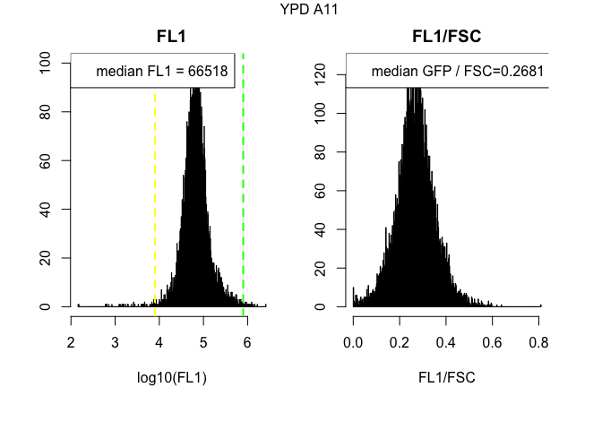<!-- --><!-- --><!-- -->

```
## [1] "-------------------------------------------------------"
## [1] "-----------------------------------"
## [1] "----------------------"
```

<!-- --><!-- --><!-- -->

```
## [1] "-------------------------------------------------------"
## [1] "-----------------------------------"
## [1] "----------------------"
```

<!-- --><!-- -->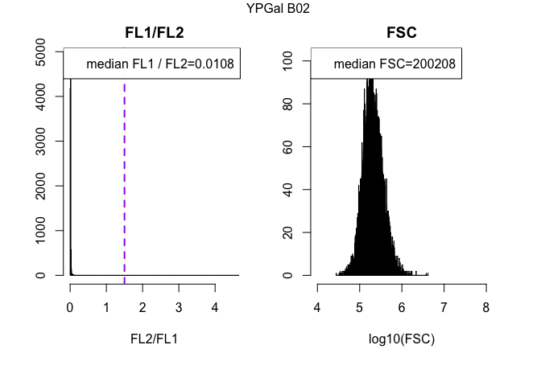<!-- -->

```
## [1] "-------------------------------------------------------"
## [1] "-----------------------------------"
## [1] "----------------------"
```

<!-- --><!-- --><!-- -->

```
## [1] "-------------------------------------------------------"
## [1] "-----------------------------------"
## [1] "----------------------"
```

<!-- -->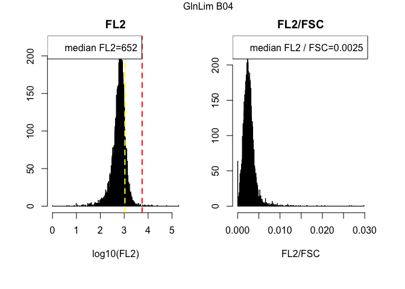<!-- --><!-- -->

```
## [1] "-------------------------------------------------------"
## [1] "-----------------------------------"
## [1] "----------------------"
```

<!-- --><!-- -->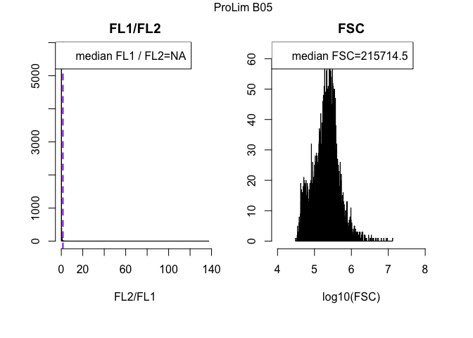<!-- -->

```
## [1] "-------------------------------------------------------"
## [1] "-----------------------------------"
## [1] "----------------------"
```

<!-- --><!-- --><!-- -->

```
## [1] "-------------------------------------------------------"
## [1] "-----------------------------------"
## [1] "----------------------"
```

<!-- --><!-- --><!-- -->

```
## [1] "-------------------------------------------------------"
## [1] "-----------------------------------"
## [1] "----------------------"
```

<!-- --><!-- --><!-- -->

```
## [1] "-------------------------------------------------------"
## [1] "-----------------------------------"
## [1] "----------------------"
```

<!-- --><!-- --><!-- -->

```
## [1] "-------------------------------------------------------"
## [1] "-----------------------------------"
## [1] "----------------------"
```

<!-- --><!-- --><!-- -->

```
## [1] "-------------------------------------------------------"
## [1] "-----------------------------------"
## [1] "----------------------"
```

<!-- --><!-- --><!-- -->

```
## [1] "-------------------------------------------------------"
## [1] "-----------------------------------"
## [1] "----------------------"
```

<!-- --><!-- --><!-- -->

```
## [1] "-------------------------------------------------------"
## [1] "-----------------------------------"
## [1] "----------------------"
```

<!-- --><!-- --><!-- -->

```
## [1] "-------------------------------------------------------"
## [1] "-----------------------------------"
## [1] "----------------------"
```

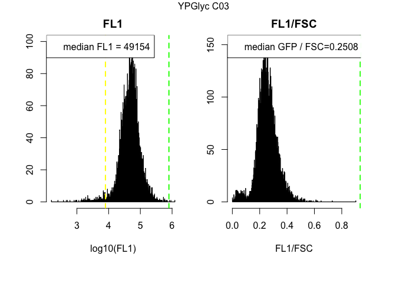<!-- --><!-- --><!-- -->

```
## [1] "-------------------------------------------------------"
## [1] "-----------------------------------"
## [1] "----------------------"
```

<!-- --><!-- --><!-- -->

```
## [1] "-------------------------------------------------------"
## [1] "-----------------------------------"
## [1] "----------------------"
```

<!-- --><!-- --><!-- -->

```
## [1] "-------------------------------------------------------"
## [1] "-----------------------------------"
## [1] "----------------------"
```

<!-- --><!-- -->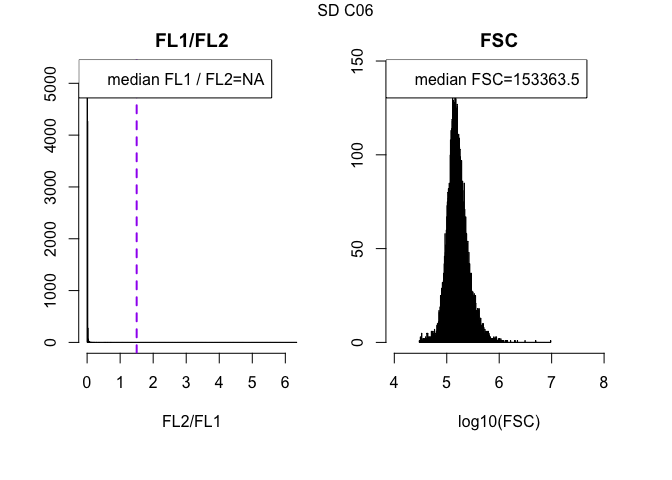<!-- -->

```
## [1] "-------------------------------------------------------"
## [1] "-----------------------------------"
## [1] "----------------------"
```

<!-- --><!-- --><!-- -->

```
## [1] "-------------------------------------------------------"
## [1] "-----------------------------------"
## [1] "----------------------"
```

<!-- --><!-- --><!-- -->

```
## [1] "-------------------------------------------------------"
## [1] "-----------------------------------"
## [1] "----------------------"
```

<!-- --><!-- --><!-- -->

```
## [1] "-------------------------------------------------------"
## [1] "-----------------------------------"
## [1] "----------------------"
```

<!-- --><!-- --><!-- -->

```
## [1] "-------------------------------------------------------"
## [1] "-----------------------------------"
## [1] "----------------------"
```

<!-- --><!-- --><!-- -->

```
## [1] "-------------------------------------------------------"
## [1] "-----------------------------------"
## [1] "----------------------"
```

<!-- --><!-- --><!-- -->

```
## [1] "-------------------------------------------------------"
## [1] "-----------------------------------"
## [1] "----------------------"
```

<!-- --><!-- --><!-- -->

```
## [1] "-------------------------------------------------------"
## [1] "-----------------------------------"
## [1] "----------------------"
```

<!-- --><!-- --><!-- -->

```
## [1] "-------------------------------------------------------"
## [1] "-----------------------------------"
## [1] "----------------------"
```

<!-- --><!-- -->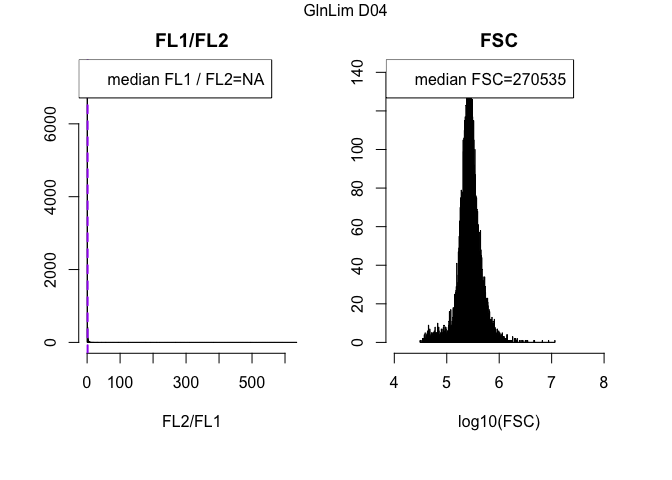<!-- -->

```
## [1] "-------------------------------------------------------"
## [1] "-----------------------------------"
## [1] "----------------------"
```

<!-- --><!-- --><!-- -->

```
## [1] "-------------------------------------------------------"
## [1] "-----------------------------------"
## [1] "----------------------"
```

<!-- --><!-- --><!-- -->

```
## [1] "-------------------------------------------------------"
## [1] "-----------------------------------"
## [1] "----------------------"
```

<!-- --><!-- --><!-- -->

```
## [1] "-------------------------------------------------------"
## [1] "-----------------------------------"
## [1] "----------------------"
```

<!-- --><!-- --><!-- -->

```
## [1] "-------------------------------------------------------"
## [1] "-----------------------------------"
## [1] "----------------------"
```

<!-- --><!-- --><!-- -->

```
## [1] "-------------------------------------------------------"
## [1] "-----------------------------------"
## [1] "----------------------"
```

<!-- --><!-- --><!-- -->

```
## [1] "-------------------------------------------------------"
## [1] "-----------------------------------"
## [1] "----------------------"
```

<!-- -->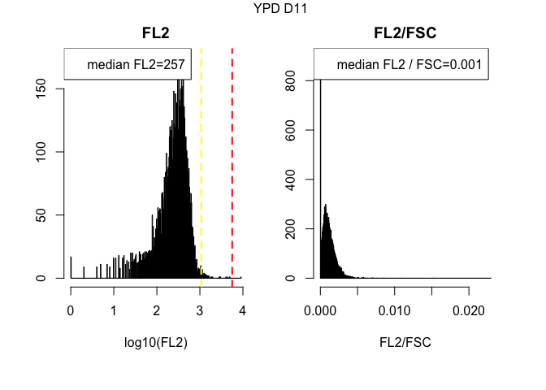<!-- --><!-- -->

```
## [1] "-------------------------------------------------------"
## [1] "-----------------------------------"
## [1] "----------------------"
```

<!-- --><!-- --><!-- -->

```
## [1] "-------------------------------------------------------"
## [1] "-----------------------------------"
## [1] "----------------------"
```

<!-- --><!-- --><!-- -->

```
## [1] "-------------------------------------------------------"
## [1] "-----------------------------------"
## [1] "----------------------"
```

<!-- --><!-- --><!-- -->

```
## [1] "-------------------------------------------------------"
## [1] "-----------------------------------"
## [1] "----------------------"
```

<!-- --><!-- -->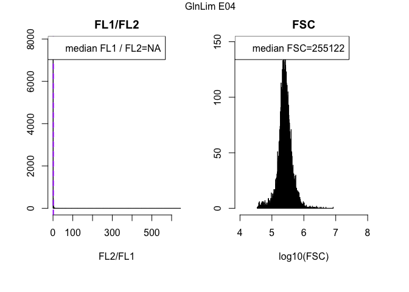<!-- -->

```
## [1] "-------------------------------------------------------"
## [1] "-----------------------------------"
## [1] "----------------------"
```

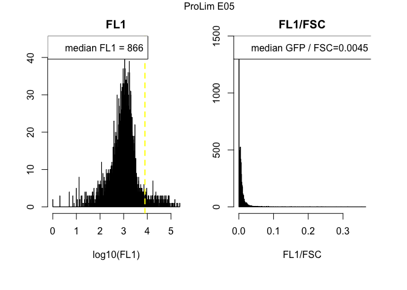<!-- --><!-- --><!-- -->

```
## [1] "-------------------------------------------------------"
## [1] "-----------------------------------"
## [1] "----------------------"
```

<!-- --><!-- --><!-- -->

```
## [1] "-------------------------------------------------------"
## [1] "-----------------------------------"
## [1] "----------------------"
```

<!-- --><!-- --><!-- -->

```
## [1] "-------------------------------------------------------"
## [1] "-----------------------------------"
## [1] "----------------------"
```

<!-- --><!-- --><!-- -->

```
## [1] "-------------------------------------------------------"
## [1] "-----------------------------------"
## [1] "----------------------"
```

<!-- --><!-- -->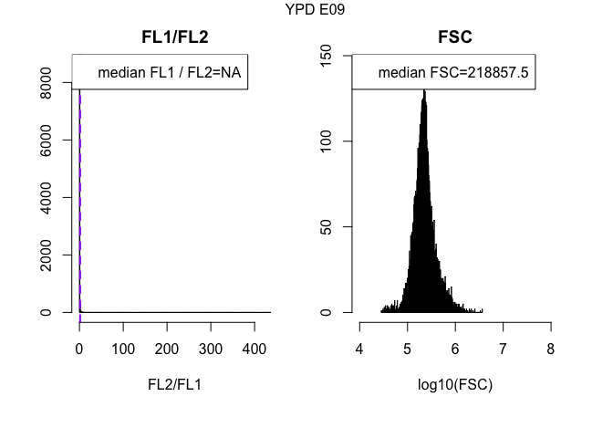<!-- -->

```
## [1] "-------------------------------------------------------"
## [1] "-----------------------------------"
## [1] "----------------------"
```

<!-- --><!-- --><!-- -->

```
## [1] "-------------------------------------------------------"
## [1] "-----------------------------------"
## [1] "----------------------"
```

<!-- --><!-- --><!-- -->

```
## [1] "-------------------------------------------------------"
## [1] "-----------------------------------"
## [1] "----------------------"
```

<!-- --><!-- --><!-- -->

```
## [1] "-------------------------------------------------------"
## [1] "-----------------------------------"
## [1] "----------------------"
```

<!-- --><!-- --><!-- -->

```
## [1] "-------------------------------------------------------"
## [1] "-----------------------------------"
## [1] "----------------------"
```

<!-- --><!-- --><!-- -->

```
## [1] "-------------------------------------------------------"
## [1] "-----------------------------------"
## [1] "----------------------"
```

<!-- --><!-- --><!-- -->

```
## [1] "-------------------------------------------------------"
## [1] "-----------------------------------"
## [1] "----------------------"
```

<!-- --><!-- --><!-- -->

```
## [1] "-------------------------------------------------------"
## [1] "-----------------------------------"
## [1] "----------------------"
```

<!-- --><!-- --><!-- -->

```
## [1] "-------------------------------------------------------"
## [1] "-----------------------------------"
## [1] "----------------------"
```

<!-- --><!-- --><!-- -->

```
## [1] "-------------------------------------------------------"
## [1] "-----------------------------------"
## [1] "----------------------"
```

<!-- --><!-- --><!-- -->

```
## [1] "-------------------------------------------------------"
## [1] "-----------------------------------"
## [1] "----------------------"
```

<!-- --><!-- --><!-- -->

```
## [1] "-------------------------------------------------------"
## [1] "-----------------------------------"
## [1] "----------------------"
```

<!-- --><!-- --><!-- -->

```
## [1] "-------------------------------------------------------"
## [1] "-----------------------------------"
## [1] "----------------------"
```

<!-- --><!-- --><!-- -->

```
## [1] "-------------------------------------------------------"
## [1] "-----------------------------------"
## [1] "----------------------"
```

```r
par(mfrow=c(1,1)) #change number of plots per row back to standard
```


##Overview of data distributions

```r
par(mar=c(8.1,4.1,4.1,2.1)) #create more space at lower margin

boxplot(comparison.FSC, names=sampleNames(filteredData), notch = TRUE, col = "gray", ylab="FSC", cex.axis=0.5,las=2, outline=F)
abline(h=haploid.fsc, lty=2, col=2)
abline(h=diploid.fsc, lty=2, col=3)
```

<!-- -->

```r
boxplot(comparison.FL1, names=sampleNames(filteredData), notch = TRUE, col = "lightgreen", ylab="FL1", cex.axis=0.5,las=2, outline=F)
abline(h=gfp.bg ,lty=2, lwd=3, col="yellow")
abline(h=gfp.wt, lty = 2, lwd=3, col="green")
```

<!-- -->

```r
boxplot(comparison.FL1NormFsc, names=sampleNames(filteredData), notch = TRUE, col = "green", ylab="FL1/FSC", cex.axis=0.5,las=2, outline=F)
abline(h=gfp.norm, lty=2, lwd=3, col="blue")
```

<!-- -->

```r
boxplot(comparison.FL2, names=sampleNames(filteredData), notch = TRUE, col = "pink", ylab="FL2", cex.axis=0.5,las=2, outline=F)
abline(h=red.bg, lty=2, lwd=3, col="pink")
abline(h=red.wt, lty=2, lwd=3, col="red")
```

<!-- -->

```r
boxplot(comparison.FL2NormFsc, names=sampleNames(filteredData), notch = TRUE, col = "red", ylab="FL2/FSC", cex.axis=0.5,las=2, outline=F)
abline(h=red.norm, lty=2, lwd=3, col="red")
```

<!-- -->

```r
boxplot(comparison.FL1NormFL2, names=sampleNames(filteredData), notch = TRUE, col = "purple", ylab="FL1/FL2", cex.axis=0.5,las=2, outline=F)
abline(h=gfp.red.norm, lty=2, lwd=3, col="purple")
```

<!-- -->

```r
par(mar=c(5.1,4.1,4.1,2.1)) #reset margins to default

#generate a summary table containing all the recorded statistics
print(summary.stats)
```

```
##            FSC_median FSC_mean   FSC_sd FL1_median    FL1_mean      FL1_sd
## YPD A01      247461.5 325429.1 354132.6    26379.5  35736.8193  70772.5209
## YPGal A02    225820.0 272638.4 200464.6    35618.0  44976.5999 158212.2434
## YPGlyc A03   215900.5 269830.7 203114.3    50794.5  63764.0797  56128.1763
## GlnLim A04   284141.0 327723.0 260741.8    74616.0  92374.1620 275126.0777
## ProLim A05   254437.0 349716.1 459818.0    46192.5  65579.0825 188450.5365
## SD A06       145856.5 183067.2 156182.8    43556.0  53067.3393  61458.4557
## YPD A07      263999.0 349311.1 312497.5    26656.0  36276.2868  41464.1285
## YPD A08      538803.0 632557.8 458928.6    17850.5  21715.3572  20934.8332
## YPD A09      271695.0 376840.4 468480.2    54310.5  65968.1099  86009.0989
## YPD A10      246015.0 296439.6 216749.2    23754.5  29674.6353  24693.5577
## YPD A11      248471.5 327895.0 296847.0    66518.0  86289.2955  91430.2186
## YPD B01      200385.0 257669.8 262276.1    25898.0  32865.1972  48169.8808
## YPGal B02    200208.0 242059.3 162897.0    47834.5  56240.1604  43279.5554
## YPGlyc B03   177957.5 226035.9 177811.3    46353.5  58188.0197  49886.4569
## GlnLim B04   263891.5 298695.4 208018.9    67822.0  75744.8475  88954.7177
## ProLim B05   215714.5 280323.7 374446.7    22194.5  63554.5873 276862.0956
## SD B06       131860.0 167487.4 142750.8    45501.5  55604.2905  49927.5804
## YPD B07      199551.0 265179.5 219934.2    21243.0  28525.1239  27600.6290
## YPD B08      372938.0 456310.8 322516.0    25234.0  32398.3281  28181.3476
## YPD B09      244791.0 316887.1 308300.1    24783.0  29997.4233  27636.0128
## YPD B10      224851.5 259793.0 174241.9    54202.0  62177.5437  48138.6414
## YPD B11      222225.0 311247.4 327396.7    52644.5  70360.5466  78385.1320
## YPD C01      188290.5 235483.1 194515.2    59111.5  71653.6920  62003.8228
## YPGal C02    230145.5 273283.0 193364.0    53007.5  61687.1457  67396.5155
## YPGlyc C03   192794.5 237045.7 179097.8    49154.0  59589.0194  50146.5389
## GlnLim C04   265228.5 291576.1 200449.7    69342.5  74445.6298  78620.3413
## ProLim C05   250406.5 323901.5 400831.4    23091.5  37196.3060 128160.3233
## SD C06       153363.5 182151.9 156431.6    49268.0  55745.7613  40850.7012
## YPD C07      152322.5 191770.9 212477.5    39708.0  48382.7642  42764.4103
## YPD C08      220057.0 270048.0 217688.6    37138.5  45165.1916  43773.5583
## YPD C09      222156.5 285703.3 264329.7   113851.0 130973.3346 102086.1480
## YPD C10      180246.5 208287.4 160786.1    32838.5  38207.6041  38903.4570
## YPD C11      181081.5 241863.7 216812.3    69045.5  87275.9821  80586.6143
## YPD D01      192391.5 239535.5 168792.1      885.0   1124.5166   2102.8010
## YPGal D02    205220.5 240864.4 152907.1     1223.5   1412.8025   1226.2160
## YPGlyc D03   194754.5 234838.7 162869.2     1040.5   1254.7565   2184.3896
## GlnLim D04   270535.0 310668.2 250476.6      844.0   1265.1224   4531.7434
## ProLim D05   116945.0 220716.4 420728.2      697.0   5914.3933  82216.7653
## SD D06       145487.0 176927.6 111949.5      593.0    734.2498    720.4033
## YPD D07      180836.5 224266.4 200058.9     1017.0   1228.5581   1462.6317
## YPD D08      403104.0 440491.5 234963.1     1485.0   1691.8805   1352.7182
## YPD D09      279013.5 370669.8 363558.1     1053.0   1345.9993   2104.3730
## YPD D10      203089.0 233484.6 149706.2     1077.0   1220.6901   1066.3363
## YPD D11      243761.5 309847.6 252242.0     1136.0   1374.3864   1500.7368
## YPD E01      164608.0 195727.8 121516.5      803.5    961.1923   1736.1587
## YPGal E02    193358.0 226302.4 134719.0     1104.0   1267.2160   1060.8688
## YPGlyc E03   182583.0 223879.5 153695.1     1101.0   1301.6346   1883.8578
## GlnLim E04   255122.0 289813.4 200607.5      959.0   1375.2787   6983.5733
## ProLim E05   193809.0 236607.4 284636.4      866.0   2493.5127   9689.4102
## SD E06       151510.0 183260.9 114098.0      650.0    786.0555    847.4659
## YPD E07      193099.5 223578.3 129659.3      930.0   1089.9021   1381.6220
## YPD E08      327894.5 374445.2 246019.3     1545.0   1796.7005   2037.9138
## YPD E09      218857.5 264283.8 191497.7     1326.0   1582.5871   1740.9697
## YPD E10      224525.5 256546.9 181550.7      945.0   1167.3423   7214.9293
## YPD E11      236730.0 296523.6 227270.9     1176.0   1410.3773   1566.2941
## YPD F01      204984.5 239400.8 167684.7      824.0    961.7102   1068.7804
## YPGal F02    210800.5 246427.0 197783.4     1118.0   1283.8944   1715.8846
## YPGlyc F03   220339.0 263567.4 182430.5     1136.5   1351.9177   1424.5133
## GlnLim F04   263436.5 290360.9 202343.5      838.0   1269.6201   3864.9961
## ProLim F05   197411.0 268013.7 437902.3      845.0   3847.3967  29201.3278
## SD F06       192583.0 223684.1 125000.4      651.0    833.7101   1935.5293
## YPD F07      200580.0 240806.2 207168.6      919.0   1112.2286   1793.2958
## YPD F08      257334.0 299133.5 180995.1     1069.0   1249.5845   1152.1011
## YPD F09      323919.0 422356.8 363111.9     1013.0   1313.1445   2479.6989
## YPD F10      232926.5 260851.1 148657.8      984.0   1124.9947   1388.6352
## YPD F11      210312.0 262966.3 196401.9      933.0   1120.6578   1082.8639
##            normalizedGFP_median normalizedGFP_mean normalizedGFP_sd
## YPD A01             0.106667303        0.109045873      0.039134906
## YPGal A02           0.161018083        0.162351800      0.099516197
## YPGlyc A03          0.232506477        0.236731821      0.070988648
## GlnLim A04          0.259818784        0.263159493      0.187450470
## ProLim A05          0.168070649        0.194304586      0.520404128
## SD A06              0.284865385        0.291907989      0.085066599
## YPD A07             0.100827292        0.104220794      0.035306505
## YPD A08             0.034738141        0.034593954      0.015847330
## YPD A09             0.198891132        0.196658414      0.076599744
## YPD A10             0.099532708        0.102191782      0.036732139
## YPD A11             0.268061348        0.268460295      0.082892593
## YPD B01             0.127812155        0.131122405      0.046895374
## YPGal B02           0.242564638        0.242824257      0.089131494
## YPGlyc B03          0.257442823        0.262173591      0.081239944
## GlnLim B04          0.253164254        0.254797663      0.102813616
## ProLim B05          0.107634116        0.183619891      0.787107402
## SD B06              0.331311963        0.337000325      0.105806117
## YPD B07             0.104423786        0.108394522      0.039200107
## YPD B08             0.071007496        0.072854667      0.030725578
## YPD B09             0.097209203        0.101379123      0.036722242
## YPD B10             0.243397172        0.245156242      0.079500147
## YPD B11             0.236949031        0.237193653      0.075385209
## YPD C01             0.305751429        0.311054910      0.093380508
## YPGal C02           0.236298022        0.233200997      0.087285513
## YPGlyc C03          0.250753871        0.254363345      0.074882878
## GlnLim C04          0.257487112        0.257294397      0.092507833
## ProLim C05          0.080727314        0.115991137      0.208812931
## SD C06              0.306859692        0.313668667      0.104735270
## YPD C07             0.255678643        0.258550664      0.089489889
## YPD C08             0.170212861        0.174073740      0.065609027
## YPD C09             0.493041708        0.499512695      0.157303021
## YPD C10             0.184458282        0.188019389      0.062371825
## YPD C11             0.367538384        0.373558768      0.098477133
## YPD D01             0.004150615        0.005185620      0.012470845
## YPGal D02           0.005660470        0.006222937      0.004605902
## YPGlyc D03          0.004931067        0.005672097      0.004923020
## GlnLim D04          0.002990510        0.003819114      0.005648874
## ProLim D05          0.005185915        0.018601917      0.057685308
## SD D06              0.003619589        0.004632496      0.004702661
## YPD D07             0.005188581        0.005849623      0.004761923
## YPD D08             0.003671655        0.004076350      0.003190524
## YPD D09             0.003417821        0.003931577      0.003455360
## YPD D10             0.005073087        0.005614078      0.004467739
## YPD D11             0.004261277        0.004804962      0.004017164
## YPD E01             0.004505895        0.005238768      0.005031424
## YPGal E02           0.005437608        0.006014042      0.004832057
## YPGlyc E03          0.005540926        0.006221351      0.004965446
## GlnLim E04          0.003622313        0.004383200      0.005040181
## ProLim E05          0.004476235        0.009404649      0.022110358
## SD E06              0.003851310        0.004707150      0.004613428
## YPD E07             0.004478367        0.005164173      0.004635511
## YPD E08             0.004598388        0.005059361      0.004159378
## YPD E09             0.005674290        0.006237335      0.004761678
## YPD E10             0.004020135        0.004546088      0.003965126
## YPD E11             0.004565374        0.005059281      0.004346979
## YPD F01             0.003751024        0.004266672      0.003691587
## YPGal F02           0.005040501        0.005585455      0.004244896
## YPGlyc F03          0.004893339        0.005440535      0.004271223
## GlnLim F04          0.003153063        0.004335401      0.006955729
## ProLim F05          0.004109085        0.009719758      0.034967270
## SD F06              0.003086299        0.003933163      0.004608146
## YPD F07             0.004319214        0.004897557      0.004204470
## YPD F08             0.003916647        0.004501369      0.003790097
## YPD F09             0.002831105        0.003400568      0.004257273
## YPD F10             0.004038773        0.004611645      0.003941844
## YPD F11             0.004006073        0.004689625      0.004111138
##            FL2_median  FL2_mean     FL2_sd normalizedRed_median
## YPD A01           396  471.3543   784.3577         0.0014826735
## YPGal A02         484  620.3280  7152.2699         0.0020922526
## YPGlyc A03        531  621.6524   501.5574         0.0023685957
## GlnLim A04        663 1041.1544 14790.6978         0.0023233902
## ProLim A05        567 1139.1976 18780.9427         0.0022290332
## SD A06            447  506.1296   481.7178         0.0028646236
## YPD A07           414  490.8988   467.1662         0.0014678944
## YPD A08           418  475.7527   414.5439         0.0007686190
## YPD A09           562  668.7004   796.7095         0.0019608726
## YPD A10           400  446.9924   328.0503         0.0015689819
## YPD A11           640  787.7418   749.4506         0.0024846269
## YPD B01           387  437.7123   520.1130         0.0017930651
## YPGal B02         531  596.3892   409.3100         0.0026041441
## YPGlyc B03        514  603.1727   453.8849         0.0027987351
## GlnLim B04        652  757.4603  2121.3505         0.0024632644
## ProLim B05        486 1129.9851  6424.9403         0.0024570854
## SD B06            472  547.8889   492.8618         0.0033912204
## YPD B07           371  431.4317   349.9387         0.0017020074
## YPD B08           462  537.9714   414.0535         0.0012022867
## YPD B09           418  476.5939   459.2885         0.0016020428
## YPD B10           548  606.0192   409.8648         0.0024083048
## YPD B11           562  702.6514   697.7101         0.0024118988
## YPD C01           577  660.5633   511.2339         0.0029067258
## YPGal C02         567  678.3580  5132.8152         0.0024083113
## YPGlyc C03        515  593.1617   430.0949         0.0026175754
## GlnLim C04        627  730.7858  2846.0591         0.0023568015
## ProLim C05        478  990.9231  7936.4659         0.0019951594
## SD C06            492  618.9472  8666.0746         0.0030580176
## YPD C07           464  538.4723   872.5951         0.0029076434
## YPD C08           468  539.3146   437.8464         0.0020765451
## YPD C09           894 1021.4106   750.4366         0.0039030935
## YPD C10           436  472.5052   385.8246         0.0023579990
## YPD C11           630  758.0868   620.5758         0.0033166882
## YPD D01           226  242.3303   177.7777         0.0010570012
## YPGal D02         253  266.8971   185.6168         0.0011540214
## YPGlyc D03        226  249.7480   333.3841         0.0010819871
## GlnLim D04        241  306.0361   776.3837         0.0008654415
## ProLim D05        241  827.0959 11802.6965         0.0018946329
## SD D06            201  214.5788   157.1247         0.0012563761
## YPD D07           249  267.0011   214.8956         0.0012679021
## YPD D08           297  320.9702   234.6751         0.0007299191
## YPD D09           247  273.3012   271.6222         0.0007803299
## YPD D10           249  266.7558   185.6623         0.0011882687
## YPD D11           257  281.2968   240.3391         0.0009514361
## YPD E01           219  231.8768   243.5725         0.0012272265
## YPGal E02         243  257.0453   178.4170         0.0011934402
## YPGlyc E03        235  255.1107   325.8384         0.0011770484
## GlnLim E04        263  329.1531  1403.4954         0.0009964196
## ProLim E05        256  359.1966   711.3159         0.0013454912
## SD E06            207  222.6590   173.9579         0.0012443426
## YPD E07           241  255.4339   194.0989         0.0011640438
## YPD E08           305  333.4169   330.1028         0.0008940573
## YPD E09           276  300.9431   242.3653         0.0011854725
## YPD E10           237  259.4225   772.4222         0.0010076601
## YPD E11           268  289.0674   213.2970         0.0010231445
## YPD F01           221  234.8461   179.3264         0.0010060321
## YPGal F02         246  260.7052   228.2742         0.0010861703
## YPGlyc F03        240  259.5928   207.4178         0.0010212200
## GlnLim F04        240  283.0728   433.8560         0.0008922409
## ProLim F05        263  606.7014  4706.0720         0.0013242036
## SD F06            213  231.5874   237.4530         0.0010352326
## YPD F07           243  261.3950   295.3026         0.0011230889
## YPD F08           253  271.7610   201.8301         0.0009390990
## YPD F09           251  279.7733   373.1259         0.0006871855
## YPD F10           241  258.6708   230.9919         0.0010151210
## YPD F11           241  260.0673   193.0251         0.0010399845
##            normalizedRed_mean normalizedRed_sd GFPnormalizedByRed_median
## YPD A01          0.0015902135     0.0009607526                  72.61711
## YPGal A02        0.0022390142     0.0039622997                  76.42039
## YPGlyc A03       0.0025071501     0.0012384483                  99.78778
## GlnLim A04       0.0025110533     0.0025160432                        NA
## ProLim A05       0.0031616342     0.0055103497                        NA
## SD A06           0.0030165588     0.0014545676                 101.23897
## YPD A07          0.0015797619     0.0009376126                  70.33997
## YPD A08          0.0008555475     0.0006733025                        NA
## YPD A09          0.0020944342     0.0011008661                        NA
## YPD A10          0.0016776363     0.0009621465                        NA
## YPD A11          0.0025983801     0.0011136277                        NA
## YPD B01          0.0019113297     0.0010913416                        NA
## YPGal B02        0.0027334874     0.0013299441                  92.22782
## YPGlyc B03       0.0029735404     0.0014164913                  92.85698
## GlnLim B04       0.0026153587     0.0014093822                        NA
## ProLim B05       0.0038782491     0.0284810523                        NA
## SD B06           0.0035326601     0.0015579725                  99.81450
## YPD B07          0.0018417138     0.0010804804                        NA
## YPD B08          0.0013067341     0.0008202830                        NA
## YPD B09          0.0017159483     0.0009655888                        NA
## YPD B10          0.0025195210     0.0011484756                        NA
## YPD B11          0.0025377194     0.0011649178                  97.11692
## YPD C01          0.0030099264     0.0012364851                 106.04374
## YPGal C02        0.0025335361     0.0013432361                        NA
## YPGlyc C03       0.0027750142     0.0013252785                  97.11152
## GlnLim C04       0.0025001102     0.0021191462                        NA
## ProLim C05       0.0031335212     0.0086386675                        NA
## SD C06           0.0031781597     0.0016536277                        NA
## YPD C07          0.0030297524     0.0014036196                        NA
## YPD C08          0.0022360315     0.0011646399                  81.21338
## YPD C09          0.0040299803     0.0015066751                 126.96698
## YPD C10          0.0025007379     0.0012514133                        NA
## YPD C11          0.0034476817     0.0013070076                 112.07977
## YPD D01          0.0012070751     0.0009558041                        NA
## YPGal D02        0.0013149301     0.0010175246                        NA
## YPGlyc D03       0.0012941996     0.0011300856                        NA
## GlnLim D04       0.0010534621     0.0011713956                        NA
## ProLim D05       0.0029051738     0.0062873051                        NA
## SD D06           0.0014609075     0.0012098473                        NA
## YPD D07          0.0014281429     0.0010870407                        NA
## YPD D08          0.0008653270     0.0008170308                        NA
## YPD D09          0.0009477618     0.0008697711                        NA
## YPD D10          0.0013444518     0.0010445057                        NA
## YPD D11          0.0011075217     0.0009097318                        NA
## YPD E01          0.0013675254     0.0010404165                        NA
## YPGal E02        0.0013679246     0.0011391605                        NA
## YPGlyc E03       0.0014055736     0.0011872367                        NA
## GlnLim E04       0.0011687001     0.0011159154                        NA
## ProLim E05       0.0019444869     0.0031176900                        NA
## SD E06           0.0014469324     0.0011955271                        NA
## YPD E07          0.0013147091     0.0010318910                        NA
## YPD E08          0.0010295619     0.0009034055                        NA
## YPD E09          0.0013314785     0.0009931054                        NA
## YPD E10          0.0011417956     0.0009130994                        NA
## YPD E11          0.0011772681     0.0009028711                        NA
## YPD F01          0.0011375361     0.0009119842                        NA
## YPGal F02        0.0012559769     0.0010025667                        NA
## YPGlyc F03       0.0012035282     0.0010442672                        NA
## GlnLim F04       0.0011464206     0.0013010038                        NA
## ProLim F05       0.0020653174     0.0035101816                        NA
## SD F06           0.0011975230     0.0010269866                        NA
## YPD F07          0.0012757155     0.0009936070                        NA
## YPD F08          0.0010861975     0.0009179274                        NA
## YPD F09          0.0008517021     0.0008404694                        NA
## YPD F10          0.0011402909     0.0009041940                        NA
## YPD F11          0.0012149035     0.0009900743                        NA
##            GFPnormalizedByRed_mean GFPnormalizedByRed_sd
## YPD A01                        Inf                   NaN
## YPGal A02                      Inf                   NaN
## YPGlyc A03                     Inf                   NaN
## GlnLim A04                     NaN                    NA
## ProLim A05                     NaN                    NA
## SD A06                         Inf                   NaN
## YPD A07                        Inf                   NaN
## YPD A08                        NaN                    NA
## YPD A09                        NaN                    NA
## YPD A10                        NaN                    NA
## YPD A11                        NaN                    NA
## YPD B01                        NaN                    NA
## YPGal B02                      Inf                   NaN
## YPGlyc B03                     Inf                   NaN
## GlnLim B04                     NaN                    NA
## ProLim B05                     NaN                    NA
## SD B06                         Inf                   NaN
## YPD B07                        NaN                    NA
## YPD B08                        NaN                    NA
## YPD B09                        NaN                    NA
## YPD B10                        NaN                    NA
## YPD B11                        Inf                   NaN
## YPD C01                        Inf                   NaN
## YPGal C02                      NaN                    NA
## YPGlyc C03                     Inf                   NaN
## GlnLim C04                     NaN                    NA
## ProLim C05                     NaN                    NA
## SD C06                         NaN                    NA
## YPD C07                        NaN                    NA
## YPD C08                        Inf                   NaN
## YPD C09                        Inf                   NaN
## YPD C10                        NaN                    NA
## YPD C11                        Inf                   NaN
## YPD D01                        NaN                    NA
## YPGal D02                      NaN                    NA
## YPGlyc D03                     NaN                    NA
## GlnLim D04                     NaN                    NA
## ProLim D05                     NaN                    NA
## SD D06                         NaN                    NA
## YPD D07                        NaN                    NA
## YPD D08                        NaN                    NA
## YPD D09                        NaN                    NA
## YPD D10                        NaN                    NA
## YPD D11                        NaN                    NA
## YPD E01                        NaN                    NA
## YPGal E02                      NaN                    NA
## YPGlyc E03                     NaN                    NA
## GlnLim E04                     NaN                    NA
## ProLim E05                     NaN                    NA
## SD E06                         NaN                    NA
## YPD E07                        NaN                    NA
## YPD E08                        NaN                    NA
## YPD E09                        NaN                    NA
## YPD E10                        NaN                    NA
## YPD E11                        NaN                    NA
## YPD F01                        NaN                    NA
## YPGal F02                      NaN                    NA
## YPGlyc F03                     NaN                    NA
## GlnLim F04                     NaN                    NA
## ProLim F05                     NaN                    NA
## SD F06                         NaN                    NA
## YPD F07                        NaN                    NA
## YPD F08                        NaN                    NA
## YPD F09                        NaN                    NA
## YPD F10                        NaN                    NA
## YPD F11                        NaN                    NA
```

```r
summary.stats <- as.data.frame(summary.stats)
```


##Quantitation of relative FL1 signal

```r
baseline.FL1 <- summary.stats$FL1_median[1]

barplot(summary.stats$FL1_median/baseline.FL1, ylab="Relative FL1 median expression", las=2, cex.names = 0.5, names.arg=sampleNames(filteredData))
```

<!-- -->

##Quantitation of forward scatter

```r
baseline.FSC <- summary.stats$FSC_median[1]

barplot(summary.stats$FSC_median/baseline.FSC, ylab="Relative median FSC", las=2, cex.names = 0.5, names.arg=sampleNames(filteredData))
```

<!-- -->

##Population composition

```r
pop.composition <- rbind(non.gfp/non.debris,gfp.cells/non.debris,hi.gfp.cells/non.debris)
barplot(pop.composition, ylab="Proportion of population", legend=c("No GFP", "Normal GFP", "High GFP"),las=2, cex.names = 0.5,names.arg=sampleNames(filteredData))
```

#Step 5: Quality control

##Gates

```r
###First flowset
#Singlets gate
xyplot(FSC.A~FSC.H, data=flowData.1, xlim=c(0,3e6), ylim=c(0,3e6), filter=pg.singlets,  smooth=F, xbin=1024, stat=T, pos=0.5, abs=T, main = "First flowset - singlets gate")

#Debris gate
xyplot(SSC.A ~ FSC.A, data=flowData.1, displayFilter=TRUE, xlim=c(0,3e6), ylim=c(0,3e5), filter=pg.nondebris, smooth=F, xbin=1024, stat=T, pos=0.5, abs=T,  main = "First flowset - nondebris gate")

#Non-fluorescent population gate
xyplot(FL1.A~FSC.A,data=flowData.1, displayFilter=TRUE, xlim=c(0,5e6), ylim=c(0,5e4), filter=pg.nongfp, smooth=F, xbin=1024, stat=T, pos=0.5, abs=T,  main = "First flowset - non GFP gate")

#Fluorescent population gate
xyplot(FL1.A~FSC.A,data=flowData.1, displayFilter=TRUE, xlim=c(0,5e6), ylim=c(0,5e4), filter=pg.gfp, smooth=F, xbin=1024, stat=T, pos=0.5, abs=T, main = "First flowset - GFP gate")

#High fluorescing gate
xyplot(FL1.A~FSC.A,data=flowData.1, xlim=c(0,5e6), ylim=c(0,5e4), filter=pg.hi.gfp, smooth=F, xbin=1024, stat=T, pos=0.5, abs=T,  main = "First flowset - high GFP gate")

################
###Second flowset
#Singlets gate
xyplot(FSC.A~FSC.H, data=flowData.2, xlim=c(0,3e6), ylim=c(0,3e6), filter=pg.singlets,  smooth=F, xbin=1024, stat=T, pos=0.5, abs=T, main = "Second flowset - singlets gate")

#Debris gate
xyplot(SSC.A ~ FSC.A, data=flowData.2, displayFilter=TRUE, xlim=c(0,3e6), ylim=c(0,3e5), filter=pg.nondebris, smooth=F, xbin=1024, stat=T, pos=0.5, abs=T,  main = "Second flowset  - nondebris gate")

#Non-fluorescent population gate
xyplot(FL1.A~FSC.A,data=flowData.2, displayFilter=TRUE, xlim=c(0,5e6), ylim=c(0,5e4), filter=pg.nongfp, smooth=F, xbin=1024, stat=T, pos=0.5, abs=T,  main = "Second flowset - non GFP gate")

#Fluorescent population gate
xyplot(FL1.A~FSC.A,data=flowData.2, displayFilter=TRUE, xlim=c(0,5e6), ylim=c(0,5e4), filter=pg.gfp, smooth=F, xbin=1024, stat=T, pos=0.5, abs=T, main = "Second flowset - GFP gate")

#High fluorescing gate 
xyplot(FL1.A~FSC.A,data=flowData.2, xlim=c(0,5e6), ylim=c(0,5e4), filter=pg.hi.gfp, smooth=F, xbin=1024, stat=T, pos=0.5, abs=T,  main = "Second flowset - high GFP gate")


#####Attempted as loop below to plot each one individually and is not working

for (i in 1:length(filteredData)){

#Singlets gate
xyplot(FSC.A~FSC.H, data=flowData[i], xlim=c(0,3e6), ylim=c(0,3e6), filter=pg.singlets,  smooth=F, xbin=1024, stat=T, pos=0.5, abs=T, main = sampleNames(flowData)[i])

#Debris gate
xyplot(SSC.A ~ FSC.A, data=flowData[i], displayFilter=TRUE, xlim=c(0,3e5), ylim=c(0,3e6), filter=pg.nondebris, smooth=F, xbin=1024, stat=T, pos=0.5, abs=T, main = sampleNames(flowData)[i])

#Non-fluorescent population gate
xyplot(FL1.A~FSC.A,data=flowData[i], displayFilter=TRUE, xlim=c(0,5e6), ylim=c(0,5e4), filter=pg.nongfp, smooth=F, xbin=1024, stat=T, pos=0.5, abs=T, main = sampleNames(flowData)[i])

#Fluorescent population gate
xyplot(FL1.A~FSC.A,data=flowData[i], displayFilter=TRUE, xlim=c(0,5e6), ylim=c(0,5e4), filter=pg.gfp, smooth=F, xbin=1024, stat=T, pos=0.5, abs=T, main = sampleNames(flowData)[i])

#High fluorescing gate
xyplot(FL1.A~FSC.A,data=flowData[i], xlim=c(0,5e6), ylim=c(0,5e4), filter=pg.hi.gfp, smooth=F, xbin=1024, stat=T, pos=0.5, abs=T, main = sampleNames(flowData)[i])

}
```


##Data transformation for visualization

```r
#In order to look at QC plots the data is transformed using the logicle transform, which is a log transform for high values that transitions to a linear transformation near zero values 

#This is simply for visualization purposes

lgcl <- logicleTransform(w = 0.5, t= 10000, m=4.5) #the parameters w,t, and m define the transformation parameters

#Dataset 1 tranformation applied to every channel except width and time
dataLGCLTransform <- transform(filteredData,'FSC.A' = lgcl(`FSC.A`), 'SSC.A' =lgcl(`SSC.A`), 'FL1.A' = lgcl(`FL1.A`), 'FL2.A' = lgcl(`FL2.A`), 'FL3.A' = lgcl(`FL3.A`), 'FL4.A' = lgcl(`FL4.A`),'FSC.H' = lgcl(`FSC.H`),'SSC.H' = lgcl(`SSC.H`),'FL1.H' = lgcl(`FL1.H`),'FL2.H' = lgcl(`FL2.H`),'FL3.H' = lgcl(`FL3.H`),'FL4.H' = lgcl(`FL4.H`)) 
```

##Effect of time

```r
#The effect of time on signal (of which there shouldn't be any)
i <- 1
xyplot(FL1.A ~ Time, data=dataLGCLTransform[i], smooth=F,  stat=T, pos=0.5, abs=T, xlim=c(150,250), main = sampleNames(filteredData)[i])
```

<!-- -->

```r
i <- 2
xyplot(FL1.A ~ Time, data=dataLGCLTransform[i], smooth=F,  stat=T, pos=0.5, abs=T, xlim=c(150,250), main = sampleNames(filteredData)[i])
```

<!-- -->

```r
i <- 3
xyplot(FL1.A ~ Time, data=dataLGCLTransform[i], smooth=F,  stat=T, pos=0.5, abs=T, xlim=c(150,250), main = sampleNames(filteredData)[i])
```

<!-- -->

```r
####Attempted as loop and will not work 
for (i in 1:length(filteredData)){
xyplot(FL1.A ~ Time, data=dataLGCLTransform[i], smooth=F,  stat=T, pos=0.5, abs=T, xlim=c(150,250), main = sampleNames(filteredData)[i])
}
```

##Plots of FL1 versus FSC

```r
i <- 1
xyplot(FL1.A ~ FSC.A, data=dataLGCLTransform[i], smooth=F,  stat=T, pos=0.5, abs=T, xlim=c(4,8), sampleNames(filteredData)[i])
```

```
## Warning: 'filter' must either be a filtersList,filterResultList, a single
## filter object or a named list of filter objects.
```

<!-- -->

```r
i <- 2
xyplot(FL1.A ~ FSC.A, data=dataLGCLTransform[i], smooth=F,  stat=T, pos=0.5, abs=T, xlim=c(4,8), sampleNames(filteredData)[i])
```

```
## Warning: 'filter' must either be a filtersList,filterResultList, a single
## filter object or a named list of filter objects.
```

<!-- -->

```r
i <- 3
xyplot(FL1.A ~ FSC.A, data=dataLGCLTransform[i], smooth=F,  stat=T, pos=0.5, abs=T, xlim=c(4,8), sampleNames(filteredData)[i])
```

```
## Warning: 'filter' must either be a filtersList,filterResultList, a single
## filter object or a named list of filter objects.
```

<!-- -->

```r
####Attempted as loop and will not work 
for (i in 1:length(filteredData)){
xyplot(FL1.A ~ FSC.A, data=dataLGCLTransform[i], smooth=F,  stat=T, pos=0.5, abs=T, xlim=c(4,8), ylim=c(2,6), sampleNames(filteredData)[i])
}
```

##Plots of FSC versus SSC

```r
i <- 1
xyplot(SSC.A ~ FSC.A, data=dataLGCLTransform[i], smooth=F,  stat=T, pos=0.5, abs=T, xlim=c(4,8), ylim=c(4,8), sampleNames(filteredData)[i])
```

```
## Warning: 'filter' must either be a filtersList,filterResultList, a single
## filter object or a named list of filter objects.
```

<!-- -->

```r
i <- 2
xyplot(SSC.A ~ FSC.A, data=dataLGCLTransform[i], smooth=F,  stat=T, pos=0.5, abs=T, xlim=c(4,8), ylim=c(4,8), sampleNames(filteredData)[i])
```

```
## Warning: 'filter' must either be a filtersList,filterResultList, a single
## filter object or a named list of filter objects.
```

<!-- -->

```r
i <- 3
xyplot(SSC.A ~ FSC.A, data=dataLGCLTransform[i], smooth=F,  stat=T, pos=0.5, abs=T, xlim=c(4,8), ylim=c(4,8), sampleNames(filteredData)[i])
```

```
## Warning: 'filter' must either be a filtersList,filterResultList, a single
## filter object or a named list of filter objects.
```

<!-- -->

```r
####Attempted as loop and will not work 
for (i in 1:length(filteredData)){
xyplot(SSC.A ~ FSC.A, data=dataLGCLTransform[i], smooth=F,  stat=T, pos=0.5, abs=T, xlim=c(4,8), ylim=c(4,8), sampleNames(filteredData)[i])
}
```


